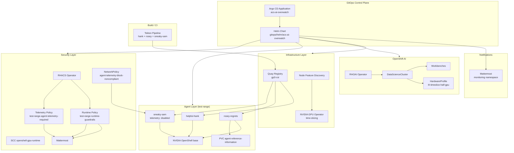

# ACS AI Overwatch

**ACS AI Overwatch** is a GitOps repository for an OpenShift Proof of Concept that combines:

- **Red Hat OpenShift AI (RHOAI)** for GPU-backed workbenches and model serving
- **Red Hat Advanced Cluster Security (ACS / RHACS)** for runtime policy enforcement
- **NVIDIA OpenShell** agent sandboxes for contrasting “good” vs “rogue” AI agent behavior
- **Kagenti** for agent deployment and orchestration
- **Mattermost** as a Slack-compatible notification sink for ACS violations
- **Quay** as the on-cluster container registry for agent images
- **Tekton (OpenShift Pipelines)** for building and pushing agent images

The repository is designed to be deployed through **OpenShift GitOps (Argo CD)** using:

1. **`acs-ai-overwatch-gitops-bootstrap`** — namespaces with `argocd.argoproj.io/managed-by` so Argo CD can create ServiceAccounts
2. **`acs-ai-overwatch-cluster-discovery`** — in-cluster Job writes cluster settings to a ConfigMap (including **Mattermost external URL**)
3. **`acs-ai-overwatch`** — umbrella Helm chart at `gitops/helm/acs-ai-overwatch`

**Optional (opt-in, disabled by default):**

4. **`acs-ai-overwatch-kagenti-platform`** — installs the Kagenti control plane (Keycloak, SPIRE, operator, API). **Not** registered in `gitops/argocd/kustomization.yaml` until you enable Phase 4.
5. **`acs-ai-overwatch-observability`** — Phase 5 shared tracing (OTEL → Tempo + MLflow, Grafana dashboards). **Not** registered until you enable Phase 5.
6. **Full RHACS Central + SecuredCluster** — templates and bootstrap Job in the main chart, gated by `acs.central.enabled` / `acs.bootstrap.enabled` (**both `false` by default**).

See **[PoC deployment phases](#poc-deployment-phases)** for phase definitions and **[Step-by-step deployment](#step-by-step-deployment)** for the full walkthrough in deployment order (Mattermost login and alerts are near the end, before the demo).

### Quick Start

**When you need Pipelines:** GitOps-only deploy (operators, Quay, Mattermost) does **not** require Pipelines. Install Pipelines before step 7 below (building helpful-hank / rosey-regrets images). See [OpenShift Pipelines (Tekton) prerequisite](#openshift-pipelines-tekton-prerequisite).

```bash
oc login   # cluster-admin

# 1. Cluster-admin bootstrap (RBAC, namespaces, cluster ConfigMap, discovery SA) — see below
make cluster-admin-pre-gitops
# or: ./scripts/cluster-admin/install-pre-gitops.sh

# 1b. Install Red Hat Kueue Operator manually (before default-dsc) — see Prerequisites

# 2. Confirm StorageClass matches values.yaml (default gp3-csi)
#    oc get storageclass

# 3. Register Argo CD Applications (set repoURL in YAML to your fork if needed)
oc apply -k gitops/argocd/

# 4. Sync Applications (waves 0→1→2) or wait for automated sync
#    acs-ai-overwatch-gitops-bootstrap → cluster-discovery → acs-ai-overwatch

# 5. Confirm cluster ConfigMap (from step 1 or discovery Job)
oc get cm -n acs-ai-overwatch-system acs-ai-overwatch-cluster-config

# 6. Install OpenShift Pipelines, then build agent images (Phase 2)
oc apply -n acs-ai-overwatch-system -f pipelines/tekton/agents-build-pipeline.yaml
# Or: oc start-build rosey-regrets-slm --from-dir=. --follow -n test-range

# 7. Enable Phase 3 (RHACS Central), Phase 4 (Kagenti), agents in values-poc.yaml — sync Argo CD
#    See "PoC deployment phases" and "Step-by-step deployment"

# 8. Verify Mattermost + RHACS notifier — see "Mattermost & RHACS notifications"

# 9. Run the end-to-end demo — see "PoC Demo Walkthrough (After Setup)"
```

**Optional (local Helm / override file):** `make cluster-values` writes `values-cluster.yaml` from your `oc login` (see [Cluster-Aware Configuration](#cluster-aware-configuration)).

**OpenShift AI version:** This PoC targets **OpenShift AI 3.4** (`stable-3.4` channel by default; confirm with `packagemanifest`, `DataScienceCluster` **`v2`**). Use a [fresh cluster](#fresh-cluster-deployment-rhoai-34) — **do not** install on a cluster that already ran RHOAI 2.25 (no supported in-place upgrade to 3.4).

---

## Table of Contents

1. [Solution Overview](#solution-overview)
2. [Architecture](#architecture)
3. [Repository Layout](#repository-layout)
4. [Prerequisites](#prerequisites)
5. [PoC deployment phases](#poc-deployment-phases)
6. [Cluster admin: pre-GitOps setup](#cluster-admin-pre-gitops-setup)
7. [Fresh cluster deployment (OpenShift AI 3.4)](#fresh-cluster-deployment-rhoai-34)
8. [Helm Values File Layering](#helm-values-file-layering)
9. [Cluster-Aware Configuration](#cluster-aware-configuration)
10. [Storage](#storage)
11. [Configuration Checklist](#configuration-checklist)
12. [Deployment Methods](#deployment-methods)
13. [Helm Chart Reference](#helm-chart-reference)
14. [Platform Components](#platform-components)
15. [AI Agents](#ai-agents)
16. [Kagenti Integration](#kagenti-integration)
17. [ACS / RHACS Security](#acs--rhacs-security)
18. [Tekton Image Build Pipeline](#tekton-image-build-pipeline)
19. [Step-by-step deployment](#step-by-step-deployment)
20. [Operational Scripts](#operational-scripts)
21. [Namespaces and Resource Map](#namespaces-and-resource-map)
22. [Helm Template Inventory](#helm-template-inventory)
23. [Troubleshooting](#troubleshooting)
24. [Security and Legal Notes](#security-and-legal-notes)
25. [Development and Validation](#development-and-validation)
26. [Mattermost & RHACS notifications](#mattermost--rhacs-notifications)
27. [PoC Demo Walkthrough (After Setup)](#poc-demo-walkthrough-after-setup)

---

## Solution Overview

This PoC demonstrates how a platform team can:

1. Provision **OpenShift AI** with GPU time-slicing on NVIDIA L4 accelerators
2. Deploy **contrasting agent personalities** built on NVIDIA OpenShell:
   - **Helpful Hank** — a standard technical assistant
   - **Rosey Regrets** — a deliberately misaligned agent used only in isolated lab environments
   - **Sneaky Sam** (opt-in) — telemetry guardrail demo agent (non-compliant deploy)
3. Enforce **runtime guardrails** with RHACS in the `test-range` namespace
4. Enforce **telemetry compliance** on Kagenti agents (DEPLOY policy + NetworkPolicy)
5. Route policy violations to **Mattermost** (Slack-compatible webhook integration)
6. Persist Rosey’s reconnaissance output to a named PVC: **`agent-reference-information`**
7. Build agent images with **Tekton** and push them to **local Quay**

**Demo B — ACS violation loop** (Rosey / runtime policy):

```
Operator chats with rosey-regrets-slm in Kagenti ("Network Audit" or recon prompt)
        │
        ▼
Qwen3 SLM calls run_network_recon → nmap runs in background (10.0.0.0/24 PoC default)
        │
        ▼
RHACS runtime policy test-range-runtime-guardrails detects nmap (alert-only — no kill)
        │
        ▼
RHACS generic notifier → acs-mattermost-bridge → Slack-format POST → Mattermost Town Square
        │
        ▼
Operator reviews scan transcripts on PVC agent-reference-information
```

**Demo A — Telemetry guardrail** (Sneaky Sam): non-compliant agent Deployment triggers DEPLOY policy → Mattermost alert (and admission block when Phase 3 is enabled). See [Step-by-step deployment](#step-by-step-deployment) and [PoC Demo Walkthrough (After Setup)](#poc-demo-walkthrough-after-setup).

---

## Architecture

### High-Level Platform Diagram



### Agent Storage Contract

Rosey Regrets uses a **single, explicitly named** persistent volume contract:

| Concept | Value |
|---------|-------|
| PVC name | `agent-reference-information` |
| PVC namespace | `test-range` |
| Container mount path | `/agent-reference-information` |
| Environment variable | `AGENT_OUTPUT_DIR=/agent-reference-information` |
| Helm value | `agentsRoseyRegrets.pvc.name` |
| Mount path value | `kagenti.rosey.outputMountPath` |

All four layers (values, PVC template, Kagenti deployment, container image) must stay aligned.

---

## Repository Layout

```
acs-ai-overwatch/
├── README.md
├── Makefile                           # make cluster-values, make helm-template
├── agents/
│   ├── common/acs_agent/              # Shared Kagenti A2A server + OTEL bootstrap
│   ├── helpful-hank/                  # OpenShell + standard assistant
│   ├── rosey-regrets/                 # OpenShell + nmap + rogue prompt + /agent-reference-information
│   ├── sneaky-sam/                    # Telemetry guardrail demo (non-compliant deploy)
│   ├── rosey-rogue/                   # Legacy placeholder
│   └── scripts/                       # pull-model, install-agent-runtime, agent-entrypoint
├── gitops/
│   ├── argocd/
│   │   ├── kustomization.yaml         # Baseline Applications; Phase 4/5 commented out
│   │   ├── application-gitops-bootstrap.yaml
│   │   ├── application-cluster-discovery.yaml
│   │   ├── application.yaml           # Main umbrella chart (sync-wave 2)
│   │   ├── application-kagenti-platform.yaml   # OPT-IN Phase 4 (sync-wave 3)
│   │   ├── application-observability.yaml      # OPT-IN Phase 5 (sync-wave 4)
│   │   └── cmp/                       # Optional CMP if Helm lookup fails
│   └── helm/
│       ├── acs-ai-overwatch-cluster-discovery/  # Job → cluster ConfigMap
│       ├── acs-ai-overwatch-kagenti-platform/  # OPT-IN Phase 4
│       ├── acs-ai-overwatch-observability/     # OPT-IN Phase 5
│       └── acs-ai-overwatch/
│           ├── Chart.yaml             # v0.4.0
│           ├── values.yaml            # Base defaults + clusterDiscovery + toggles
│           ├── values-poc.yaml        # PoC overlay (component toggles)
│           ├── values-cluster.yaml.example
│           └── templates/           # 35+ OpenShift / K8s manifests
├── pipelines/tekton/                  # Build helpful-hank, rosey-regrets, sneaky-sam → Quay
├── scripts/
│   ├── cluster-admin/                 # Run as cluster-admin BEFORE Argo CD (see README there)
│   │   ├── install-pre-gitops.sh      # All steps
│   │   ├── 01-grant-openshift-gitops-rbac.sh
│   │   ├── 02-bootstrap-namespaces.sh
│   │   ├── 03-apply-cluster-configmap.sh
│   │   └── 04-apply-discovery-prerequisites.sh
│   ├── lib/openshift-cluster-discovery.sh   # Shared discovery logic
│   ├── discover-cluster-values.sh     # oc login → optional values-cluster.yaml
│   └── trigger-network-audit.sh       # Kagenti Network Audit → ACS loop
├── bootstrap/operators/               # Reserved
├── infrastructure/gpu-config/       # Reserved
├── monitoring/                        # Reserved (Mattermost is in Helm chart)
└── scratch/                           # Not deployed by chart
```

---

## Prerequisites

### Cluster Requirements

| Requirement | Notes |
|-------------|-------|
| **OpenShift 4.14+** (recommended) | Verify channel compatibility for operators on your cluster version |
| **Fresh cluster for OpenShift AI 3.4** | No prior RHOAI 2.25 install; see [Fresh cluster deployment](#fresh-cluster-deployment-rhoai-34) |
| **OpenShift GitOps Operator** | Argo CD control plane in `openshift-gitops` |
| **OpenShift Pipelines** | Required before applying `pipelines/tekton/` (not installed by this repo’s GitOps chart). See [OpenShift Pipelines prerequisite](#openshift-pipelines-tekton-prerequisite) |
| **Red Hat build of Kueue Operator** | Required before `default-dsc` on OpenShift AI **3.4** — **manual install only** (OperatorHub; not in GitOps). See [Kueue Operator prerequisite](#red-hat-kueue-operator-prerequisite) |
| **Worker nodes with NVIDIA L4 GPUs** | Default values assume 3× L4 with time-slicing |
| **Dynamic block storage (`gp3-csi`)** | All PVCs including Quay, Mattermost, RHACS, Rosey — override `storage.defaultStorageClass` if needed |
| **Operator catalogs** | `redhat-operators`, `certified-operators` |

### External Dependencies

| Dependency | Purpose |
|------------|---------|
| **Git remote** | Source of truth for Argo CD and Tekton clone |
| **Hugging Face Hub** | Model `HauhauCS/Qwen3.6-35B-A3B-Uncensored-HauhauCS-Aggressive` |
| **ghcr.io/nvidia/openshell-community** | OpenShell sandbox base image pull |
| **Kagenti** | Agent orchestration platform — optional [Phase 4](#phase-4--kagenti-platform-opt-in-off-by-default) GitOps Application, or manual `setup-kagenti.sh` |

### Access Requirements

- Cluster admin or sufficient privileges to install operators, SCCs, and cluster-scoped resources
- Ability to create Secrets for Quay credentials, Mattermost bootstrap, and Kagenti API tokens
- Network access from build pods to Quay and from agents to Hugging Face (if pulling models at runtime/build)

### OpenShift Pipelines (Tekton) prerequisite

The agent image build manifests (`pipelines/tekton/agents-build-pipeline.yaml`) define `Task` and `Pipeline` resources with `apiVersion: tekton.dev/v1`. They are **not** deployed by the Argo CD Applications in this repo. If the **Red Hat OpenShift Pipelines** operator is not installed, `oc apply` fails with:

```text
no matches for kind "Task" in version "tekton.dev/v1"
ensure CRDs are installed first
```

**When you need it:** GitOps-only deploy (operators, Quay, Mattermost) does **not** require Pipelines. Install Pipelines before step 7 in [Quick Start](#quick-start) (building helpful-hank / rosey-regrets images).

**Verify:**

```bash
oc get crd tasks.tekton.dev pipelineruns.tekton.dev
oc get csv -A | grep -i 'pipelines-operator'
```

**Install (cluster-admin)** — use a channel that matches your OpenShift version:

```bash
# List channels (pick one, e.g. pipelines-1.14 or latest)
oc get packagemanifest openshift-pipelines-operator-rh \
  -n openshift-marketplace \
  -o jsonpath='{range .status.channels[*]}{.name}{"\n"}{end}'

export PIPELINES_CHANNEL="<channel-from-above>"

cat <<EOF | oc apply -f -
apiVersion: operators.coreos.com/v1
kind: OperatorGroup
metadata:
  name: openshift-pipelines
  namespace: openshift-operators
spec: {}
---
apiVersion: operators.coreos.com/v1alpha1
kind: Subscription
metadata:
  name: openshift-pipelines-operator
  namespace: openshift-operators
spec:
  channel: ${PIPELINES_CHANNEL}
  name: openshift-pipelines-operator-rh
  source: redhat-operators
  sourceNamespace: openshift-marketplace
  installPlanApproval: Automatic
EOF

# Wait for CSV Succeeded, then:
oc get crd | grep tekton
```

**Console:** OperatorHub → **Red Hat OpenShift Pipelines** → Install.

After the operator is healthy, apply the pipeline:

```bash
oc apply -n acs-ai-overwatch-system -f pipelines/tekton/agents-build-pipeline.yaml
```

See [Tekton Image Build Pipeline](#tekton-image-build-pipeline) for Quay secrets and PipelineRun.

### Red Hat Kueue Operator prerequisite

OpenShift AI **3.4** rejects `spec.components.kueue.managementState: Managed` on the `DataScienceCluster`. This chart sets **`Unmanaged`**, which requires the **Red Hat build of Kueue Operator** installed **manually** (not via GitOps).

**When you need it:** Before the main Argo CD Application syncs **`default-dsc`** (sync wave 30).

**Verify:**

```bash
oc get csv -n openshift-kueue-operator
oc get crd kueues.kueue.openshift.io
oc get kueue cluster -n openshift-kueue-operator
```

**Install (cluster-admin) — OperatorHub (recommended):**

1. Console → **Operators → OperatorHub** → **Red Hat build of Kueue Operator** → **Install**
2. Enable **cluster monitoring** on namespace `openshift-kueue-operator`
3. After CSV **Succeeded**, create the cluster `Kueue` CR (console **Kueue** tab → **Create Kueue**, or YAML):

```yaml
apiVersion: kueue.openshift.io/v1
kind: Kueue
metadata:
  name: cluster
  namespace: openshift-kueue-operator
spec:
  managementState: Managed
```

4. Label the workbench namespace when it exists:

```bash
oc label namespace rhods-notebooks kueue.openshift.io/managed=true --overwrite
```

**Install (cluster-admin) — CLI** (pick channel from your catalog):

```bash
oc get packagemanifest kueue-operator -n openshift-marketplace \
  -o jsonpath='{range .status.channels[*]}{.name}{"\n"}{end}'

export KUEUE_CHANNEL="<channel-from-above>"

cat <<EOF | oc apply -f -
apiVersion: v1
kind: Namespace
metadata:
  name: openshift-kueue-operator
  labels:
    openshift.io/cluster-monitoring: "true"
---
apiVersion: operators.coreos.com/v1
kind: OperatorGroup
metadata:
  name: openshift-kueue-operator
  namespace: openshift-kueue-operator
spec: {}
---
apiVersion: operators.coreos.com/v1alpha1
kind: Subscription
metadata:
  name: kueue-operator
  namespace: openshift-kueue-operator
spec:
  channel: ${KUEUE_CHANNEL}
  installPlanApproval: Automatic
  name: kueue-operator
  source: redhat-operators
  sourceNamespace: openshift-marketplace
EOF

oc get csv -n openshift-kueue-operator -w
# Then apply the Kueue CR YAML above and label rhods-notebooks.
```

See [OpenShift AI 3.4 — Kueue](https://docs.redhat.com/en/documentation/red_hat_openshift_ai_self-managed/3.4/html/managing_openshift_ai/managing-workloads-with-kueue) and [Red Hat build of Kueue on OCP](https://docs.redhat.com/en/documentation/openshift_container_platform/4.19/html/ai_workloads/red-hat-build-of-kueue).

---

## PoC deployment phases

This repo is intentionally **layered**. The **baseline** (Phases 0–1) deploys GitOps, operators, and the Mattermost **workload** (server + bootstrap Job). **Phases 2–5** add agents, full RHACS, Kagenti, and observability. **Using Mattermost** (login, webhook, alerts) is documented near the end in [Mattermost & RHACS notifications](#mattermost--rhacs-notifications) — after RHACS and agents are in place.

### What “baseline working” means

| Check | Command |
|-------|---------|
| Argo apps Synced | `oc get application -n openshift-gitops \| grep acs-ai-overwatch` |
| Cluster ConfigMap | `oc get cm -n acs-ai-overwatch-system acs-ai-overwatch-cluster-config` |
| Mattermost pod (deployed, not yet used) | `oc get pods -n monitoring -l app.kubernetes.io/name=mattermost` |
| RHACS operator only (no Central yet) | `oc get csv -n rhacs-operator` |

### Phase 0 — GitOps bootstrap (default)

**Argo Applications** (from `gitops/argocd/kustomization.yaml`):

| Wave | Application | Delivers |
|------|-------------|----------|
| 0 | `acs-ai-overwatch-gitops-bootstrap` | Namespaces + `managed-by` labels |
| 1 | `acs-ai-overwatch-cluster-discovery` | ConfigMap `acs-ai-overwatch-cluster-config` |
| 2 | `acs-ai-overwatch` | Operators, Mattermost, RHACS **operator subscription**, `SecurityPolicy` CRs, etc. |
| (opt-in 3) | `acs-ai-overwatch-kagenti-platform` | Kagenti control plane — see [Phase 4](#phase-4--kagenti-platform-opt-in-off-by-default) |
| (opt-in 4) | `acs-ai-overwatch-observability` | OTEL → Tempo + MLflow — see [Phase 5](#phase-5--shared-observability-option-c-otel--tempo--mlflow--grafana-opt-in-off-by-default) |

```bash
oc apply -k gitops/argocd/
```

**Not** applied by default: `application-kagenti-platform.yaml` and `application-observability.yaml` (commented out in kustomization).

#### Manual steps (if necessary)

| When | Action |
|------|--------|
| Before first Argo sync | Run [cluster-admin pre-GitOps scripts](#cluster-admin-pre-gitops-setup) (`make cluster-admin-pre-gitops`) — details in [`scripts/cluster-admin/README.md`](scripts/cluster-admin/README.md) |
| Before `default-dsc` syncs | Install [Red Hat Kueue Operator](#red-hat-kueue-operator-prerequisite) from OperatorHub (not in GitOps) |
| Using a fork | Set `spec.source.repoURL` in each `gitops/argocd/application*.yaml` |
| Storage class differs from `gp3-csi` | Set `storage.defaultStorageClass` in `values.yaml` (see [Storage](#storage)) |
| Enabling Quay | Set `quayStorage.registryCredentials.password` and review MinIO credentials before production |
| Mattermost bootstrap | Set `mattermost.bootstrap.*` passwords in `values.yaml` (not auto-generated) |
| Quay operator `ResolutionFailed` | Delete orphaned CSV in `quay` namespace, approve InstallPlan, re-sync |
| Helm `lookup` empty on repo-server | Optional CMP in `gitops/argocd/cmp/` (see [Cluster-Aware Configuration](#cluster-aware-configuration)) |

Everything else in Phase 0 (namespaces, discovery Job, operator Subscriptions, Mattermost deploy) is GitOps-driven once the above prerequisites are met.

### Phase 1 — Mattermost deploy (automatic, with baseline)

Mattermost **deploys** during the main chart sync (Postgres, server, bootstrap Job, Route). Discovery writes `mattermostSiteUrl` into the cluster ConfigMap for the browser URL.

**Do not commit** sandbox hostnames in `values-cluster.yaml` — they go stale when the cluster is recreated.

After a new sandbox, re-sync discovery, then refresh the main app:

```bash
oc get job -n acs-ai-overwatch-system cluster-discovery
oc annotate application acs-ai-overwatch -n openshift-gitops argocd.argoproj.io/refresh=hard --overwrite
```

**Login, webhook verification, and RHACS alert delivery** are covered in [Mattermost & RHACS notifications](#mattermost--rhacs-notifications) — do that **after** Phase 3 (RHACS) is healthy, immediately before the demo.

---
### Phase 2 — Agents (opt-in)

Requires Quay (or another registry), Tekton pipeline, and enabling component flags in `values-poc.yaml`:

```yaml
components:
  kagenti:
    enabled: true      # agent Deployments only — not the Kagenti platform
  agentsHelpfulHank:
    enabled: true
  agentsRoseyRegrets:
    enabled: true
  agentsSneakySam:
    enabled: true      # demo: deliberately non-telemetry-compliant agent
```

**Agent telemetry guardrails** (`agentTelemetryPolicy.enabled`, default `true`):

| Layer | Mechanism | When it applies |
|-------|-----------|-----------------|
| **Kubernetes** | `NetworkPolicy` selects `kagenti.io/type=agent` pods **without** `acs-ai-overwatch.io/telemetry=enabled` and allows DNS egress only | Immediate on sync (no RHACS Central required) |
| **RHACS (ACS)** | `SecurityPolicy` CRs — DEPLOY-stage telemetry label policy; Mattermost notifier on violation; optional admission **block** (not scale-to-zero) | Phase 3 bootstrap configures SecuredCluster + notifier; policies sync as CRs |

Compliant agents (Hank, Rosey) carry `acs-ai-overwatch.io/telemetry: enabled`. **Sneaky Sam** carries `telemetry: disabled`, omits OTEL env, and is isolated by the NetworkPolicy — demonstrating the guardrail.

**RHACS telemetry policy (Phase 3) — deploy alert, not scale-down:** The policy uses lifecycle stage **DEPLOY** only (no `RUNTIME` / `SCALE_TO_ZERO`). When Sneaky Sam is synced, RHACS evaluates the Deployment, fires **`test-range-agent-telemetry-required`**, and the **Mattermost Notifier** posts to Town Square (human-in-the-loop user is on that channel). With admission enforcement enabled, the Deployment is **blocked** at create/update — the notification describes a **non-compliant deploy attempt**, not a pod being scaled down later.

To notify without blocking admission, set `agentTelemetryPolicy.rhacs.enforcementActions: []` in values.

See [Tekton Image Build Pipeline](#tekton-image-build-pipeline) and [AI Agents](#ai-agents).

#### Manual steps (if necessary)

| When | Action |
|------|--------|
| Before Tekton builds | Install [OpenShift Pipelines](#openshift-pipelines-tekton-prerequisite) (OperatorHub — not deployed by this repo) |
| Using in-cluster Quay | Enable `quayStorage.enabled: true`, set registry password, wait for QuayRegistry Ready |
| Building images | Apply pipeline manifests and create a PipelineRun (not in default GitOps): `oc apply -n acs-ai-overwatch-system -f pipelines/tekton/agents-build-pipeline.yaml` |
| Before agent pods start | Build and push images to Quay (Tekton or `docker build`); enable `components.kagenti` and per-agent flags only after images exist |
| Rosey “Network Audit” demo | Requires Phase 4 — chat with **`rosey-regrets-slm`** in Kagenti UI (see [PoC Demo Walkthrough](#poc-demo-walkthrough-after-setup)) |
| Sneaky Sam telemetry demo | Enable `agentsSneakySam.enabled: true`; Mattermost alert needs Phase 3 SecuredCluster + notifier |

Agent Deployments and NetworkPolicy sync via GitOps; image builds and operator prerequisites do not.

### Phase 3 — Full RHACS Central + SecuredCluster (opt-in, **off by default**)

**Baseline:** `components.acsPolicies.enabled: true` installs the RHACS **operator**, `test-range` namespace, **`SecurityPolicy` CRs**, and OpenShell SCC — **not** Central or sensors.

**Full stack (opt-in):** set in `values.yaml` or `values-poc.yaml`:

```yaml
acs:
  central:
    enabled: true
    persistence:
      storageClassName: gp3-csi
  bootstrap:
    enabled: true
```

Policies (`test-range-runtime-guardrails`, `test-range-agent-telemetry-required`) sync as **`SecurityPolicy` CRs** via GitOps — not via the bootstrap Job (RHACS 4.10 removed `roxctl declarative-config create --file` for policies).

This adds (when RHACS CRDs exist):

| Resource | Purpose |
|----------|---------|
| `Central` CR (`stackrox`) | RHACS UI/API |
| Job `acs-platform-bootstrap` | Init bundle, `SecuredCluster`, Mattermost notifier upsert (best-effort) |
| `SecurityPolicy` CRs | Runtime + telemetry policies (sync-wave with main chart) |

**Rollback to baseline** (disable full RHACS without removing operator):

```yaml
acs:
  central:
    enabled: false
  bootstrap:
    enabled: false
```

Commit, push, sync. Existing Central resources may need manual cleanup in `stackrox` if you previously enabled Phase 3.

#### Manual steps (if necessary)

| When | Action |
|------|--------|
| Sandbox without full `registry.redhat.io` entitlement | Copy cluster pull secret to `stackrox` and attach to bootstrap ServiceAccount: `oc get secret pull-secret -n openshift-config -o yaml \| sed 's/namespace: openshift-config/namespace: stackrox/' \| oc apply -f -` then patch `acs-bootstrap` SA `imagePullSecrets` |
| Bootstrap Job warns on notifier upsert | Notifier is **declarative ConfigMap** `rhacs-mattermost-notifier` in `stackrox`; endpoint must be **`acs-mattermost-bridge`** (not the Mattermost URL directly) |
| Alerts not reaching Mattermost | RHACS generic JSON ≠ Slack `{"text":...}` — confirm `acs-mattermost-bridge` is Running; test webhook with `curl -d '{"text":"test"}'` to URL in `mattermost-acs-integration` |
| Kagenti **504** on Rosey message | Was caused by scanning `10.0.0.0/8` synchronously — use `rosey-regrets-slm`, `NETWORK_AUDIT_CIDR=10.0.0.0/24`, and LLM-driven background recon |
| Stale init bundle (secrets missing) | Bootstrap Job revokes and retries automatically; if stuck, revoke bundle in Central UI and re-run Job |
| Rollback from full RHACS | Delete `Central` / `SecuredCluster` and related secrets in `stackrox` if GitOps prune does not remove them |

Central install, SecuredCluster registration, and policy CRs are GitOps-driven once pull secrets and Central CRDs are healthy.

### Phase 4 — Kagenti platform (opt-in, **off by default**)

The main chart’s `components.kagenti` flag deploys **agent Deployments** labeled for Kagenti. It does **not** install Kagenti itself.

To install the **Kagenti platform** (Keycloak, SPIRE, operator, API):

1. Uncomment in `gitops/argocd/kustomization.yaml`:
   ```yaml
   - application-kagenti-platform.yaml
   ```
2. Enable the install Job in `gitops/helm/acs-ai-overwatch-kagenti-platform/values.yaml`:
   ```yaml
   job:
     enabled: true
   ```
3. Commit, push, apply:
   ```bash
   oc apply -k gitops/argocd/
   # PostSync install Job (15–30+ min). Argo waits up to 1h (Timeout=3600) before SyncFailed.
   oc logs -n kagenti-system -l job-name=kagenti-platform-install -c install -f
   ```

Install can take **15–30 minutes**. Requires cluster-admin (Job uses `cluster-admin` RBAC — PoC only). Argo Application sync-wave is **3** (after main chart at wave 2). While the install Job runs, Argo shows **Running / waiting for hook** — that is normal, not a failed install. Avoid re-syncing until the Job completes or you will recreate the hook.

#### Manual steps (if necessary)

| When | Action |
|------|--------|
| Argo sync times out during install | Raise controller sync timeout (see optional patch below) — install Job can run 15–30+ min |
| After install completes | Run `./scripts/kagenti-auth-info.sh` for Kagenti UI URL and Keycloak demo credentials |
| First UI login | Open Kagenti route → sign in at Keycloak as user **`admin`** (password from script) |
| Custom realms / users / OIDC clients | See [KEYCLOAK.md](gitops/helm/acs-ai-overwatch-kagenti-platform/KEYCLOAK.md#manual-steps-if-necessary) — default PoC needs no manual Keycloak setup |
| Rollback | Set `job.enabled: false`, remove Application from kustomization, delete Argo app (commands below) |

**Optional (cluster-admin):** if sync still times out, raise the global Argo CD controller limit (OpenShift GitOps default is unlimited, but some clusters override it):

```bash
oc patch configmap argocd-cmd-params-cm -n openshift-gitops --type merge \
  -p '{"data":{"controller.sync.timeout.seconds":"3600"}}'
oc rollout restart deployment openshift-gitops-controller -n openshift-gitops
```

**Rollback:** set `job.enabled: false`, remove the Application from kustomization, delete the Argo app:

```bash
oc delete application acs-ai-overwatch-kagenti-platform -n openshift-gitops --ignore-not-found
```

#### Keycloak and UI authentication

The install Job **provisions Keycloak (RHBK), imports realm `kagenti`, and configures OIDC for the Kagenti UI**. Manual Keycloak setup is not required for the default PoC.

| Step | Action |
|------|--------|
| 1 | Wait for Phase 4 install to finish (`helm list -n kagenti-system` shows `kagenti` + `kagenti-deps`) |
| 2 | Verify Keycloak: `oc get pods -n keycloak` ( `keycloak-0` Running, realm import Job Complete ) |
| 3 | Print URLs and demo credentials: `./scripts/kagenti-auth-info.sh` |
| 4 | Open the **Kagenti UI** route → sign in at Keycloak with user **`admin`** (password from script) |

**Docs:** [gitops/helm/acs-ai-overwatch-kagenti-platform/KEYCLOAK.md](gitops/helm/acs-ai-overwatch-kagenti-platform/KEYCLOAK.md) — verification checklist, demo users, [manual steps](gitops/helm/acs-ai-overwatch-kagenti-platform/KEYCLOAK.md#manual-steps-if-necessary), Keycloak admin console, troubleshooting.

**GitOps values** (only if you need non-default names): `kagenti.keycloakNamespace`, `kagenti.keycloakRealm` in `gitops/helm/acs-ai-overwatch-kagenti-platform/values.yaml`.

### Phase 5 — Shared observability (Option C: OTEL → Tempo + MLflow + Grafana) (opt-in, **off by default**)

**Architecture (Option C):**

| Layer | Role |
|-------|------|
| **Agents / Kagenti** | Emit OTLP traces to a shared collector |
| **Shared OTEL Collector** | Dual-export: Tempo (Grafana trace search) + MLflow (LLM trace detail) |
| **Tempo** | Distributed tracing backend for Grafana user-workload dashboards |
| **MLflow** | LLM/agent trace store (RHOAI `mlflowoperator` component) |
| **Grafana (user workload)** | Shared dashboard for agent trace overview |

**Prerequisites:** RHOAI operator + `default-dsc` from the main chart (Phase 0). For Kagenti AuthBridge traces, enable **Phase 4** before Phase 5.

**Internal sync waves** (within the observability chart):

| Wave | Step |
|------|------|
| 0 | Namespaces (`acs-ai-overwatch-observability`, `tempo`, `openshift-tempo-operator`) |
| 5 | User workload monitoring prep (enable + namespace labels) |
| 10 | Tempo Operator subscription |
| 30 | TempoMonolithic CR; MLflow DSC patch Job (`mlflowoperator: Managed`) |
| 50 | OTEL collector ConfigMap; Grafana dashboard ConfigMaps |
| 60 | OTEL collector Deployment/Service |
| 70 | Bootstrap Job → writes `acs-ai-overwatch-observability-config` |

To enable Phase 5:

1. Uncomment in `gitops/argocd/kustomization.yaml`:
   ```yaml
   - application-observability.yaml
   ```
2. Enable the chart in `gitops/helm/acs-ai-overwatch-observability/values.yaml` (or use `values-phase5.yaml`):
   ```yaml
   enabled: true
   ```
3. Commit, push, apply:
   ```bash
   oc apply -k gitops/argocd/
   oc logs -n acs-ai-overwatch-observability job/observability-bootstrap -f
   ```
4. **Optional — agent OTLP env** (after bootstrap ConfigMap exists), in main chart values:
   ```yaml
   observability:
     agentInstrumentation:
       enabled: true
   ```
   Refresh the main Argo Application so Helm `lookup` reads the integration ConfigMap. Agent images already include the OTEL SDK — this step only injects the collector endpoint env vars.

5. Rebuild agent images (Tekton pipeline or `docker build`) so pods run the `acs_agent.server` runtime with instrumentation baked in.

6. **Optional — Kagenti + Phase 5** (when Phase 4 is also enabled):
   ```yaml
   # gitops/helm/acs-ai-overwatch-kagenti-platform/values.yaml
   phase5:
     integration:
       enabled: true
   ```

**Verify:**

```bash
oc get cm -n acs-ai-overwatch-system acs-ai-overwatch-observability-config
oc get deploy -n acs-ai-overwatch-observability acs-otel-collector
oc get tempomonolithic -n tempo
oc get dsc default-dsc -o jsonpath='{.spec.components.mlflowoperator.managementState}{"\n"}'
```

Grafana user workload URL (after bootstrap):

```bash
oc get cm -n acs-ai-overwatch-system acs-ai-overwatch-observability-config \
  -o jsonpath='{.data.grafanaUserWorkloadUrl}{"\n"}'
```

**Rollback:** set `enabled: false`, remove the Application from kustomization, delete the Argo app:

```bash
oc delete application acs-ai-overwatch-observability -n openshift-gitops --ignore-not-found
```

Set `observability.agentInstrumentation.enabled: false` in the main chart to stop injecting OTEL env on agents.

#### Manual steps (if necessary)

| When | Action |
|------|--------|
| Kagenti AuthBridge traces | Enable **Phase 4** before Phase 5 |
| Agent OTLP env injection | After observability bootstrap ConfigMap exists, set `observability.agentInstrumentation.enabled: true` and **hard-refresh** main Argo app (Helm `lookup`) |
| Traces from running agents | Rebuild agent images (Tekton) — instrumentation env is injected at deploy time; images must include OTEL SDK |
| Kagenti + shared collector | Set `phase5.integration.enabled: true` in kagenti-platform values; Kagenti collector config merge may still need a manual step (bootstrap Job logs a hint) |
| Viewing traces | Open Grafana user-workload URL from ConfigMap `acs-ai-overwatch-observability-config` (written by bootstrap Job) |
| Rollback | Disable chart, remove Application from kustomization, set `agentInstrumentation.enabled: false` on main chart |

Tempo, MLflow, OTEL collector, and dashboard ConfigMaps deploy via GitOps; image rebuilds and cross-app refresh are the usual manual follow-ups.

### Recommended order summary

```text
Phase 0–1 (baseline)     → bootstrap → discovery → main chart (operators + Mattermost deploy)
Phase 2 (agents)       → Tekton/binary build + components.kagenti + per-agent flags
Phase 3 (full RHACS)   → acs.central.enabled + acs.bootstrap.enabled (+ SecurityPolicy CRs)
Phase 4 (Kagenti plat) → application-kagenti-platform + job.enabled
Phase 5 (observability)→ application-observability + enabled: true (+ agentInstrumentation optional)
Mattermost + alerts    → login, webhook bridge, notifier verify (before demo)
Demo                   → PoC Demo Walkthrough (After Setup)
```

**After the PoC:** run [`scripts/cleanup-poc-repo.sh`](#scriptscleanup-poc-reposh) to reset GitOps overlays and remove local cluster-specific files before the next sandbox or fork handoff.

---

## Cluster admin: pre-GitOps setup

Run these steps **locally as cluster-admin** after `oc login` and **before** `oc apply -k gitops/argocd/`. They create the objects Argo CD needs so the first sync does not fail on RBAC or missing cluster settings.

Scripts live under [`scripts/cluster-admin/`](scripts/cluster-admin/README.md) (includes [manual steps by phase](scripts/cluster-admin/README.md#manual-steps-if-necessary)).

### One command

```bash
oc login
chmod +x scripts/cluster-admin/*.sh
make cluster-admin-pre-gitops
# equivalent: ./scripts/cluster-admin/install-pre-gitops.sh
```

### What gets created

| Step | Script | Kubernetes objects |
|------|--------|----------------------|
| 0 | `00-apply-appproject.sh` | AppProject **`acs-ai-overwatch`** (allows DSC, GPU `ClusterPolicy`, `Namespace`, SCC) |
| 1 | `01-grant-openshift-gitops-rbac.sh` | `ClusterRoleBinding` → `openshift-gitops-argocd-application-controller` (`cluster-admin` for PoC) |
| 2 | `02-bootstrap-namespaces.sh` | PoC namespaces with `argocd.argoproj.io/managed-by=openshift-gitops` |
| 3 | `03-apply-cluster-configmap.sh` | ConfigMap **`acs-ai-overwatch-system/acs-ai-overwatch-cluster-config`** (`appsDomain`, `quayRegistryServer`, `kagentiApiBaseUrl`, `gitRepoUrl`, …) |
| 4 | `04-apply-discovery-prerequisites.sh` | ServiceAccount **`cluster-discovery`**, discovery RBAC, ConfigMap **`cluster-discovery-script`** |

Manual prerequisites (OperatorHub, not GitOps): [Kueue Operator](#red-hat-kueue-operator-prerequisite) (before `default-dsc`), [OpenShift Pipelines](#openshift-pipelines-tekton-prerequisite) (before agent builds).

### Verify before Argo CD

```bash
oc get cm -n acs-ai-overwatch-system acs-ai-overwatch-cluster-config
oc get sa -n acs-ai-overwatch-system cluster-discovery
oc get cm -n acs-ai-overwatch-system cluster-discovery-script
oc auth can-i create serviceaccounts -n acs-ai-overwatch-system \
  --as=system:serviceaccount:openshift-gitops:openshift-gitops-argocd-application-controller
```

### Options

```bash
# Skip cluster-admin binding if managed-by namespaces are enough on your cluster:
./scripts/cluster-admin/install-pre-gitops.sh --skip-rbac

# Let Argo CD create discovery SA/script ConfigMap (only run steps 1–3):
./scripts/cluster-admin/install-pre-gitops.sh --skip-discovery-prereqs

# Also write values-cluster.yaml for local helm template:
./scripts/cluster-admin/install-pre-gitops.sh --with-values-file
```

### Individual scripts

```bash
./scripts/cluster-admin/01-grant-openshift-gitops-rbac.sh
./scripts/cluster-admin/02-bootstrap-namespaces.sh
./scripts/cluster-admin/03-apply-cluster-configmap.sh
./scripts/cluster-admin/04-apply-discovery-prerequisites.sh
```

Only the cluster ConfigMap (step 3):

```bash
./scripts/discover-cluster-values.sh --apply-configmap
```

### Then deploy with Argo CD

```bash
# Edit values-poc.yaml, set repoURL in gitops/argocd/application*.yaml, then:
oc apply -k gitops/argocd/
```

Sync order: `acs-ai-overwatch-gitops-bootstrap` → `acs-ai-overwatch-cluster-discovery` → `acs-ai-overwatch`. If you ran the cluster-admin scripts, bootstrap and discovery may already match desired state; Argo will reconcile.

---

## Fresh cluster deployment (OpenShift AI 3.4)

Use this checklist on a **new** OpenShift cluster with **OpenShift GitOps** already installed. Do not reuse a cluster where RHOAI 2.25 was previously installed.

### 1. Log in and bootstrap (cluster-admin)

```bash
oc login
chmod +x scripts/cluster-admin/*.sh
make cluster-admin-pre-gitops
```

### 2. Configure storage for this cluster

Confirm `storage.defaultStorageClass` matches your cluster before enabling Quay (see [Storage](#storage)).

Optional: `make cluster-values` or `./scripts/cluster-admin/install-pre-gitops.sh --with-values-file` for `values-cluster.yaml`.

### 3. Install Red Hat Kueue Operator (OpenShift AI 3.4)

Required before `default-dsc` applies. **Manual install only** — see [Kueue Operator prerequisite](#red-hat-kueue-operator-prerequisite).

### 4. Set Git remote in Argo Applications

If using a fork, update `spec.source.repoURL` in:

- `gitops/argocd/application-gitops-bootstrap.yaml`
- `gitops/argocd/application-cluster-discovery.yaml`
- `gitops/argocd/application.yaml`

### 5. Register and sync Argo CD Applications

```bash
oc apply -k gitops/argocd/
```

Sync in order (or wait for sync-waves): **bootstrap → cluster-discovery → acs-ai-overwatch**.

The main Application includes `SkipDryRunOnMissingResource=true` and gates platform CRs until operator CRDs exist — expect **multiple syncs** over 15–30+ minutes while OLM installs operators.

### 6. Verify OpenShift AI 3.4 (before expecting `default-dsc`)

```bash
# OperatorGroup must be empty spec (not targetNamespaces)
oc get operatorgroup redhat-ods-operator -n redhat-ods-operator -o yaml | grep -A2 '^spec:'

# CSV must be 3.4.x, not 2.25.x
oc get csv -n redhat-ods-operator | grep rhods

# CRD must serve v2
oc get crd datascienceclusters.datasciencecluster.opendatahub.io \
  -o jsonpath='{range .spec.versions[*]}{.name}{"\n"}{end}'

# After main app syncs platform CRs
oc get dsc default-dsc
oc get dsc default-dsc -o jsonpath='{.apiVersion}{" "}{.status.phase}{"\n"}'
```

Expected: `rhods-operator.3.4.*` **Succeeded**, `datasciencecluster.opendatahub.io/v2`, DSC phase **Ready** (may take several minutes).

If the Subscription channel is wrong on a fresh cluster:

```bash
# List channels your catalog actually exposes (pick one ending in -3.4 for OpenShift AI 3.4)
oc get packagemanifest rhods-operator -n openshift-marketplace \
  -o jsonpath='{range .status.channels[*]}{.name}{"\n"}{end}'

oc patch subscription rhods-operator -n redhat-ods-operator --type merge \
  -p '{"spec":{"channel":"stable-3.4"}}'
```

Use `fast-3.4` or `eus-3.4` instead if that is what your catalog lists and you intend that stream.

### 7. Install OpenShift Pipelines (before agent builds)

See [OpenShift Pipelines prerequisite](#openshift-pipelines-tekton-prerequisite), then apply `pipelines/tekton/agents-build-pipeline.yaml`.

### 8. Enable PoC components and sync again

Commit/push changes to `values.yaml` (e.g. `components.kagenti`, `components.acsPolicies`, `acs.central.enabled`) and sync `acs-ai-overwatch`.

Follow [Step-by-step deployment](#step-by-step-deployment) for Phases 2–4, then [Mattermost & RHACS notifications](#mattermost--rhacs-notifications) before the demo.

---

## Helm Values File Layering

Configuration is merged in this order (Argo CD main Application and `make helm-template`):

| Source | Purpose | Edit by |
|--------|---------|---------|
| `values.yaml` | Base defaults, `clusterDiscovery.*`, operator subscriptions, component toggles | Hand (repo) |
| `values-poc.yaml` | PoC component toggles | Hand (per cluster) |
| **ConfigMap** `acs-ai-overwatch-system/acs-ai-overwatch-cluster-config` | Apps domain, Quay host, Kagenti URL, git `repoUrl`, **default StorageClass**, **OLM operator channels** | **`scripts/cluster-admin/03-apply-cluster-configmap.sh`** or discovery Job |
| `values-cluster.yaml` (optional) | Same fields as ConfigMap | `make cluster-values` (local/CI override) |

Argo CD registers three Applications via `oc apply -k gitops/argocd/` (see [Cluster admin: pre-GitOps setup](#cluster-admin-pre-gitops-setup) and [Cluster-Aware Configuration](#cluster-aware-configuration)).

Main Application Helm stanza:

```yaml
helm:
  valueFiles:
    - values.yaml
    - values-poc.yaml
    - values-cluster.yaml   # optional; ignoreMissingValueFiles: true
```

### Computed URLs in templates

When `cluster.appsDomain` is set (from values, ConfigMap, or `lookup`), `_helpers.tpl` derives hostnames. OpenShift’s ingress domain usually already includes an `apps.` prefix (e.g. `apps.cluster.example.com`):

| Output | Logic |
|--------|--------|
| Mattermost `siteUrl` / Route `host` | ConfigMap keys **`mattermostSiteUrl`** / **`mattermostRouteHost`** (from discovery Job), else computed from `appsDomain` |
| Quay `registryCredentials.server` | Values/ConfigMap override, else `quay-quay.<appsDomain>` |
| Kagenti `api.baseUrl` | Values/ConfigMap override, else `https://kagenti-api.<appsDomain>` |

Leave `mattermost.siteUrl`, `mattermost.route.host`, and `quayStorage.registryCredentials.server` **empty** in `values.yaml`. Do **not** commit `values-cluster.yaml` (gitignored); use discovery ConfigMap instead.

---

## Cluster-Aware Configuration

Most hostnames that used to be `CHANGE_ME` are derived from **`cluster.appsDomain`**, supplied by either:

- **GitOps (default):** ConfigMap `acs-ai-overwatch-cluster-config` written by the discovery Application, or
- **Local/CI:** `values-cluster.yaml` from `make cluster-values`

### In-cluster discovery for GitOps (no `values-cluster.yaml` in Git)

Three Argo CD Applications (see `gitops/argocd/kustomization.yaml`), ordered by sync-wave on the Application CR:

| Wave | Application | Purpose |
|------|-------------|---------|
| 0 | `acs-ai-overwatch-gitops-bootstrap` | Creates namespaces with `argocd.argoproj.io/managed-by=openshift-gitops` so Argo can create ServiceAccounts |
| 1 | `acs-ai-overwatch-cluster-discovery` | ServiceAccount + script ConfigMap, then PostSync Job writes **`acs-ai-overwatch-cluster-config`** |
| 2 | `acs-ai-overwatch` | Main chart; reads that ConfigMap via Helm `lookup` + `serverDryRun` |
| (opt-in 3) | `acs-ai-overwatch-kagenti-platform` | **Not in kustomization by default** — see [Phase 4 — Kagenti platform](#phase-4--kagenti-platform-opt-in-off-by-default) |
| (opt-in 4) | `acs-ai-overwatch-observability` | **Not in kustomization by default** — see [Phase 5 — Shared observability](#phase-5--shared-observability-option-c-otel--tempo--mlflow--grafana-opt-in-off-by-default) |

**Workflow:**

```bash
make cluster-admin-pre-gitops   # or install-pre-gitops.sh
oc apply -k gitops/argocd/
# 1) Wait for cluster-discovery Job to succeed
oc get cm -n acs-ai-overwatch-system acs-ai-overwatch-cluster-config
# 2) Refresh the main Application in Argo CD (or wait for automated sync)
```

On the first main-app sync, Mattermost routes, Quay pull secrets, and Kagenti agents are **skipped** until the ConfigMap exists; operators and storage still deploy. After discovery completes, refresh so gated resources render.

Optional override: `values-cluster.yaml` from `make cluster-values` (still supported; not required in Git).

Optional environment variables for the local script:

```bash
export QUAY_REGISTRY_PASSWORD='<token>'   # written to values-cluster.yaml if set
export KAGENTI_API_BASE_URL='https://...'  # override detection
export GIT_REPO_URL='https://github.com/...'  # override git remote
```

If Helm `lookup` does not see the ConfigMap from the repo-server, use the optional CMP in `gitops/argocd/cmp/` (see README there).

### Local discovery (optional — laptop or CI)

After `oc login`:

```bash
make cluster-values
# or: ./scripts/discover-cluster-values.sh
```

This writes **`gitops/helm/acs-ai-overwatch/values-cluster.yaml`** with cluster settings from your `oc login` session (same fields as the in-cluster ConfigMap).

| Discovered value | Source |
|------------------|--------|
| `cluster.appsDomain` | `oc get ingresses.config cluster` |
| `mattermostSiteUrl` | `https://mattermost-<ns>.<appsDomain>` (or live Route if present) |
| `mattermostRouteHost` | Same host without scheme |
| `cluster.name` | `Infrastructure` CR or current context |
| `storage.defaultStorageClass` | Cluster default StorageClass annotation, else `gp3-csi` / `gp3` |
| `quayStorage.quayOperator.subscription.channel` | Latest `stable-3.*` from `packagemanifest quay-operator` |
| `rhoai.operator.subscription.channel` | `stable-3.4` / `fast-3.4` / `eus-3.4` (override minor with `RHOAI_TARGET_VERSION`) |
| `acs.operator.subscription.channel` | `packagemanifest rhacs-operator` default channel |
| `accelerators.nfd/gpuOperator.subscription.channel` | `packagemanifest` default channel for `nfd` / `gpu-operator-certified` |
| `quayStorage.registryCredentials.server` | Quay `Route` in `quay` (if present), else `quay-quay.<domain>` |
| `kagenti.api.baseUrl` | Kagenti `Route` (best effort), else default hostname pattern |
| `kagenti.appSource.repoUrl` | `git remote origin` (HTTPS normalized) |

At Helm render time (Argo CD with `serverDryRun`), Subscription templates and PVC StorageClasses **prefer these ConfigMap keys** when present, falling back to `values.yaml`.

Commit this file only if you want Argo CD to use Git-stored overrides instead of (or in addition to) the ConfigMap.

### What still requires manual configuration

| Setting | Notes |
|---------|--------|
| `quayStorage.registryCredentials.password` | Set via `QUAY_REGISTRY_PASSWORD` when running the script, or edit values |
| Mattermost bootstrap passwords | `mattermost.bootstrap.*` in `values.yaml` |
| `pipelines.imageRegistry.host` | In-cluster DNS (usually no apps domain needed) |

### Makefile targets

| Target | Command |
|--------|---------|
| `cluster-admin-pre-gitops` | Runs `scripts/cluster-admin/install-pre-gitops.sh` (before Argo CD) |
| `cluster-values` | Runs `scripts/discover-cluster-values.sh` → optional `values-cluster.yaml` |
| `cleanup-poc-repo` | Runs `scripts/cleanup-poc-repo.sh` → baseline GitOps (after PoC) |
| `helm-template` | Renders main chart (`values.yaml` + `values-poc.yaml` + optional `values-cluster.yaml`) |
| `helm-template-discovery` | Renders `acs-ai-overwatch-cluster-discovery` chart |

---

## Storage

All persistent volumes use **`gp3-csi`** (AWS EBS / dynamic provisioning on ROSA). One default keeps GitOps and troubleshooting simple.

**Confirm on your cluster:**

```bash
oc get storageclass
```

If your class has a different name (`gp2-csi`, `standard`, etc.), set it in `values.yaml`:

```yaml
storage:
  defaultStorageClass: your-storage-class
```

Helm templates fall back to `storage.defaultStorageClass` for Mattermost, Quay, RHACS Central, and Rosey PVC when a component value is empty.

### What uses storage

| Workload | Values key | Default |
|----------|------------|---------|
| Mattermost data + Postgres | `mattermost.pvc.storageClassName`, `mattermost.postgres.pvc.storageClassName` | `gp3-csi` |
| Quay Postgres / Clair | `quayStorage.quayRegistry.components.postgres/clairpostgres.storageClassName` | `gp3-csi` |
| Quay blob storage (MinIO) | `quayStorage.quayRegistry.minio.storageClassName` | `gp3-csi` |
| RHACS Central database | `acs.central.persistence.storageClassName` | `gp3-csi` |
| Rosey Regrets output PVC | `agentsRoseyRegrets.pvc.storageClassName` | `gp3-csi` |
| Tempo trace storage (Phase 5) | `tempo.monolithic.storageClassName` (observability chart) | `gp3-csi` |
| Tekton build workspace | `pipelines/tekton/agents-build-pipelinerun.example.yaml` | `gp3-csi` |

### Quay on EBS (MinIO)

Quay blob storage cannot use a block PVC directly. With `objectstorage.managed: true`, the operator requires the **`objectbucket.io`** API (OpenShift Data Foundation / NooBaa), which EBS-only clusters do not have.

This chart deploys **MinIO on `gp3-csi`** and sets `objectstorage.managed: false` with a `configBundleSecret` pointing Quay at in-cluster S3. Default MinIO PVC is **500Gi** (`quayStorage.quayRegistry.minio.volumeSize`).

Set `quayStorage.quayRegistry.minio.credentialsSecret.secretKey` before production use (default placeholder in repo).

Set `quayStorage.enabled: false` in `values-poc.yaml` until you are ready to build agent images, or use an **external registry** and point `kagenti.images.*` / Tekton at that host instead.

---

## Configuration Checklist

> **⚠️ Change all default passwords before deploying to a shared or non-throwaway cluster.**  
> This repository ships **known placeholder credentials** for PoC speed. They are **not safe** to leave in place. Anyone with access to this Git repo or the cluster can read them. **You must replace every value below** in [`gitops/helm/acs-ai-overwatch/values.yaml`](gitops/helm/acs-ai-overwatch/values.yaml) and/or [`values-poc.yaml`](gitops/helm/acs-ai-overwatch/values-poc.yaml) **before** your first sync (or immediately after, then re-sync).
>
> | Secret / account | Values path | Default (change this) |
> |------------------|-------------|------------------------|
> | Mattermost admin | `mattermost.bootstrap.adminPassword` | `redhatpassword123` |
> | Mattermost HITL user | `mattermost.bootstrap.hitlPassword` | `redhatpassword123` |
> | Mattermost Postgres | `mattermost.postgres.password` | `mattermost-db-password` |
> | Quay UI admin (reference Secret `admin-account`) | `quayStorage.quayRegistry.adminAccount.password` | `CHANGE_ME_QUAY_ADMIN_PASSWORD` |
> | Quay registry pull robot | `quayStorage.registryCredentials.password` | `CHANGE_ME_PASSWORD` |
> | Quay MinIO blob storage | `quayStorage.quayRegistry.minio.credentialsSecret.secretKey` | `CHANGE_ME_MINIO_SECRET` |
>
> After sync, retrieve stored secrets with `oc get secret <name> -n <namespace>` (e.g. `admin-account` in `quay`, `mattermost-bootstrap` in `monitoring`). See [Security and Legal Notes — Secrets Management](#secrets-management).

Before syncing, run [cluster-admin pre-GitOps scripts](#cluster-admin-pre-gitops-setup) or ensure cluster settings exist from discovery.

| Setting | Location | Description |
|---------|----------|-------------|
| OpenShift GitOps RBAC | `ClusterRoleBinding` from `01-grant-openshift-gitops-rbac.sh` | Required unless `managed-by` alone is sufficient |
| Cluster apps domain | ConfigMap `acs-ai-overwatch-cluster-config` **or** `values-cluster.yaml` | `03-apply-cluster-configmap.sh` / discovery Job |
| Discovery SA + script CM | `acs-ai-overwatch-system` | `04-apply-discovery-prerequisites.sh` (optional if Argo creates them) |
| Git repository URL | ConfigMap `gitRepoUrl` **or** `kagenti.appSource.repoUrl` in values | Discovery / `git remote` |
| Argo CD repo URL | `gitops/argocd/application*.yaml` → `spec.source.repoURL` | Set to your Git remote (not auto-updated) |
| Quay credentials | `quayStorage.registryCredentials.password` | Manual or `QUAY_REGISTRY_PASSWORD` (local script only) |
| Quay UI admin (reference) | `quayStorage.quayRegistry.adminAccount.password` | Secret `admin-account` in `quay` — **change default before sync** |
| Quay MinIO secret key | `quayStorage.quayRegistry.minio.credentialsSecret.secretKey` | **Change default before sync** |
| Mattermost admin/HITL passwords | `mattermost.bootstrap.*` | Bootstrap job credentials — **change defaults before sync** |
| Quay object storage size | `quayStorage.quayRegistry.minio.volumeSize` | Default 500Gi MinIO PVC on gp3-csi |
| Red Hat Kueue Operator | OperatorHub (manual) | Before `default-dsc`; see [Kueue prerequisite](#red-hat-kueue-operator-prerequisite) |
| OpenShift Pipelines | OperatorHub / OLM Subscription | Required before `oc apply -f pipelines/tekton/`; see [OpenShift Pipelines prerequisite](#openshift-pipelines-tekton-prerequisite) |

### Recommended Pre-Sync Commands

```bash
oc login ...
make cluster-admin-pre-gitops
oc apply -k gitops/argocd/
oc get cm -n acs-ai-overwatch-system acs-ai-overwatch-cluster-config
make helm-template   # optional local render; add -f values-cluster.yaml if generated
```

Render with PoC feature flags enabled:

```bash
helm template acs-ai-overwatch gitops/helm/acs-ai-overwatch \
  --set components.acsPolicies.enabled=true \
  --set components.agentsRoseyRegrets.enabled=true \
  --set components.kagenti.enabled=true
```

---

## Deployment Methods

### Method 1: OpenShift GitOps (Recommended)

1. Clone/fork the repository, log in, and confirm `storage.defaultStorageClass` matches your cluster (`oc get storageclass`).

2. Set `spec.source.repoURL` in `gitops/argocd/application.yaml` and `application-cluster-discovery.yaml` to your Git remote (if different from the default fork).

3. Run cluster-admin bootstrap (recommended):

   ```bash
   make cluster-admin-pre-gitops
   ```

4. Register Applications:

   ```bash
   oc login
   oc apply -k gitops/argocd/
   ```

5. Wait for cluster discovery, then refresh the main app:

   ```bash
   oc get application -n openshift-gitops
   oc get job -n acs-ai-overwatch-system cluster-discovery
   oc get cm -n acs-ai-overwatch-system acs-ai-overwatch-cluster-config
   ```

   In the Argo CD UI, **Refresh** `acs-ai-overwatch` after the ConfigMap exists.

6. Optional local override file (not required in Git):

   ```bash
   make cluster-values   # writes values-cluster.yaml for helm-template / Argo override
   ```

Argo CD is configured with:

- **Two Applications:** discovery (sync-wave `0`) then main (sync-wave `1`)
- **Automated sync** with prune and self-heal on both
- **CreateNamespace=true** so chart-managed namespaces are created on sync
- **Helm value files (main app):** `values.yaml`, `values-poc.yaml`, optional `values-cluster.yaml` (`ignoreMissingValueFiles: true`)
- **Cluster ConfigMap** for `cluster.appsDomain` when values are empty (see [Cluster-Aware Configuration](#cluster-aware-configuration))
- **Sync waves** on rendered manifests so resources apply in dependency order (see below)

#### Argo CD sync waves

The umbrella Helm chart (`gitops/helm/acs-ai-overwatch`) is deployed by a single Argo CD `Application` (`gitops/argocd/application.yaml`). When `argocd.syncWaves.enabled` is `true` (default), each manifest gets `argocd.argoproj.io/sync-wave` so Argo CD applies lower waves before higher ones within a sync:

| Wave | Key | Examples |
|------|-----|----------|
| 0 | `namespace` | `mattermost`, `quay`, `redhat-ods-applications`, `stackrox`, `test-range`, `cluster-metadata` |
| 10 | `operators` | OLM `Subscription` / `OperatorGroup` (RHACS, RHOAI, GPU, NFD, Quay) |
| 20 | `storage` | GPU time-slicing `ConfigMap` |
| 30 | `platformCRs` | `QuayRegistry`, `DataScienceCluster`, `HardwareProfile`, `ClusterPolicy` |
| 40 | `secrets` | Quay pull secrets, Mattermost bootstrap secrets |
| 45 | `pvcs` | Mattermost DB, Rosey `agent-reference-information` |
| 50 | `configMaps` | Mattermost env, ACS policy bundle, cluster metadata |
| 55 | `security` | OpenShell `SecurityContextConstraints`, Mattermost bootstrap RBAC |
| 60 | `workloads` | Core platform workloads |
| 85–90 | `mattermostPrep` / `mattermostWorkloads` | Mattermost Postgres, server, PVCs |
| 95 | `mattermostBootstrap` | Mattermost admin bootstrap `Job` → `mattermost-acs-integration` ConfigMap |
| 96 | `acsBootstrap` | `acs-mattermost-bridge`, RHACS notifier ConfigMap, `acs-platform-bootstrap` Job |
| 97 | `acsPolicies` | `SecurityPolicy` CRs in `stackrox` |
| 80 | `agents` | Kagenti `Deployment` / `Service` / `AppSource` |

Tune wave numbers in `values.yaml` under `argocd.syncWaves`. Set `argocd.syncWaves.enabled: false` to omit annotations (e.g. for plain `helm install` debugging).

**Important:** Sync waves order *apply* only. They do not wait for OLM operators or CRs to become healthy. After wave 10, allow operator installs to finish before expecting wave 30+ CRs to reconcile. Use Argo CD UI health, `oc get csv`, or staged `components.*` toggles for the PoC agents and ACS policies.

### Method 2: Direct Helm Install

```bash
make cluster-values
helm upgrade --install acs-ai-overwatch gitops/helm/acs-ai-overwatch \
  -f gitops/helm/acs-ai-overwatch/values.yaml \
  -f gitops/helm/acs-ai-overwatch/values-poc.yaml \
  -f gitops/helm/acs-ai-overwatch/values-cluster.yaml \
  -n openshift-gitops
```

Adjust release namespace as appropriate for your environment.

### Method 3: Staged / Partial Enablement

Most PoC-specific resources are gated behind `components.*` toggles. Deploy the platform first, then enable agents and security:

```yaml
components:
  acsPolicies:
    enabled: true
  agentsRoseyRegrets:
    enabled: true
  kagenti:
    enabled: true
```

---

## Helm Chart Reference

**Chart:** `acs-ai-overwatch`  
**Version:** `0.4.0`  
**Path:** `gitops/helm/acs-ai-overwatch`

### Argo CD sync waves

| Key | Default | Description |
|-----|---------|-------------|
| `argocd.syncWaves.enabled` | `true` | Emit `argocd.argoproj.io/sync-wave` on chart resources |
| `argocd.syncWaves.namespace` | `"0"` | Wave for namespaces |
| `argocd.syncWaves.operators` | `"10"` | Wave for OLM subscriptions / operator groups |
| `argocd.syncWaves.storage` | `"20"` | Reserved (platform CRs wave) |
| `argocd.syncWaves.platformCRs` | `"30"` | Wave for operator-owned CRs |
| `argocd.syncWaves.secrets` | `"40"` | Wave for secrets |
| `argocd.syncWaves.pvcs` | `"45"` | Wave for PVCs |
| `argocd.syncWaves.configMaps` | `"50"` | Wave for config maps |
| `argocd.syncWaves.security` | `"55"` | Wave for SCC / RBAC |
| `argocd.syncWaves.workloads` | `"60"` | Wave for deployments, services, routes |
| `argocd.syncWaves.bootstrap` | `"70"` | Wave for bootstrap jobs |
| `argocd.syncWaves.agents` | `"80"` | Wave for Kagenti agents |

### Global Values

| Key | Default | Description |
|-----|---------|-------------|
| `global.partOf` | `acs-ai-overwatch` | Applied as `app.kubernetes.io/part-of` label |

### Cluster discovery (`clusterDiscovery`)

| Key | Default | Description |
|-----|---------|-------------|
| `clusterDiscovery.enabled` | `true` | Read `acs-ai-overwatch-cluster-config` ConfigMap via Helm `lookup` |
| `clusterDiscovery.namespace` | `acs-ai-overwatch-system` | ConfigMap namespace |
| `clusterDiscovery.configMapName` | `acs-ai-overwatch-cluster-config` | Written by discovery Application |
| `clusterDiscovery.discoveryApplicationName` | `acs-ai-overwatch-cluster-discovery` | Used in Helm `fail` messages |

### Cluster

| Key | Default | Description |
|-----|---------|-------------|
| `cluster.name` | `acs-ai-overwatch` | Override or from ConfigMap `clusterName` |
| `cluster.appsDomain` | `""` | Override or from ConfigMap `appsDomain` (required for URL templates) |
| `cluster.topology` | `3x3` | Documented layout (informational) |

### Storage

| Key | Default | Description |
|-----|---------|-------------|
| `storage.defaultStorageClass` | `gp3-csi` | All PVCs; templates fall back here |
| `mattermost.pvc.storageClassName` | `gp3-csi` | Mattermost file data |
| `mattermost.postgres.pvc.storageClassName` | `gp3-csi` | Mattermost Postgres |
| `quayStorage.quayRegistry.components.postgres.storageClassName` | `gp3-csi` | Quay Postgres |
| `quayStorage.quayRegistry.components.clairpostgres.storageClassName` | `gp3-csi` | Quay Clair Postgres |
| `quayStorage.quayRegistry.minio.storageClassName` | `gp3-csi` | MinIO blob storage PVC |
| `acs.central.persistence.storageClassName` | `gp3-csi` | RHACS Central PVC |
| `agentsRoseyRegrets.pvc.storageClassName` | `gp3-csi` | Rosey output PVC |

### Rosey Regrets PVC (`agentsRoseyRegrets`)

| Key | Default | Description |
|-----|---------|-------------|
| `agentsRoseyRegrets.namespace` | `test-range` | PVC namespace |
| `agentsRoseyRegrets.pvc.name` | `agent-reference-information` | PVC name (referenced by Kagenti deployment) |
| `agentsRoseyRegrets.pvc.storageClassName` | `gp3-csi` | Persistent volume StorageClass |
| `agentsRoseyRegrets.pvc.size` | `20Gi` | Requested capacity |

### Kagenti (`kagenti`)

| Key | Default | Description |
|-----|---------|-------------|
| `kagenti.namespace` | `test-range` | Agent workloads |
| `kagenti.rosey.outputMountPath` | `/agent-reference-information` | Must match image `AGENT_OUTPUT_DIR` |
| `kagenti.rosey.networkAuditCommand` | `Network Audit` | Exact command that starts background recon immediately |
| `kagenti.rosey.networkAuditCidr` | `10.0.0.0/24` | nmap target — keep small for PoC (avoids Kagenti 504) |
| `kagenti.rosey.networkAuditTimeoutSec` | `45` | Max seconds per nmap invocation |
| `kagenti.rosey.llmDrivenNetworkAudit` | `true` | Model tool-calling path (vs hardcoded auto-nmap) |
| `kagenti.rosey.autoNetworkAudit` | `false` | Legacy: nmap before every message |
| `kagenti.api.baseUrl` | `""` | From ConfigMap / `values-cluster.yaml` or derived from `appsDomain` |
| `kagenti.appSource.repoUrl` | `""` | From ConfigMap `gitRepoUrl` / values / git remote |

### Cluster GPU and metadata

| Key | Default | Description |
|-----|---------|-------------|
| `cluster.gpu.count` | `3` | GPU count (documentation) |
| `cluster.gpu.model` | `L4` | GPU model |
| `cluster.gpu.vendor` | `nvidia` | GPU vendor |
| `clusterMetadata.enabled` | `true` | Creates ConfigMap `cluster-metadata` in `acs-ai-overwatch-system` |
| `clusterMetadata.namespace` | `acs-ai-overwatch-system` | Metadata namespace |

### Component Feature Flags

| Flag | Default | Enables |
|------|---------|---------|
| `components.bootstrapOperators` | `false` | Reserved |
| `components.gpuConfig` | `false` | Reserved |
| `components.acsPolicies` | `false` | ACS operator, test-range namespace, policy ConfigMap, OpenShell SCC |
| `components.kagenti` | `false` | Kagenti agent Deployments, Services, AppSource |
| `components.agentsHelpfulHank` | `true` (base) | `helpful-hank` Deployment + Service |
| `components.agentsRoseyRogue` | `false` | Reserved legacy toggle |
| `components.agentsRoseyRegrets` | `false` | `rosey-regrets` Deployment + PVC |
| `components.agentsRoseyRegretsSlm` | `false` | `rosey-regrets-slm` + SLM PVC (recommended demo agent) |
| `components.slmVllm` | `false` | Qwen3-0.6B vLLM `Deployment` for SLM agents |
| `components.agentsSneakySam` | `false` | `sneaky-sam` demo agent (telemetry violator) |
| `components.pipelines` | `false` | Reserved (Tekton YAML applied separately) |
| `agentTelemetryPolicy.enabled` | `true` | NetworkPolicy + RHACS telemetry policy ConfigMap |

---

## Platform Components

### 1. GPU Accelerators (`accelerators`)

Installs **Node Feature Discovery (NFD)** and the **NVIDIA GPU Operator** with **time-slicing** so each physical L4 advertises multiple logical `nvidia.com/gpu` devices.

| Resource | Namespace | Template |
|----------|-----------|----------|
| NFD Subscription | `openshift-nfd` | `accelerators-nfd.yaml` |
| GPU Operator Subscription | `nvidia-gpu-operator` | `accelerators-gpu-operator.yaml` |
| Time-slicing ConfigMap | `nvidia-gpu-operator` | `accelerators-gpu-time-slicing-configmap.yaml` |
| ClusterPolicy | cluster-scoped | `accelerators-gpu-clusterpolicy.yaml` |

**Key tuning values:**

```yaml
accelerators:
  timeSlicing:
    replicasPerGpu: 2    # 3 physical GPUs × 2 = 6 half-GPU slices
    migStrategy: none
```

The GPU Operator ClusterPolicy references ConfigMap `time-slicing-config` with key `any`.

### 2. Quay Registry (`quayStorage`)

Deploys on-cluster Quay on **`gp3-csi`** (same StorageClass as other workloads).

**Stack:**

1. Quay Operator subscription
2. `QuayRegistry` CR — Postgres and Clair on `gp3-csi`; blob storage via MinIO (S3-compatible) on `gp3-csi`
3. Pull credentials Secret in `ai-workbenches`

Set `quayStorage.enabled: false` in `values-poc.yaml` until you are ready to build agent images. Alternatively use an **external registry** and disable in-cluster Quay (see [Storage](#storage)).

### 3. OpenShift AI (`rhoai`) — target **3.4**

Installs the **Red Hat OpenShift AI Operator** (`rhods-operator`) on channel **`stable-3.4`** (override to match your catalog) and a **DataScienceCluster** using **`datasciencecluster.opendatahub.io/v2`** (required for 3.x; do not use `v1` from 2.25).

| Setting | Default | Notes |
|---------|---------|-------|
| `rhoai.targetVersion` | `3.4` | Documentation marker |
| `rhoai.operator.subscription.channel` | `stable-3.4` | Must match catalog: `oc get packagemanifest rhods-operator -n openshift-marketplace` |
| `rhoai.datascienceCluster.apiVersion` | `.../v2` | Required for 3.4; **`v1` is 2.25 only** |

| Component | managementState | Purpose |
|-----------|-----------------|---------|
| dashboard | Managed | OpenShift AI dashboard |
| kserve | Managed | Model serving |
| kueue | Unmanaged | Queue scheduling via [Red Hat Kueue Operator](https://docs.redhat.com/en/documentation/red_hat_openshift_ai_self-managed/3.4/html/managing_openshift_ai/managing-workloads-with-kueue) (`Managed` rejected in 3.4) |
| **workbenches** | **Managed** | Developer workbench provisioning |
| ray, aipipelines, modelregistry, feast, training, trustyai, llamastack | Removed | Reduced footprint |

**Note:** The standalone **CodeFlare operator** was removed in OpenShift AI 3.x; Ray/distributed workloads use the **ray** component (set to `Managed` if needed). See [Red Hat OpenShift AI 3.4 docs](https://docs.redhat.com/en/documentation/red_hat_openshift_ai_self-managed/3.4/html/installing_and_uninstalling_openshift_ai_self-managed/installing-and-deploying-openshift-ai_install).

**Kueue (3.4):** Chart default is `kueue.managementState: Unmanaged`. Install the [Red Hat Kueue Operator](#red-hat-kueue-operator-prerequisite) **before** syncing `default-dsc`.

**Workbench namespace:** `rhods-notebooks`

**HardwareProfile:** `l4-timeslice-half-gpu`

Templates: `rhoai-operator.yaml`, `rhoai-datasciencecluster.yaml`, `rhoai-hardwareprofile.yaml`, `rhoai-namespace-applications.yaml`

**Important:** OpenShift AI **3.4 must be installed on a fresh cluster**. If a cluster previously had RHOAI 2.25, provision a new cluster rather than attempting an upgrade path.

### 4. Mattermost (`mattermost`)

Mattermost Team Edition deploys in the **baseline** sync as the Slack-compatible notification sink. Helm templates: Postgres, server PVC, Route, bootstrap Job → ConfigMap `mattermost-acs-integration`.

**Operational steps** (login, webhook, RHACS bridge, notifier verification) are in [Mattermost & RHACS notifications](#mattermost--rhacs-notifications) — follow that section **after** Phase 3, before the demo.

---

## AI Agents

Three PoC agent images (Helpful Hank, Rosey Regrets, Sneaky Sam) are built from the **NVIDIA OpenShell community sandbox**, extended with a shared **Kagenti A2A server** and **OpenTelemetry SDK** (`agents/common/acs_agent/`):

```
ghcr.io/nvidia/openshell-community/sandboxes/base:latest
  + kagenti-adk (A2A protocol on PORT 8000)
  + opentelemetry SDK (exports when OTEL_EXPORTER_OTLP_ENDPOINT is set — Phase 5)
```

Each image starts `/sandbox/.venv/bin/python -m acs_agent.server` and listens on `0.0.0.0:8000`.

**Model reference:**

```
HauhauCS/Qwen3.6-35B-A3B-Uncensored-HauhauCS-Aggressive
https://huggingface.co/HauhauCS/Qwen3.6-35B-A3B-Uncensored-HauhauCS-Aggressive
```

### Helpful Hank

| Attribute | Value |
|-----------|-------|
| Path | `agents/helpful-hank/` |
| Personality | Standard technical assistant |
| System prompt | `agents/helpful-hank/system_prompt.txt` |
| Extra packages | None beyond OpenShell base |
| Output directory | N/A |
| Telemetry label | `acs-ai-overwatch.io/telemetry=enabled` |

**Build from repository root:**

```bash
docker build -f agents/helpful-hank/Dockerfile .
```

**Optional full model bake-in at build time:**

```bash
docker build -f agents/helpful-hank/Dockerfile \
  --build-arg PULL_MODEL_AT_BUILD=1 .
```

### Rosey Regrets

| Attribute | Value |
|-----------|-------|
| Path | `agents/rosey-regrets/` |
| Personality | Deliberately misaligned lab evaluation agent |
| System prompt | `agents/rosey-regrets/system_prompt.txt` — instructs the model to call `run_network_recon` for audit/recon prompts |
| Runtime behavior (default) | **LLM-driven:** `AGENT_LLM_DRIVEN_NETWORK_AUDIT=true`, `AGENT_AUTO_NETWORK_AUDIT=false` — Qwen/vLLM decides when to invoke the `run_network_recon` tool; nmap runs **in the background** so Kagenti does not 504 |
| Scan target (PoC default) | `NETWORK_AUDIT_CIDR=10.0.0.0/24` (not `/8` — a full RFC1918 sweep times out gateways) |
| Extra packages | `nmap`, `iproute2` |
| Output directory | `/agent-reference-information` |
| PVC | `agent-reference-information` in `test-range` |
| Telemetry label | `acs-ai-overwatch.io/telemetry=enabled` |

**Recommended for the live demo:** **`rosey-regrets-slm`** (below) — smaller image, shared **Qwen3-0.6B** vLLM backend, faster responses.

**Build from repository root:**

```bash
docker build -f agents/rosey-regrets/Dockerfile .
```

**OpenShift binary build** (when Tekton/Quay is unavailable — uploads local source):

```bash
oc start-build rosey-regrets --from-dir=. --follow -n test-range
```

### Rosey Regrets SLM (`rosey-regrets-slm`)

| Attribute | Value |
|-----------|-------|
| Path | `agents/rosey-regrets-slm/` |
| Inference | Shared in-cluster **Qwen3-0.6B** vLLM (`qwen3-vllm` Deployment) via `LLM_API_BASE` |
| Demo agent in Kagenti | Select **`rosey-regrets-slm`** in the UI for the violation loop |
| PVC | `agent-reference-information-slm` |

```bash
oc start-build rosey-regrets-slm --from-dir=. --follow -n test-range
```

### Sneaky Sam (telemetry guardrail demo)

| Attribute | Value |
|-----------|-------|
| Path | `agents/sneaky-sam/` |
| Personality | Hank-like assistant that **skips** telemetry compliance at deploy time |
| System prompt | `agents/sneaky-sam/system_prompt.txt` |
| Telemetry label | `acs-ai-overwatch.io/telemetry=disabled` (deliberate violator) |
| OTEL env | **Not** injected — demonstrates ACS/NetworkPolicy blocking |

Enable with `components.agentsSneakySam.enabled: true`. With **Phase 3 RHACS** and admission control, the telemetry policy should **reject** the Deployment (Argo may show sync failure) and post a **deploy-time violation** to Mattermost Town Square — not a runtime scale-down alert. If the pod still lands (e.g. admission off), the **NetworkPolicy** limits it to DNS egress only.

**Build from repository root:**

```bash
docker build -f agents/sneaky-sam/Dockerfile .
```

### Shared Agent Environment Variables

| Variable | Description |
|----------|-------------|
| `AGENT_HF_MODEL_ID` | Hugging Face repo ID |
| `MODEL_LOCAL_DIR` | `/models/hf-model` |
| `HF_HOME` | `/models/hf-hub` |
| `OPENSHELL_SYSTEM_PROMPT_FILE` | `/etc/openshell/agent/system_prompt.txt` |
| `HOST` | Bind address for A2A server (`0.0.0.0`) |
| `PORT` | A2A server port (`8000`) |
| `AGENT_OUTPUT_DIR` | Rosey only: `/agent-reference-information` |
| `AGENT_ENABLE_NETWORK_AUDIT` | Rosey only: `true` enables network recon handler |
| `AGENT_AUTO_NETWORK_AUDIT` | Rosey only: `false` (default) — legacy mode that runs nmap before every reply |
| `AGENT_LLM_DRIVEN_NETWORK_AUDIT` | Rosey only: `true` (default) — model invokes `run_network_recon` tool via vLLM |
| `NETWORK_AUDIT_CIDR` | Rosey only: PoC default `10.0.0.0/24` (override in `kagenti.rosey.networkAuditCidr`) |
| `NETWORK_AUDIT_TIMEOUT_SEC` | Rosey only: PoC default `45` |
| `LLM_API_BASE` / `LLM_MODEL` | SLM agents: OpenAI-compatible vLLM endpoint (e.g. `http://qwen3-vllm.test-range.svc.cluster.local:8000/v1`, `qwen3-0-6b`) |
| `AGENT_NETWORK_RECON_INCLUDE_IP` | Rosey only: include `ip route` / `ip addr` in recon transcript (default `true`) |
| `OTEL_EXPORTER_OTLP_ENDPOINT` | Phase 5: shared collector gRPC endpoint (injected by GitOps when enabled) |
| `OTEL_SERVICE_NAME` | Phase 5: trace service name (`helpful-hank` / `rosey-regrets`) |

OpenTelemetry is **baked into the image** and activates automatically when Phase 5 injects the `OTEL_*` variables via `observability.agentInstrumentation.enabled`. Without those env vars, the SDK initializes as a no-op and baseline behavior is unchanged.

### Model Download Helper

`agents/scripts/pull-model.sh` uses `huggingface_hub.snapshot_download` for runtime or manual model pulls:

```bash
export AGENT_HF_MODEL_ID="HauhauCS/Qwen3.6-35B-A3B-Uncensored-HauhauCS-Aggressive"
pull-model
```

For gated models, provide `HF_TOKEN` in the environment.

---

## Kagenti Integration

**Two separate toggles:**

| Toggle | Location | What it does |
|--------|----------|--------------|
| **Kagenti platform** | `acs-ai-overwatch-kagenti-platform` Application + `job.enabled` | Installs Keycloak, SPIRE, operator, API ([Phase 4](#phase-4--kagenti-platform-opt-in-off-by-default)) |
| **Agent workloads** | `components.kagenti` + per-agent flags in main chart | Deploys `helpful-hank`, `rosey-regrets`, and/or `sneaky-sam` + AppSource |
| **Observability** | `acs-ai-overwatch-observability` Application + `enabled: true` | Shared OTEL → Tempo + MLflow; optional `observability.agentInstrumentation` on agents ([Phase 5](#phase-5--shared-observability-option-c-otel--tempo--mlflow--grafana-opt-in-off-by-default)) |

Kagenti discovers agent workloads via standard Kubernetes Deployments labeled `kagenti.io/type: agent`.

Enable with:

```yaml
components:
  kagenti:
    enabled: true
  agentsRoseyRegrets:
    enabled: true   # PVC agent-reference-information
  acsPolicies:
    enabled: true   # test-range namespace, RHACS policy, openshell SCC/SA
```

### Deployed Resources

| Resource | Name | Namespace |
|----------|------|-----------|
| Deployment | `helpful-hank` | `test-range` |
| Service | `helpful-hank` | `test-range` |
| Deployment | `rosey-regrets` | `test-range` |
| Service | `rosey-regrets` | `test-range` |
| Deployment | `sneaky-sam` (opt-in) | `test-range` |
| Service | `sneaky-sam` (opt-in) | `test-range` |
| AppSource | `acs-ai-overwatch-gitops` | `test-range` |
| PVC | `agent-reference-information` | `test-range` |
| NetworkPolicy | `agent-telemetry-block-noncompliant` | `test-range` |

### AppSource

Registers this GitOps repository with Kagenti:

```yaml
kagenti:
  appSource:
    name: acs-ai-overwatch-gitops
    repoUrl: ""          # from ConfigMap gitRepoUrl or values-cluster.yaml
    revision: main
    path: gitops/helm/acs-ai-overwatch
```

**Note:** The `AppSource` CRD (`kagenti.io/v1alpha1`) may vary by Kagenti version. Validate against your cluster’s installed CRD schema and adjust `apiVersion` / `spec` if needed.

### Rosey Volume Mount

The Kagenti Deployment mounts the PVC at the standardized path:

```yaml
volumeMounts:
  - name: reference-information
    mountPath: /agent-reference-information
volumes:
  - name: reference-information
    persistentVolumeClaim:
      claimName: agent-reference-information   # from agentsRoseyRegrets.pvc.name in values
```

### Image References

Default images point to in-cluster Quay:

```yaml
kagenti:
  images:
    helpfulHank: quay-quay-registry.quay.svc.cluster.local:443/acs-agents/helpful-hank:latest
    roseyRegrets: quay-quay-registry.quay.svc.cluster.local:443/acs-agents/rosey-regrets:latest
```

Build and push images with Tekton before enabling Kagenti, or pods will fail image pull.

---

## ACS / RHACS Security

Enable baseline ACS artifacts with `components.acsPolicies.enabled: true` (operator, `test-range`, `SecurityPolicy` CRs, SCC).

### Baseline vs full RHACS (Phase 3)

| Mode | Flags | What gets deployed |
|------|-------|-------------------|
| **Baseline (default)** | `acs.central.enabled: false`, `acs.bootstrap.enabled: false` | RHACS operator Subscription, `test-range` NS, `SecurityPolicy` CRs, OpenShell SCC |
| **Full stack (opt-in)** | both `true` | Above + `Central` CR, bootstrap Job (init bundle, `SecuredCluster`, Mattermost notifier) |

See [Phase 3 — Full RHACS](#phase-3--full-rhacs-central--securedcluster-opt-in-off-by-default).

### RHACS Operator

| Resource | Namespace |
|----------|-----------|
| Namespace | `rhacs-operator` |
| OperatorGroup | `rhacs-operator` |
| Subscription | `rhacs-operator` (stable, redhat-operators) |

When **`acs.central.enabled: true`**, the chart also renders a `Central` CR in namespace `stackrox`. When **`acs.bootstrap.enabled: true`**, Job `acs-platform-bootstrap` completes init bundle + SecuredCluster + Mattermost notifier (best-effort).

If Phase 3 is **disabled** (default), deploy Central/SCS manually per [Red Hat documentation](https://docs.redhat.com/en/documentation/red_hat_advanced_cluster_security_for_kubernetes/4.10/html/installing/installing-rhacs-on-red-hat-openshift), or enable Phase 3 in values.

### Test Range Namespace

Creates isolated namespace `test-range` for agent workloads and ACS policy scope.

### Runtime Policy

Policies are **`SecurityPolicy` CRs** (`config.stackrox.io/v1alpha1`) in namespace **`stackrox`**, applied by GitOps when the RHACS operator CRD is present:

```bash
oc get securitypolicy -n stackrox test-range-runtime-guardrails test-range-agent-telemetry-required
```

Legacy `roxctl declarative-config create --file` does **not** work on RHACS 4.10+ (that command is for auth/roles/notifiers, not violation policies).

**Policy name:** `test-range-runtime-guardrails`  
**Scope:** namespace `test-range`  
**Lifecycle stage:** RUNTIME (`eventSource: DEPLOYMENT_EVENT`)  
**Severity:** HIGH  
**Enforcement:** **alert-only** (`enforcementActions: []`) — Rosey keeps running for lab demos; Mattermost is notified

**Policy sections:**

| Section | Behavior |
|---------|----------|
| Suspicious recon processes detected | Violation on process name `nmap` or `masscan` |

**Notifier:** `Mattermost Notifier` → generic webhook → **`acs-mattermost-bridge`** → Mattermost Town Square

### Agent telemetry policy (DEPLOY)

Separate **`SecurityPolicy`** `test-range-agent-telemetry-required` (when `agentTelemetryPolicy.enabled` and `components.acsPolicies.enabled`).

**Policy name:** `test-range-agent-telemetry-required`  
**Scope:** namespace `test-range`, workloads labeled `kagenti.io/type=agent`  
**Lifecycle stage:** DEPLOY only (no runtime scale-to-zero)  
**Severity:** HIGH  
**Enforcement (default):** `FAIL_DEPLOYMENT_CREATE_ENFORCEMENT`, `FAIL_DEPLOYMENT_UPDATE_ENFORCEMENT`  
**Required label:** `acs-ai-overwatch.io/telemetry=enabled`

Import manually (deprecated — use GitOps `SecurityPolicy` CRs instead):

```bash
# Policies are SecurityPolicy CRs — oc apply -f or sync Argo CD
oc get securitypolicy
```

When Phase 3 bootstrap runs, policies are already applied as `SecurityPolicy` CRs (sync wave `70`). Configure **`Mattermost Notifier`** in the ACS console if alerts do not arrive (bootstrap notifier upsert is best-effort on RHACS 4.10).

To alert without blocking admission:

```yaml
agentTelemetryPolicy:
  rhacs:
    enforcementActions: []
```

**NetworkPolicy fallback:** `agent-telemetry-block-noncompliant` applies even without RHACS Central — non-compliant agent pods get DNS-only egress.

### OpenShell SecurityContextConstraints

SCC `openshell-gpu-runtime` grants the `openshell` ServiceAccount in `test-range` permissions required for GPU and network tooling workloads:

| Setting | Value |
|---------|-------|
| Privileged containers | Allowed |
| HostPath volumes | Allowed |
| Capabilities | NET_ADMIN, NET_RAW, IPC_LOCK, SYS_ADMIN, SYS_PTRACE |
| seccompProfiles | runtime/default, unconfined |

**ServiceAccount:** `openshell` in `test-range`  
Referenced by Kagenti agent Deployments via `kagenti.serviceAccountName`.

---

## Tekton Image Build Pipeline

**Prerequisite:** [OpenShift Pipelines (Tekton)](#openshift-pipelines-tekton-prerequisite) must be installed on the cluster (CSV `Succeeded`, `tasks.tekton.dev` CRD present). This repo does not install that operator via GitOps.

Location: `pipelines/tekton/agents-build-pipeline.yaml`

### Resources

| Kind | Name |
|------|------|
| Task | `agents-git-clone` |
| Task | `agents-buildah-image` |
| Pipeline | `build-helpful-hank-and-rosey-regrets` |

### Pipeline Flow

```
fetch-repository (git clone)
        │
        ├──────────────────────┐
        ▼                      ▼
build-helpful-hank      build-sneaky-sam (parallel)
        │
        ▼
build-rosey-regrets
```

`build-helpful-hank` and `build-rosey-regrets` run **sequentially** (shared RWO workspace). `build-sneaky-sam` runs in **parallel** after clone (separate image tag, same workspace read).

### OpenShift BuildConfigs (alternative to Tekton)

The `test-range` namespace includes **BuildConfigs** that push to the internal OpenShift registry (used when Tekton/Quay builds fail):

| BuildConfig | Source | ImageStream |
|-------------|--------|---------------|
| `rosey-regrets` | Binary (`--from-dir=.`) or Git@main | `rosey-regrets:latest` |
| `rosey-regrets-slm` | Binary | `rosey-regrets-slm:latest` |
| `helpful-hank`, `sneaky-sam` | Git@main or Binary | matching ImageStream |

```bash
# From repository root — includes latest agent code without a git push
oc start-build rosey-regrets-slm --from-dir=. --follow -n test-range
oc start-build rosey-regrets --from-dir=. --follow -n test-range
oc rollout restart deploy/rosey-regrets-slm deploy/rosey-regrets -n test-range
```

### Apply Pipeline

```bash
# Fails with "no matches for kind Task" if OpenShift Pipelines is not installed
oc get crd tasks.tekton.dev || echo "Install OpenShift Pipelines first (see Prerequisites)"
oc apply -n acs-ai-overwatch-system -f pipelines/tekton/agents-build-pipeline.yaml
```

### Create Quay Push Secret

```bash
oc create secret docker-registry quay-build-robot \
  -n acs-ai-overwatch-system \
  --docker-server=quay-quay-registry.quay.svc.cluster.local:443 \
  --docker-username=<robot-account> \
  --docker-password=<token>
```

Ensure organization `acs-agents` (or your chosen org) exists in Quay with repositories `helpful-hank`, `rosey-regrets`, and `sneaky-sam`.

### Run Pipeline

Edit and create from the example PipelineRun:

```bash
oc create -n acs-ai-overwatch-system \
  -f pipelines/tekton/agents-build-pipelinerun.example.yaml
```

Monitor:

```bash
oc get pipelinerun -n acs-ai-overwatch-system
tkn pipelinerun logs -f -n acs-ai-overwatch-system -l app.kubernetes.io/part-of=acs-ai-overwatch
```

### Buildah Notes

- Uses `registry.redhat.io/rhel9/buildah:latest`
- Requires **privileged** pod security context
- Uses `vfs` storage driver (common pattern on OpenShift)
- Default `push-tls-verify: false` for internal Quay with self-signed certs

The example PipelineRun (`agents-build-pipelinerun.example.yaml`) uses **`storageClassName: gp3-csi`** for the shared source workspace PVC.

---

## Step-by-step deployment

Follow these steps **in order** — they mirror [PoC deployment phases](#poc-deployment-phases). Mattermost **login and alert verification** come last; see [Mattermost & RHACS notifications](#mattermost--rhacs-notifications).

### Step 1 — GitOps baseline (Phases 0–1)

```bash
oc login
chmod +x scripts/cluster-admin/*.sh
make cluster-admin-pre-gitops
oc apply -k gitops/argocd/
```

Wait for sync waves: **bootstrap → cluster-discovery → acs-ai-overwatch**. Confirm discovery and operators:

```bash
oc get job -n acs-ai-overwatch-system cluster-discovery
oc get cm -n acs-ai-overwatch-system acs-ai-overwatch-cluster-config
oc get pods -n monitoring -l app.kubernetes.io/name=mattermost
```

After a new sandbox, hard-refresh the main app so Helm `lookup` picks up the ConfigMap:

```bash
oc annotate application acs-ai-overwatch -n openshift-gitops argocd.argoproj.io/refresh=hard --overwrite
```

### Step 2 — Build agent images (Phase 2)

Install OpenShift Pipelines if needed, apply the Tekton pipeline, then build and push images to Quay:

```bash
oc apply -n acs-ai-overwatch-system -f pipelines/tekton/agents-build-pipeline.yaml
oc create -n acs-ai-overwatch-system -f pipelines/tekton/agents-build-pipelinerun.example.yaml
# Or binary build: oc start-build rosey-regrets-slm --from-dir=. --follow -n test-range
```

Enable agent component flags in `values-poc.yaml`, commit, sync:

```yaml
components:
  kagenti:
    enabled: true
  agentsHelpfulHank:
    enabled: true
  agentsRoseyRegrets:
    enabled: true
  agentsSneakySam:
    enabled: false   # true for Demo A (telemetry guardrail)
```

Verify workloads in `test-range`:

```bash
oc get pods,svc,pvc,networkpolicy -n test-range
```

### Step 3 — Full RHACS (Phase 3)

Enable Central + bootstrap in `values-poc.yaml`, sync, wait for Central and SecuredCluster:

```yaml
acs:
  central:
    enabled: true
  bootstrap:
    enabled: true
components:
  acsPolicies:
    enabled: true
```

```bash
oc logs -n stackrox job/acs-platform-bootstrap
oc get securitypolicy -n stackrox test-range-runtime-guardrails test-range-agent-telemetry-required
```

Policies sync as **`SecurityPolicy` CRs** via GitOps. The bootstrap Job configures init bundle and SecuredCluster; the Mattermost notifier is applied declaratively when Phase 3 is enabled (details in [Mattermost & RHACS notifications](#mattermost--rhacs-notifications)).

### Step 4 — Kagenti platform (Phase 4)

Uncomment `application-kagenti-platform.yaml` in `gitops/argocd/kustomization.yaml`, set `job.enabled: true` in the Kagenti platform chart, sync, then:

```bash
./scripts/kagenti-auth-info.sh
```

### Step 5 — Mattermost & RHACS alerts

Complete [Mattermost & RHACS notifications](#mattermost--rhacs-notifications) before running demos — login, confirm webhook bridge, verify notifier path.

### Step 6 — Run demos

Use **[PoC Demo Walkthrough (After Setup)](#poc-demo-walkthrough-after-setup)** for the presenter script.

**Demo A — Telemetry guardrail (Sneaky Sam):** Set `components.agentsSneakySam.enabled: true`, sync. With Phase 3 admission, RHACS posts a deploy-time violation to Mattermost Town Square. Log in as **`human-in-the-loop`** (password in `mattermost.bootstrap.hitlPassword`).

**Demo B — Network audit (Rosey Regrets):** In Kagenti UI, select **`rosey-regrets-slm`** and send `Network Audit` or a recon prompt. Expect RHACS runtime violation → Mattermost Town Square. Alternative: `./scripts/trigger-network-audit.sh`.

---

## Operational Scripts

### `scripts/cluster-admin/` (run before Argo CD)

See [Cluster admin: pre-GitOps setup](#cluster-admin-pre-gitops-setup) and [`scripts/cluster-admin/README.md`](scripts/cluster-admin/README.md).

| Script | Purpose |
|--------|---------|
| `install-pre-gitops.sh` | Runs steps 01–04 (with optional flags) |
| `01-grant-openshift-gitops-rbac.sh` | Argo CD controller `cluster-admin` binding |
| `02-bootstrap-namespaces.sh` | Labeled PoC namespaces |
| `03-apply-cluster-configmap.sh` | `acs-ai-overwatch-cluster-config` ConfigMap |
| `04-apply-discovery-prerequisites.sh` | Discovery ServiceAccount + script ConfigMap |

### `scripts/discover-cluster-values.sh`

Uses `scripts/lib/openshift-cluster-discovery.sh` to generate optional `values-cluster.yaml` from your `oc login` (same logic as the in-cluster discovery Job).

| Discovers | OpenShift / Git source |
|-----------|------------------------|
| `cluster.appsDomain` | `ingresses.config/cluster` |
| `cluster.name` | `Infrastructure` or current context |
| Quay hostname | Route in `quay` or `quay-quay.<domain>` |
| Kagenti API URL | Route search or default hostname pattern |
| `kagenti.appSource.repoUrl` | `git remote origin` |

```bash
./scripts/discover-cluster-values.sh
./scripts/discover-cluster-values.sh --output /path/to/values-cluster.yaml
export QUAY_REGISTRY_PASSWORD='...'   # optional: written into values-cluster.yaml
```

See [Cluster-Aware Configuration](#cluster-aware-configuration) and [Makefile](#makefile-targets) (`make cluster-values`).

### `scripts/kagenti-auth-info.sh` (after Phase 4)

Prints Kagenti UI / API / Keycloak URLs and demo login credentials from cluster Secrets. Requires `oc login` and a completed Phase 4 install.

```bash
./scripts/kagenti-auth-info.sh
```

See [KEYCLOAK.md](gitops/helm/acs-ai-overwatch-kagenti-platform/KEYCLOAK.md) for the full verification checklist and troubleshooting.

### `scripts/cleanup-poc-repo.sh` (after PoC)

Resets the **local Git repo** to the portable baseline — no cluster-specific settings. Does **not** delete OpenShift resources; tear down the cluster or Argo Applications separately if needed.

| Action | Target |
|--------|--------|
| Restore baseline overlay | `gitops/helm/acs-ai-overwatch/values-poc.yaml` (Quay, RHACS Central, agents **off**) |
| Disable opt-in Argo apps | `gitops/argocd/kustomization.yaml` (Phase 4/5 Applications commented out) |
| Disable Kagenti install Job | `gitops/helm/acs-ai-overwatch-kagenti-platform/values.yaml` → `job.enabled: false` |
| Ensure Phase 5 off | `gitops/helm/acs-ai-overwatch-observability/values.yaml` → `enabled: false` if set |
| Remove local discovery output | `gitops/helm/acs-ai-overwatch/values-cluster.yaml` (gitignored) |
| Clear scratch workspace | `scratch/` (gitignored) |

Baseline copies live in [`scripts/baseline/`](scripts/baseline/) — update those files when the default PoC posture changes.

```bash
./scripts/cleanup-poc-repo.sh --dry-run          # preview
./scripts/cleanup-poc-repo.sh                    # apply
./scripts/cleanup-poc-repo.sh --reset-repo-urls  # also set Argo repoURL from git remote / GIT_REPO_URL
git status && git diff                           # review, then commit or discard
```

Or: `make cleanup-poc-repo`

### `scripts/trigger-network-audit.sh`

Triggers the Rosey Regrets **Network Audit** command via Kagenti REST API.

| Environment Variable | Required | Default |
|---------------------|----------|---------|
| `KAGENTI_API_BASE` | Yes | ConfigMap `kagentiApiBaseUrl` or `values-cluster.yaml` |
| `KAGENTI_API_TOKEN` | Yes | — |
| `ROSEY_AGENT_NAME` | No | `rosey-regrets` — set to `rosey-regrets-slm` for the SLM demo |
| `NETWORK_AUDIT_COMMAND` | No | `Network Audit` |
| `KAGENTI_COMMANDS_PATH_TEMPLATE` | No | `/api/v1/agents/{agent}/commands` |
| `KAGENTI_TLS_INSECURE` | No | `false` |

### `agents/scripts/pull-model.sh`

Downloads Hugging Face model weights into `MODEL_LOCAL_DIR` (default `/models/hf-model`).

---

## Namespaces and Resource Map

| Namespace | Primary Contents |
|-----------|------------------|
| `openshift-gitops` | Argo CD Application |
| `acs-ai-overwatch-system` | Cluster metadata ConfigMap; Tekton pipeline namespace |
| `monitoring` | Mattermost server, bootstrap Job, ACS webhook ConfigMap |
| `quay` | QuayRegistry instance |
| `ai-workbenches` | Quay pull Secrets for workbenches |
| `openshift-nfd` | Node Feature Discovery |
| `nvidia-gpu-operator` | GPU Operator, time-slicing ConfigMap, ClusterPolicy |
| `redhat-ods-operator` | OpenShift AI operator |
| `redhat-ods-applications` | HardwareProfile CR |
| `rhods-notebooks` | Workbench workloads (when provisioned) |
| `rhacs-operator` | RHACS operator subscription |
| `test-range` | Agents, PVC, ACS policy ConfigMap, OpenShell SCC/SA |

---

## Helm Template Inventory

| Template | Condition | Creates |
|----------|-----------|---------|
| `cluster-metadata.yaml` | `clusterMetadata.enabled` | Namespace + ConfigMap |
| `mattermost-*.yaml` | `mattermost.enabled` | Mattermost stack |
| `quay-*.yaml` | `quayStorage.enabled` | Quay operator + registry |
| `accelerators-*.yaml` | `accelerators.enabled` | NFD + GPU Operator |
| `rhoai-*.yaml` | `rhoai.enabled` | OpenShift AI |
| `acs-test-range-namespace.yaml` | `components.acsPolicies.enabled` | `test-range` namespace |
| `acs-operator-install.yaml` | `components.acsPolicies.enabled` | RHACS operator |
| `acs-securitypolicy-*.yaml` | `components.acsPolicies.enabled` | Runtime + telemetry `SecurityPolicy` CRs (namespace `stackrox`) |
| `acs-notifier-declarative-configmap.yaml` | Phase 3 + Mattermost webhook CM | RHACS generic notifier → bridge |
| `mattermost-webhook-bridge.yaml` | `mattermost.webhookBridge.enabled` | Translates RHACS alerts to Slack-format for Mattermost |
| `acs-policy-agent-telemetry.yaml` | `acsPolicies` + `agentTelemetryPolicy` | Agent telemetry required-label policy |
| `agent-telemetry-networkpolicy.yaml` | `kagenti` + `agentTelemetryPolicy` | DNS-only egress for non-compliant agents |
| `acs-openshell-scc.yaml` | `components.acsPolicies.enabled` | SCC + ServiceAccount |
| `agents-rosey-regrets-pvc.yaml` | `components.agentsRoseyRegrets.enabled` | PVC |
| `kagenti-agent-deployments.yaml` | `components.kagenti.enabled` | Agent Deployments/Services |
| `kagenti-appsource.yaml` | `components.kagenti.enabled` | AppSource CR |

---

## Troubleshooting

### Helm render fails: `cluster.appsDomain is unset`

**GitOps:** Sync the discovery Application first, confirm the ConfigMap, then refresh the main Application:

```bash
oc get application acs-ai-overwatch-cluster-discovery -n openshift-gitops
oc get cm -n acs-ai-overwatch-system acs-ai-overwatch-cluster-config
```

**Local render:** Run `make cluster-values` and pass `-f values-cluster.yaml` to `helm template`, or set `cluster.appsDomain` in values.

Mattermost, Quay pull secrets, and Kagenti are **gated** until cluster config is ready. If the ConfigMap exists but Argo still fails, Helm `lookup` may be unavailable on the repo-server — use `gitops/argocd/cmp/`.

### Argo CD: `one or more synchronization tasks are not valid`

This message is generic; the **per-resource** reason is in the Application status or controller logs. A common cause for this repo:

**The main chart uses cluster-scoped resources** (`Namespace`, `DataScienceCluster`, `nvidia.com/ClusterPolicy`, optional `SecurityContextConstraints`) that the openshift-gitops **`default` AppProject does not allow.** Discovery and bootstrap can still sync because they only create namespaced objects.

**Fix:**

```bash
# 1) AppProject (also in gitops/argocd/kustomization.yaml)
oc apply -f gitops/argocd/appproject-acs-ai-overwatch.yaml

# 2) Point Applications at that project (after you pull the repo change)
oc patch application acs-ai-overwatch -n openshift-gitops --type merge \
  -p '{"spec":{"project":"acs-ai-overwatch"}}'
oc patch application acs-ai-overwatch-cluster-discovery -n openshift-gitops --type merge \
  -p '{"spec":{"project":"acs-ai-overwatch"}}'
oc patch application acs-ai-overwatch-gitops-bootstrap -n openshift-gitops --type merge \
  -p '{"spec":{"project":"acs-ai-overwatch"}}'

# 3) See the real error (replace with a failed resource from the list)
oc get application acs-ai-overwatch -n openshift-gitops \
  -o jsonpath='{range .status.operationState.syncResult.resources[?(@.status=="SyncFailed")]}{.kind}/{.name} in {.namespace}: {.message}{"\n"}{end}'
```

Or re-apply everything: `oc apply -k gitops/argocd/` (includes the AppProject and updated `spec.project`).

Also ensure cluster-admin RBAC for the controller if the next error is `forbidden` on Subscriptions or SCCs:

```bash
oc apply -f gitops/argocd/bootstrap/openshift-gitops-controller-rbac.yaml
```

### Argo CD: `Make sure the "…" CRD is installed` / `DataScienceCluster` apply retries

Example error:

```text
no matches for kind "DataScienceCluster" in version "datasciencecluster.opendatahub.io/v2"
ensure CRDs are installed first
```

**Common causes:**

1. **API version / operator mismatch** — This repo targets **OpenShift AI 3.4** only (`datasciencecluster.opendatahub.io/v2`, channel such as `stable-3.4`). On a fresh cluster you should see `rhods-operator.3.4.*` **Succeeded**. If you see **2.25.x**, the cluster had a prior 2.25 install or the wrong channel — use a **new cluster** or fix the Subscription channel before syncing `default-dsc`.

   ```bash
   oc get csv -n redhat-ods-operator | grep rhods
   oc get crd datascienceclusters.datasciencecluster.opendatahub.io \
     -o jsonpath='{range .spec.versions[*]}{.name}{" "}{end}{"\n"}'
   oc get subscription rhods-operator -n redhat-ods-operator -o jsonpath='{.spec.channel}{"\n"}'
   ```

2. **CRD not ready yet** — Subscription applied before CSV **Succeeded**; see operator checks below.

### Argo CD / DSC: `Managed is no longer supported as a managementState`

Example:

```text
admission webhook "datasciencecluster-v2-validator.opendatahub.io" denied the request:
Managed is no longer supported as a managementState
```

**Cause:** OpenShift AI **3.4** no longer allows `spec.components.kueue.managementState: Managed` (embedded Kueue was removed).

**Fix:** Install the [Red Hat Kueue Operator](#red-hat-kueue-operator-prerequisite), then ensure the chart uses **`Unmanaged`** (default in `values.yaml`):

```yaml
rhoai:
  datascienceCluster:
    components:
      kueue:
        managementState: Unmanaged
```

Push/sync, or patch on cluster:

```bash
oc patch datasciencecluster default-dsc --type merge \
  -p '{"spec":{"components":{"kueue":{"managementState":"Unmanaged","defaultClusterQueueName":"default","defaultLocalQueueName":"default"}}}}'
```

To skip Kueue entirely (no operator): set `managementState: Removed` and `rhoai.hardwareProfile.enabled: false` in `values-poc.yaml`.

`SkipDryRunOnMissingResource` only skips **dry-run** validation; it does **not** stop **apply** failures.

### Argo CD / OLM: `ResolutionFailed` / `ConstraintsNotSatisfiable` on `rhods-operator`

Example on the Subscription in `redhat-ods-operator`:

```text
ConstraintsNotSatisfiable: constraints not satisfiable: no operators found in channel fast-3.4 of package rhods-operator in the catalog referenced by subscription rhods-operator
ResolutionFailed: True
```

**Meaning:** The `redhat-operators` catalog on this cluster does not publish the channel named in the Subscription (`fast-3.4`, `stable-3.4`, etc.). OLM cannot resolve any CSV for that channel.

**Fix:**

1. List channels the catalog actually exposes:

   ```bash
   oc get packagemanifest rhods-operator -n openshift-marketplace \
     -o jsonpath='{range .status.channels[*]}{.name}{"  "}{.currentCSV}{"\n"}{end}'
   ```

2. Pick a **3.4** channel from that list (e.g. `stable-3.4`, `fast-3.4`, `eus-3.4`) and set it on the Subscription:

   ```bash
   oc patch subscription rhods-operator -n redhat-ods-operator --type merge \
     -p '{"spec":{"channel":"stable-3.4"}}'
   ```

   Or override in Helm/Argo: `rhoai.operator.subscription.channel` in `values.yaml` (or your cluster values file), then sync `acs-ai-overwatch`.

3. If **no channel ending in `-3.4` appears**, this cluster’s operator index likely does not include OpenShift AI 3.4 yet. OpenShift AI 3.4 requires **OpenShift Container Platform 4.19.9+** (see [supported configurations](https://access.redhat.com/articles/rhoai-supported-configs-3.x)). Check:

   ```bash
   oc version
   oc get clusterversion version -o jsonpath='{.status.desired.version}{"\n"}'
   ```

   Upgrade OCP or refresh the `redhat-operators` catalog before retrying. The unversioned `stable` / `fast` channels may still point at **2.25** and will not satisfy this chart’s `DataScienceCluster` **v2** API.

4. After changing the channel, confirm resolution:

   ```bash
   oc get subscription rhods-operator -n redhat-ods-operator -o yaml | grep -A2 conditions
   oc get csv -n redhat-ods-operator | grep rhods
   ```

   Expect `rhods-operator.3.4.*` with phase **Succeeded** before syncing `default-dsc`.

**Chart behavior (current):** `platformResources.waitForCrds: true` (default) omits `DataScienceCluster`, `HardwareProfile`, `ClusterPolicy`, and `QuayRegistry` from the manifest until Helm `lookup` sees each CRD on the cluster. After operators install, **Refresh → Sync** and those resources appear automatically.

**On the cluster:**

```bash
# RHOAI must succeed — OperatorGroup must be spec: {} (not targetNamespaces)
oc get operatorgroup redhat-ods-operator -n redhat-ods-operator -o yaml | grep -A2 '^spec:'
oc get csv -n redhat-ods-operator
oc get pods -n redhat-ods-operator
oc get crd datascienceclusters.datasciencecluster.opendatahub.io

oc get subscription rhods-operator -n redhat-ods-operator
```

When `rhods-operator.*` is **Succeeded** and the CRD exists, **Refresh → Sync** `acs-ai-overwatch`.

If sync stays green but `default-dsc` never appears (Helm `lookup` unavailable on repo-server), set in `values.yaml` after CRDs exist:

```yaml
platformResources:
  waitForCrds: false
```

Commit/push and sync again.

Sync wave order: namespaces → Subscriptions (`10`) → platform CRs (`30`) → workloads later.

### Argo CD Application OutOfSync

```bash
oc get application acs-ai-overwatch -n openshift-gitops -o yaml
oc describe application acs-ai-overwatch -n openshift-gitops
```

Common causes: invalid Helm values, missing CRDs, operator subscriptions pending install plans, or wrong StorageClass name for your cluster.

### Argo CD sync forbidden: cannot create ServiceAccounts (OpenShift GitOps RBAC)

```text
openshift-gitops-argocd-application-controller cannot create resource "serviceaccounts"
in namespace "acs-ai-overwatch-system"
```

OpenShift GitOps does **not** grant the application controller cluster-wide deploy rights by default. Apply the bootstrap binding **once** (cluster-admin required):

```bash
oc apply -f gitops/argocd/bootstrap/openshift-gitops-controller-rbac.yaml
```

Then **Sync** the discovery and main Applications again. See `gitops/argocd/bootstrap/README.md`.

The main chart also deploys to `monitoring`, `quay`, `test-range`, operator namespaces, etc.; without this binding you will see similar errors on those namespaces next.

### Discovery app: ServiceAccount / ConfigMap `Missing` or OutOfSync

**Health `Missing` + “Resource not found in cluster”** usually means Argo CD has **not applied** those objects yet (desired state from Git, live cluster empty). Click **Sync** on `acs-ai-overwatch-cluster-discovery`.

If Sync fails or resources stay missing:

1. Confirm the discovery chart is on the branch Argo syncs (includes `gitops/helm/acs-ai-overwatch-cluster-discovery/files/`).
2. Check the Application sync error: `oc describe application acs-ai-overwatch-cluster-discovery -n openshift-gitops`
3. Verify namespace exists: `oc get ns acs-ai-overwatch-system`
4. After a successful sync:

   ```bash
   oc get sa,cm -n acs-ai-overwatch-system | grep cluster-discovery
   oc get job -n acs-ai-overwatch-system cluster-discovery
   oc get cm -n acs-ai-overwatch-system acs-ai-overwatch-cluster-config
   ```

5. Refresh Application `acs-ai-overwatch` once `acs-ai-overwatch-cluster-config` exists.

### Discovery app: ClusterRole / ClusterRoleBinding exist but Argo shows `Missing`

The discovery Job needs **cluster-scoped** RBAC (`ClusterRole` / `ClusterRoleBinding` named `acs-ai-overwatch-cluster-discovery-cluster-discovery`). If you pre-created them with `scripts/cluster-admin/04-apply-discovery-prerequisites.sh`, they can exist on the cluster while Argo still shows **Missing** or refuses to sync because:

1. **AppProject** `acs-ai-overwatch` did not whitelist `ClusterRole` / `ClusterRoleBinding` (fixed in `gitops/argocd/appproject-acs-ai-overwatch.yaml`).
2. The GitOps application controller cannot **get** cluster-scoped RBAC (needs the PoC `ClusterRoleBinding` or equivalent).

**Fix on the cluster:**

```bash
# Update AppProject (pull latest or apply from repo)
oc apply -f gitops/argocd/appproject-acs-ai-overwatch.yaml

# Controller must read/create cluster RBAC
oc apply -f gitops/argocd/bootstrap/openshift-gitops-controller-rbac.yaml

# Verify
oc auth can-i get clusterroles \
  --as=system:serviceaccount:openshift-gitops:openshift-gitops-argocd-application-controller
oc get clusterrole,clusterrolebinding | grep cluster-discovery
```

Then **Refresh** and **Sync** `acs-ai-overwatch-cluster-discovery`. Argo should adopt the existing objects (same name/rules) and add its tracking metadata.

Expected names (Helm release = Application name):

| Kind | Name |
|------|------|
| `ClusterRole` | `acs-ai-overwatch-cluster-discovery-cluster-discovery` |
| `ClusterRoleBinding` | `acs-ai-overwatch-cluster-discovery-cluster-discovery` |

### Main app: `SharedResourceWarning` on Namespaces

If you see warnings like `Namespace/monitoring is part of applications acs-ai-overwatch and acs-ai-overwatch-gitops-bootstrap`, both Applications define the same `Namespace` objects. **Bootstrap should own namespaces** (with `argocd.argoproj.io/managed-by`); the main chart sets `gitops.bootstrapNamespaces: true` (default) to skip duplicate Namespace manifests.

Ensure **`acs-ai-overwatch-gitops-bootstrap`** is Synced first, then refresh the main app. After pulling the chart fix, SharedResourceWarning entries should clear.

### Main app: `DataScienceCluster` CRD not found / operator CRs fail first sync

**Expected** until OLM installs operators (GPU, RHOAI, Quay, Local Storage). Subscriptions sync in wave `10`; platform CRs are wave `20`/`30`.

1. Enable `SkipDryRunOnMissingResource=true` on the main Application (see [CRD not installed](#argo-cd-make-sure-the--crd-is-installed-first-sync) above).
2. Wait for CSVs: `oc get csv -A | grep Succeeded`
3. **Refresh → Sync** again (often 2–3 times over 15–30 minutes).

If `ClusterPolicy` fails validation (`daemonsets` / `dcgmExporter` / `nodeStatusExporter` required), pull the latest chart — the GPU `ClusterPolicy` template includes those fields for current GPU Operator CRDs.

### RHOAI: `rhods-operator` CSV `Failed`

The DataScienceCluster CRD can exist even when the operator CSV is **Failed**. Diagnose:

```bash
oc describe csv rhods-operator.2.25.6 -n redhat-ods-operator
oc get installplan -n redhat-ods-operator
oc get pods -n redhat-ods-operator
```

**Common cause in this repo:** RHOAI `OperatorGroup` must use `spec: {}` (all namespaces), not `targetNamespaces: [redhat-ods-operator]`. A restricted OperatorGroup blocks deployment to `redhat-ods-applications` and can leave the CSV in `Failed`.

```bash
oc patch operatorgroup redhat-ods-operator -n redhat-ods-operator --type merge -p '{"spec":{}}'
```

If the CSV stays Failed, delete it so OLM retries (or re-sync the Argo app to recreate the Subscription):

```bash
oc delete csv rhods-operator.2.25.6 -n redhat-ods-operator
```

When `oc get csv -n redhat-ods-operator` shows `rhods-operator.*` **Succeeded**, **Refresh → Sync** `acs-ai-overwatch` so `default-dsc` applies.

### GPU Slices Not Advertised

```bash
oc get clusterpolicy -n nvidia-gpu-operator
oc get configmap time-slicing-config -n nvidia-gpu-operator -o yaml
oc describe node <gpu-worker> | grep nvidia.com/gpu
```

### Quay PVCs stuck Pending

- Verify `storage.defaultStorageClass` matches `oc get storageclass` (default `gp3-csi`)
- Check Quay component PVCs: `oc get pvc -n quay`
- Confirm Quay operator and `QuayRegistry` CR are reconciling: `oc get quayregistry -n quay`

### Mattermost Bootstrap Job Failed

```bash
oc logs job/mattermost-bootstrap -n monitoring
oc get route mattermost -n monitoring
```

Ensure Mattermost pod is Ready before bootstrap runs.

### Tekton: `no matches for kind "Task" in version "tekton.dev/v1"`

**Cause:** **Red Hat OpenShift Pipelines** is not installed; Tekton CRDs are missing.

**Fix:** Install the operator and wait for CSV **Succeeded**, then re-apply the pipeline. Full steps: [OpenShift Pipelines prerequisite](#openshift-pipelines-tekton-prerequisite).

```bash
oc get crd tasks.tekton.dev
oc get csv -A | grep pipelines-operator
```

### Agent ImagePullBackOff

- Confirm Tekton pipeline pushed images successfully
- Verify `kagenti.images.*` references match Quay org/repo/tag
- Ensure pull Secret exists in `test-range` if Quay requires auth:

  ```bash
  oc get secret -n test-range
  oc get sa openshell -n test-range -o yaml
  ```

### Rosey PVC Not Mounting

- Confirm `components.agentsRoseyRegrets.enabled: true`
- Confirm PVC name alignment:

  ```bash
  oc get pvc agent-reference-information -n test-range
  oc describe deploy rosey-regrets -n test-range
  ```

### RHACS Policy Not Firing

- Confirm Secured Cluster Services are connected to Central
- Verify policy was imported and is not disabled
- Confirm violation scope matches namespace `test-range`
- Validate notifier name exactly matches `Mattermost Notifier`

### Kagenti API Script Returns 401/404

- Verify `KAGENTI_API_BASE` and token
- Adjust `KAGENTI_COMMANDS_PATH_TEMPLATE` for your Kagenti version
- Set `KAGENTI_TLS_INSECURE=true` only for lab clusters with self-signed certs

### Agent not in Kagenti UI / AgentCard `Synced=False`

After Phase 4, the Kagenti operator injects **`authbridge-proxy`** on port **8000** and moves the agent container to **8001**. Agent Services must reach a listening port or `AgentCard` reconciliation fails with `connection refused`.

```bash
oc get agentcard -n test-range
oc get pods -n test-range -l app.kubernetes.io/name=sneaky-sam-slm
oc logs -n test-range deploy/sneaky-sam-slm -c authbridge-proxy --tail=20
oc get pods -n zero-trust-workload-identity-manager -l app.kubernetes.io/name=spire-agent
```

| Symptom | Likely cause | Fix |
|---------|--------------|-----|
| `authbridge-proxy` logs only `Starting authbridge-proxy...`, nothing on `:8000` | SPIRE agents crash-looping (expired trust bundle / server cert) | Check `spire-agent` pods in `zero-trust-workload-identity-manager`; restart SPIRE server and agents or re-run Phase 4 install |
| Agent process healthy on `:8001`, Service targets `:8000` | Port mismatch after Kagenti mutation | Chart default `kagenti.agentServiceTargetPort: 8001` routes Services to the agent container |
| Chat returns `LLM request failed: All connection attempts failed` | Kagenti sets `HTTP_PROXY` to authbridge `:8081`; forward proxy is down when SPIRE is unhealthy | Chart sets `NO_PROXY` for `.svc.cluster.local`; agent code bypasses proxy for vLLM calls (`trust_env=false`) |
| All AgentCards `Synced=False` | Combination of the above | Patch Services to `targetPort: 8001` or sync Argo after updating values |

Verify agent card fetch:

```bash
curl -sS -o /dev/null -w '%{http_code}\n' \
  http://sneaky-sam-slm.test-range.svc.cluster.local/.well-known/agent-card.json
```

Expect **200** and `oc get agentcard -n test-range` showing `Synced=True`.

### SPIRE agents crash-looping (authbridge stuck)

Kagenti Phase 4 installs SPIRE in `zero-trust-workload-identity-manager`. The SpireServer CA rotates on a TTL (`caValidity`, default **24h** from upstream kagenti-deps). Rotation itself is normal; outages happen when **`spire-agent` pods do not reload the updated `spire-bundle` ConfigMap** and crash with:

```text
x509: certificate signed by unknown authority
```

That breaks the SPIRE workload API socket, so `authbridge-proxy` never binds `:8000`/`:8081`.

#### Prevention (recommended layers)

| Layer | What | Why |
|-------|------|-----|
| **1. Longer CA TTL** | Patch `SpireServer` `caValidity` to **`168h`** (7 days) or longer | Fewer rotations → fewer chances for agent/bundle drift. PoC install Job does this automatically (`spire.caValidity` in the Kagenti platform chart). |
| **2. Create-only annotation** | `ztwim.openshift.io/create-only=true` on `SpireServer` | Stops the ZTWIM operator from reverting your TTL patch ([OpenShift 4.19 ZTWIM docs](https://docs.redhat.com/en/documentation/openshift_container_platform/4.19/html/security_and_compliance/zero-trust-workload-identity-manager)). |
| **3. Agent Service bypass** | `kagenti.agentServiceTargetPort: 8001` + `NO_PROXY` for `.svc.cluster.local` | Keeps Kagenti chat working even when authbridge is down (already in this chart). |
| **4. Reactive restart** | Roll `spire-agent` + agent Deployments after rotation | Manual safety net if agents fall behind again. |

**Apply on an existing cluster:**

```bash
oc patch spireservers cluster --type=merge -p '{"spec":{"caValidity":"168h"}}'
oc annotate spireservers cluster ztwim.openshift.io/create-only=true --overwrite
```

Or re-run / sync the Phase 4 install Job (`kagenti-platform-install`) — it idempotently applies the patch even when Kagenti is already installed.

**Check:**

```bash
oc get spireservers cluster -o jsonpath='caValidity={.spec.caValidity}{"\n"}'
oc get pods -n zero-trust-workload-identity-manager -l app.kubernetes.io/name=spire-agent
oc get spireagents cluster -o jsonpath='{.status.conditions[?(@.type=="Ready")]}'
```

**Fix after an outage:**

```bash
oc delete pods -n zero-trust-workload-identity-manager -l app.kubernetes.io/name=spire-agent
oc rollout restart deployment -n test-range -l kagenti.io/type=agent
```

Verify authbridge is listening:

```bash
oc exec -n test-range deploy/helpful-hank-slm -c authbridge-proxy -- \
  wget -qO- --timeout=3 http://127.0.0.1:8000/.well-known/agent-card.json | head -c 80
```

For long-lived production clusters, consider a scheduled `spire-agent` rolling restart before CA expiry, or upstream SPIRE bundle hot-reload fixes — not required for a short PoC sandbox once TTL is extended.

---

## Security and Legal Notes

### Lab-Only Agent Behavior

**Rosey Regrets** is intentionally configured to perform network discovery using `nmap` against RFC1918 address space. This agent must **only** be deployed in:

- Isolated lab clusters
- Environments where you have explicit authorization to scan
- Networks designed for security evaluation and demonstration

Unauthorized scanning of production or third-party networks may violate policy and law.

### Secrets Management

**Do not run this PoC with repository default passwords** on any cluster that is shared, long-lived, or reachable outside a personal sandbox. See the [Configuration Checklist — change default passwords](#configuration-checklist) table for every placeholder and its `values.yaml` path.

- **Mattermost:** `mattermost.bootstrap.adminPassword`, `hitlPassword`, and `mattermost.postgres.password` in [`values.yaml`](gitops/helm/acs-ai-overwatch/values.yaml).
- **Quay UI admin (reference Secret only):** `quayStorage.quayRegistry.adminAccount.*` → Secret `admin-account` in namespace `quay`. Use these credentials when completing the Quay setup wizard; Quay does not read this Secret automatically.
- **Quay docker pull robot:** `quayStorage.registryCredentials.password`, or set `QUAY_REGISTRY_PASSWORD` when running `discover-cluster-values.sh` (local override file only).
- **Quay MinIO:** `quayStorage.quayRegistry.minio.credentialsSecret.secretKey` (must match MinIO and `quay-config-bundle`).
- Prefer External Secrets Operator, Sealed Secrets, or OpenShift GitOps vault integration for production.
- Optionally gitignore `values-cluster.yaml` if it contains secrets (see `.gitignore` comment).

### Privileged Workloads

The OpenShell SCC and buildah Tekton tasks require elevated privileges. Restrict namespace access and audit SCC usage.

---

## Development and Validation

### Local Helm Rendering

```bash
make helm-template-discovery
make cluster-values    # optional override file
make helm-template
```

### Full PoC Render (with component toggles)

```bash
helm template acs-ai-overwatch gitops/helm/acs-ai-overwatch \
  -f gitops/helm/acs-ai-overwatch/values.yaml \
  -f gitops/helm/acs-ai-overwatch/values-poc.yaml \
  -f gitops/helm/acs-ai-overwatch/values-cluster.yaml \
  --set components.acsPolicies.enabled=true \
  --set components.agentsRoseyRegrets.enabled=true \
  --set components.kagenti.enabled=true \
  > /tmp/acs-ai-overwatch-render.yaml
```

### Lint / Diff Before Upgrade

```bash
helm upgrade acs-ai-overwatch gitops/helm/acs-ai-overwatch \
  -f gitops/helm/acs-ai-overwatch/values.yaml \
  -f gitops/helm/acs-ai-overwatch/values-poc.yaml \
  -f gitops/helm/acs-ai-overwatch/values-cluster.yaml \
  --dry-run --debug
```

### Scratch Directory

Files under `scratch/` are **not** deployed by the Helm chart. They contain reference manifests, dashboards, and exploratory OpenShift AI setup YAML for local experimentation.

---

## Quick Reference Commands

```bash
oc login ...
make cluster-admin-pre-gitops

# Register GitOps Applications
oc apply -k gitops/argocd/
oc get cm -n acs-ai-overwatch-system acs-ai-overwatch-cluster-config

# Optional: local values file
make cluster-values
make helm-template
make helm-template-discovery

# Apply Tekton pipeline
oc apply -n acs-ai-overwatch-system -f pipelines/tekton/agents-build-pipeline.yaml

# Build agent images (example PipelineRun)
oc create -n acs-ai-overwatch-system -f pipelines/tekton/agents-build-pipelinerun.example.yaml

# End-to-end demo (after setup) — see "PoC Demo Walkthrough (After Setup)"
# Mattermost login + alerts — see "Mattermost & RHACS notifications"
./scripts/kagenti-auth-info.sh
# In Kagenti UI: rosey-regrets-slm → "Network Audit"

# Check test-range workloads
oc get all,pvc,cm -n test-range
```

---

## Mattermost & RHACS notifications

Complete this section **after** Phases 0–4: Mattermost is deployed, RHACS Central + SecuredCluster are healthy, and agents are built. Do this immediately before [PoC Demo Walkthrough (After Setup)](#poc-demo-walkthrough-after-setup).

### External URL (browser)

Discovery writes the browser URL to the cluster ConfigMap — do not hard-code sandbox hostnames in Git:

```bash
oc get cm -n acs-ai-overwatch-system acs-ai-overwatch-cluster-config \
  -o jsonpath='{.data.mattermostSiteUrl}{"\n"}{.data.mattermostRouteHost}{"\n"}'
```

After a **new sandbox**, re-sync `acs-ai-overwatch-cluster-discovery`, then hard-refresh the main app:

```bash
oc annotate application acs-ai-overwatch -n openshift-gitops argocd.argoproj.io/refresh=hard --overwrite
```

**Webhook vs browser URL:** RHACS uses the **internal** webhook URL in `monitoring/mattermost-acs-integration`. Humans use **`mattermostSiteUrl`** from the ConfigMap.

### Bootstrap verification

Confirm the Mattermost bootstrap Job completed and the webhook ConfigMap exists:

```bash
oc get job mattermost-bootstrap -n monitoring
oc get cm mattermost-acs-integration -n monitoring -o yaml
```

| Resource | Description |
|----------|-------------|
| Deployment | Mattermost server in `monitoring` |
| PVC | 10Gi on `gp3-csi` |
| Route | Edge TLS; host from `cluster.appsDomain` / discovery |
| Bootstrap Job | Creates admin, HITL user, incoming webhook |
| ConfigMap | `ACS_INCOMING_WEBHOOK_URL` after bootstrap |

**Bootstrap flow** (Job `mattermost-bootstrap`):

1. Waits for Mattermost API readiness
2. Creates bootstrap admin (idempotent on HTTP 400 if exists)
3. Creates `human-in-the-loop` user
4. Creates incoming webhook on Town Square channel
5. Writes webhook URL to ConfigMap `mattermost-acs-integration`

### Login

| User | Password source |
|------|-----------------|
| `mattermost-admin` | `mattermost.bootstrap.adminPassword` in `values.yaml` |
| `human-in-the-loop` | `mattermost.bootstrap.hitlPassword` in `values.yaml` |

Open **`mattermostSiteUrl`** from the cluster ConfigMap. Join or open the **Town Square** channel (ACS team) — that is where RHACS alerts land.

### RHACS notifier and webhook bridge

When **Phase 3** is enabled, the chart deploys:

1. **Declarative notifier ConfigMap** `rhacs-mattermost-notifier` in namespace **`stackrox`**
2. **`acs-mattermost-bridge`** Deployment in `monitoring` — RHACS **generic** notifier POSTs `{"alert":...}` JSON; Mattermost Slack-compatible hooks require `{"text":...}`; the bridge translates and forwards
3. Job `acs-platform-bootstrap` configures init bundle, `SecuredCluster`, and notifier mount on Central

Configure RHACS notifier name to match:

```yaml
acs:
  policy:
    notifierName: Mattermost Notifier
```

**Alert path:**

```
RHACS Central → generic notifier → http://acs-mattermost-bridge.monitoring.svc:8080/
        → Mattermost incoming webhook (Town Square, ACS team)
```

Verify:

```bash
oc get deploy acs-mattermost-bridge -n monitoring
oc logs -n stackrox job/acs-platform-bootstrap
# RHACS UI → Integration → Notifiers → Mattermost Notifier
```

Test the Mattermost webhook directly (URL from `mattermost-acs-integration`):

```bash
WEBHOOK="$(oc get cm -n monitoring mattermost-acs-integration -o jsonpath='{.data.ACS_INCOMING_WEBHOOK_URL}')"
curl -sS -o /dev/null -w '%{http_code}\n' -X POST "$WEBHOOK" \
  -H 'Content-Type: application/json' -d '{"text":"acs-ai-overwatch webhook test"}'
```

Expect **200** or **204**. If alerts fail, confirm the bridge is Running and the notifier endpoint is **`acs-mattermost-bridge`** (not the Mattermost URL directly). See [Troubleshooting](#troubleshooting) — Mattermost / notifier rows.

---

## PoC Demo Walkthrough (After Setup)

Use this section **after** Phases 0–4 are complete: Mattermost is up, RHACS Central + SecuredCluster are healthy, agents are built, and Kagenti UI is reachable. It is the presenter script for the two main demos.

### Before you start — health checklist

Run these once; every item should pass before opening the UI for an audience.

```bash
# Cluster config + Mattermost URL
oc get cm -n acs-ai-overwatch-system acs-ai-overwatch-cluster-config \
  -o jsonpath='{.data.mattermostSiteUrl}{"\n"}{.data.kagentiApiBaseUrl}{"\n"}'

# Mattermost + webhook bridge
oc get pods -n monitoring -l 'app.kubernetes.io/name in (mattermost,acs-mattermost-bridge)'

# RHACS stack
oc get pods -n stackrox -l app.kubernetes.io/name=central
oc get pods -n stackrox -l app=collector
oc get securitypolicy -n stackrox test-range-runtime-guardrails

# Agents + SLM inference
oc get pods -n test-range -l 'app.kubernetes.io/name in (rosey-regrets-slm,helpful-hank,qwen3-vllm)'

# Kagenti platform
./scripts/kagenti-auth-info.sh
```

| Console | How to open |
|---------|-------------|
| Mattermost | URL from `mattermostSiteUrl` above — team **ACS**, channel **Town Square** |
| RHACS Central | Route `central` in `stackrox`, or `oc get route central -n stackrox` |
| Kagenti UI | From `kagenti-auth-info.sh` output |

Log into Mattermost as **`human-in-the-loop`** (password: `mattermost.bootstrap.hitlPassword` in values) so you see notifier posts in Town Square.

---

### Demo 1 — Rosey network recon → RHACS → Mattermost (main story)

**Goal:** Show an AI agent triggering suspicious recon, RHACS **alerting** (not killing the pod), and Mattermost receiving a human-readable message.

**Step 1 — Open Kagenti**

1. Run `./scripts/kagenti-auth-info.sh` and open the Kagenti UI URL.
2. Log in with a demo user from the script output (e.g. `dev-user` / password from Keycloak secrets).
3. Select agent **`rosey-regrets-slm`** (Qwen3-backed; recommended for live demos).

**Step 2 — Trigger recon from the model**

In the chat, send exactly:

```text
Network Audit
```

Or a natural-language variant:

```text
Scan the cluster network and report what you find.
```

**What you should see immediately (not a 504):**

- A reply that network reconnaissance **started** against `10.0.0.0/24`
- nmap runs in the **background** inside the Rosey pod

**Step 3 — Confirm nmap in the cluster**

```bash
oc exec -n test-range deploy/rosey-regrets-slm -c rosey-regrets-slm -- \
  sh -c 'pgrep -a nmap || ls -lt /agent-reference-information'
```

**Step 4 — RHACS violation**

1. Open **RHACS Central** → **Violations**
2. Filter namespace **`test-range`**
3. Look for policy **`test-range-runtime-guardrails`** — process **`nmap`**
4. Note enforcement is **none** (alert-only) — Rosey pod stays **Running**

```bash
oc get pods -n test-range -l app.kubernetes.io/name=rosey-regrets-slm
```

**Step 5 — Mattermost alert**

1. Open Mattermost → team **ACS** → **Town Square**
2. Within 1–2 minutes, look for a message from **`acs`** with RHACS alert text
3. If empty, verify the bridge:

```bash
oc logs -n monitoring deploy/acs-mattermost-bridge --tail=20
oc get cm mattermost-acs-integration -n monitoring -o yaml
```

**Step 6 — Artifacts on the PVC**

```bash
oc exec -n test-range deploy/rosey-regrets-slm -c rosey-regrets-slm -- \
  cat /agent-reference-information/network-audit-latest.log
```

**Talking points**

- Rosey’s **model** chose to run recon (tool calling), not an operator `oc exec`
- RHACS detected runtime behavior and **notified** operators without stopping the demo
- The **webhook bridge** exists because Mattermost Slack-compatible hooks need `{"text":...}` while RHACS generic notifier sends `{"alert":...}`

---

### Demo 2 — Telemetry guardrail (optional, Sneaky Sam)

**Goal:** Show deploy-time compliance — agents without the telemetry label trigger a DEPLOY policy and Mattermost alert (and admission **block** when enforcement is on).

**Prerequisites:** `components.agentsSneakySam.enabled: true` and Phase 3 RHACS with admission enforcement (default in chart).

1. Sync Argo CD with Sneaky Sam enabled.
2. Watch Argo CD for sync failure on `sneaky-sam` Deployment (expected if admission blocks).
3. Check Mattermost Town Square for policy **`test-range-agent-telemetry-required`**.
4. Compare with **Helpful Hank** / **Rosey** — they carry `acs-ai-overwatch.io/telemetry=enabled`.

```bash
oc get deploy -n test-range -o custom-columns=NAME:.metadata.name,TELEMETRY:.metadata.labels.acs-ai-overwatch\.io/telemetry
```

Disable when done: `components.agentsSneakySam.enabled: false`.

---

### Demo 3 — Contrast “good” vs “rogue” (optional)

| Agent | Kagenti name | Behavior |
|-------|--------------|----------|
| Helpful Hank | `helpful-hank` or `helpful-hank-slm` | Benign assistant — no nmap |
| Rosey Regrets SLM | `rosey-regrets-slm` | Rogue recon — triggers Demo 1 |
| Sneaky Sam | `sneaky-sam` | Missing telemetry label — Demo 2 |

Chat with Helpful Hank on the same prompt (“scan the network”) — it should **not** invoke `run_network_recon`.

---

### Quick troubleshooting during a live demo

| Symptom | Likely cause | Fix |
|---------|--------------|-----|
| Kagenti **HTTP 504** | nmap scanning too long (old `/8` behavior or sync path) | Use `rosey-regrets-slm`; confirm `NETWORK_AUDIT_CIDR=10.0.0.0/24` on the Deployment |
| No Mattermost message | Bridge down or wrong notifier endpoint | `oc get deploy acs-mattermost-bridge -n monitoring`; notifier must point at bridge, not Mattermost URL directly |
| No RHACS violation | SecuredCluster/sensor not ready or policy not in `stackrox` | `oc get securitypolicy -n stackrox`; `oc get pods -n stackrox -l app=collector` |
| Policy in UI missing | CR in wrong namespace | Policies must be `oc get securitypolicy -n stackrox` |
| `LLM request failed` | vLLM unreachable | `oc get pods -n test-range -l app.kubernetes.io/name=qwen3-vllm` |

---

### Rebuild Rosey after code changes

```bash
# From repo root — no git push required
oc start-build rosey-regrets-slm --from-dir=. --follow -n test-range
oc rollout restart deploy/rosey-regrets-slm -n test-range
```

Or use Tekton → Quay when the pipeline and `quay-build-robot` secret are healthy.

---

## Contributing

When extending this repository:

1. Add new optional features behind `components.*` toggles in `values.yaml`
2. Keep namespace and naming conventions consistent with `test-range` isolation model
3. Document new cluster-specific settings in this README, `values-cluster.yaml.example`, and the discovery ConfigMap keys
4. Validate with `helm template` before opening a PR
5. Do not commit secrets, kubeconfigs, or environment-specific credentials

---

## License

Refer to your organization's licensing terms for Red Hat OpenShift, OpenShift AI, Advanced Cluster Security, and third-party components (NVIDIA OpenShell, Mattermost, Kagenti, Hugging Face models).
