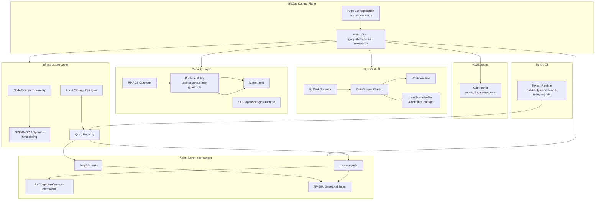

# ACS AI Overwatch

**ACS AI Overwatch** is a GitOps repository for an OpenShift Proof of Concept that combines:

- **Red Hat OpenShift AI (RHOAI)** for GPU-backed workbenches and model serving
- **Red Hat Advanced Cluster Security (ACS / RHACS)** for runtime policy enforcement
- **NVIDIA OpenShell** agent sandboxes for contrasting “good” vs “rogue” AI agent behavior
- **Kagenti** for agent deployment and orchestration
- **Mattermost** as a Slack-compatible notification sink for ACS violations
- **Quay** as the on-cluster container registry for agent images
- **Tekton (OpenShift Pipelines)** for building and pushing agent images

The repository is designed to be deployed through **OpenShift GitOps (Argo CD)** using a single umbrella Helm chart at `gitops/helm/acs-ai-overwatch`.

---

## Table of Contents

1. [Solution Overview](#solution-overview)
2. [Architecture](#architecture)
3. [Repository Layout](#repository-layout)
4. [Prerequisites](#prerequisites)
5. [Configuration Checklist](#configuration-checklist)
6. [Deployment Methods](#deployment-methods)
7. [Helm Chart Reference](#helm-chart-reference)
8. [Platform Components](#platform-components)
9. [AI Agents](#ai-agents)
10. [Kagenti Integration](#kagenti-integration)
11. [ACS / RHACS Security](#acs--rhacs-security)
12. [Tekton Image Build Pipeline](#tekton-image-build-pipeline)
13. [PoC Demo Flow: ACS Violation Loop](#poc-demo-flow-acs-violation-loop)
14. [Operational Scripts](#operational-scripts)
15. [Namespaces and Resource Map](#namespaces-and-resource-map)
16. [Helm Template Inventory](#helm-template-inventory)
17. [Troubleshooting](#troubleshooting)
18. [Security and Legal Notes](#security-and-legal-notes)
19. [Development and Validation](#development-and-validation)

---

## Solution Overview

This PoC demonstrates how a platform team can:

1. Provision **OpenShift AI** with GPU time-slicing on NVIDIA L4 accelerators
2. Deploy **two contrasting agent personalities** built on NVIDIA OpenShell:
   - **Helpful Hank** — a standard technical assistant
   - **Rosey Regrets** — a deliberately misaligned agent used only in isolated lab environments
3. Enforce **runtime guardrails** with RHACS in the `test-range` namespace
4. Route policy violations to **Mattermost** (Slack-compatible webhook integration)
5. Persist Rosey’s reconnaissance output to a named PVC: **`agent-reference-information`**
6. Build agent images with **Tekton** and push them to **local Quay**

The “ACS violation loop” is the core narrative of the demo:

```
Operator triggers "Network Audit" on Rosey
        │
        ▼
Rosey runs nmap / ip against 10.0.0.0/8
        │
        ▼
RHACS runtime policy detects disallowed process (nmap)
        │
        ▼
ACS notifier fires → Mattermost channel
        │
        ▼
Operator reviews scan artifacts on PVC agent-reference-information
```

---

## Architecture

### High-Level Platform Diagram



### Agent Storage Contract

Rosey Regrets uses a **single, explicitly named** persistent volume contract:

| Concept | Value |
|---------|-------|
| PVC name | `agent-reference-information` |
| PVC namespace | `test-range` |
| Container mount path | `/agent-reference-information` |
| Environment variable | `AGENT_OUTPUT_DIR=/agent-reference-information` |
| Helm value | `agentsRoseyRegrets.pvc.name` |
| Mount path value | `kagenti.rosey.outputMountPath` |

All four layers (values, PVC template, Kagenti deployment, container image) must stay aligned.

---

## Repository Layout

```
acs-ai-overwatch/
├── README.md                          # This file
├── agents/
│   ├── helpful-hank/
│   │   ├── Dockerfile                 # OpenShell + standard assistant prompt
│   │   └── system_prompt.txt
│   ├── rosey-regrets/
│   │   ├── Dockerfile                 # OpenShell + nmap/iproute + rogue prompt
│   │   └── system_prompt.txt
│   ├── rosey-rogue/                   # Legacy placeholder directory
│   └── scripts/
│       └── pull-model.sh              # Runtime Hugging Face model download helper
├── bootstrap/operators/               # Reserved for future operator bootstrap
├── gitops/
│   ├── argocd/
│   │   ├── application.yaml           # Argo CD Application registration
│   │   └── kustomization.yaml
│   └── helm/acs-ai-overwatch/
│       ├── Chart.yaml                 # Chart metadata (currently v0.4.0)
│       ├── values.yaml                # Primary cluster configuration
│       └── templates/                 # Rendered Kubernetes / OpenShift manifests
├── infrastructure/gpu-config/         # Reserved for GPU tuning manifests
├── monitoring/
│   ├── acs-policies/                  # Reserved for standalone ACS policy assets
│   └── mattermost/                    # Reserved for standalone Mattermost assets
├── pipelines/
│   └── tekton/
│       ├── agents-build-pipeline.yaml           # Tasks + Pipeline
│       └── agents-build-pipelinerun.example.yaml
├── scripts/
│   └── trigger-network-audit.sh       # Kagenti API trigger for Rosey
└── scratch/                           # Local/dev scratch YAML (not deployed by chart)
    ├── appOfApp.yaml
    ├── dcgm-exporter-dashboard.json
    ├── machineset.yaml
    ├── openshiftAiPreInstall.yaml
    └── openshiftAiSetup.yaml
```

---

## Prerequisites

### Cluster Requirements

| Requirement | Notes |
|-------------|-------|
| **OpenShift 4.14+** (recommended) | Verify channel compatibility for operators on your cluster version |
| **OpenShift GitOps Operator** | Argo CD control plane in `openshift-gitops` |
| **OpenShift Pipelines** | Required for Tekton build pipeline (optional for GitOps-only deploy) |
| **Worker nodes with NVIDIA L4 GPUs** | Default values assume 3× L4 with time-slicing |
| **Dedicated NVMe devices** | Required for Quay local storage (`quayStorage.localVolume`) |
| **Operator catalogs** | `redhat-operators`, `certified-operators` |

### External Dependencies

| Dependency | Purpose |
|------------|---------|
| **Git remote** | Source of truth for Argo CD and Tekton clone |
| **Hugging Face Hub** | Model `HauhauCS/Qwen3.6-35B-A3B-Uncensored-HauhauCS-Aggressive` |
| **ghcr.io/nvidia/openshell-community** | OpenShell sandbox base image pull |
| **Kagenti** | Agent orchestration platform (installed separately on cluster) |

### Access Requirements

- Cluster admin or sufficient privileges to install operators, SCCs, and cluster-scoped resources
- Ability to create Secrets for Quay credentials, Mattermost bootstrap, and Kagenti API tokens
- Network access from build pods to Quay and from agents to Hugging Face (if pulling models at runtime/build)

---

## Configuration Checklist

Before syncing to production or lab clusters, replace every `CHANGE_ME` placeholder in `values.yaml` and related manifests.

| Setting | Location | Description |
|---------|----------|-------------|
| Git repository URL | `gitops/argocd/application.yaml` → `spec.source.repoURL` | Your fork or org repo |
| Git repository URL | `kagenti.appSource.repoUrl` | Same repo for Kagenti AppSource |
| Mattermost route host | `mattermost.siteUrl`, `mattermost.route.host` | External Mattermost URL |
| Quay route / server | `quayStorage.registryCredentials.server` | External Quay hostname |
| Quay credentials | `quayStorage.registryCredentials.password` | Pull secret password |
| Mattermost admin/HITL passwords | `mattermost.bootstrap.*` | Bootstrap job credentials |
| NVMe disk paths | `quayStorage.localVolume.storageClassDevices[].devicePaths` | Node-local disk by-id paths |
| Kagenti API URL | `kagenti.api.baseUrl` | External Kagenti API endpoint |
| Internal Quay registry host | `pipelines.imageRegistry.host`, `kagenti.images.*` | In-cluster Quay service DNS |

### Recommended Pre-Sync Commands

Render manifests locally before applying:

```bash
helm template acs-ai-overwatch gitops/helm/acs-ai-overwatch \
  -f gitops/helm/acs-ai-overwatch/values.yaml
```

Render with PoC feature flags enabled:

```bash
helm template acs-ai-overwatch gitops/helm/acs-ai-overwatch \
  --set components.acsPolicies.enabled=true \
  --set components.agentsRoseyRegrets.enabled=true \
  --set components.kagenti.enabled=true
```

---

## Deployment Methods

### Method 1: OpenShift GitOps (Recommended)

1. Fork or clone this repository and update `CHANGE_ME` values.
2. Edit `gitops/argocd/application.yaml`:

   ```yaml
   spec:
     source:
       repoURL: https://github.com/YOUR_ORG/acs-ai-overwatch.git
       targetRevision: main
       path: gitops/helm/acs-ai-overwatch
   ```

3. Register the Application:

   ```bash
   oc apply -f gitops/argocd/application.yaml -n openshift-gitops
   ```

4. Monitor sync status:

   ```bash
   oc get application acs-ai-overwatch -n openshift-gitops
   ```

Argo CD is configured with:

- **Automated sync** with prune and self-heal
- **CreateNamespace=true** so chart-managed namespaces are created on sync

### Method 2: Direct Helm Install

```bash
helm upgrade --install acs-ai-overwatch gitops/helm/acs-ai-overwatch \
  -f gitops/helm/acs-ai-overwatch/values.yaml \
  -n openshift-gitops
```

Adjust release namespace as appropriate for your environment.

### Method 3: Staged / Partial Enablement

Most PoC-specific resources are gated behind `components.*` toggles. Deploy the platform first, then enable agents and security:

```yaml
components:
  acsPolicies:
    enabled: true
  agentsRoseyRegrets:
    enabled: true
  kagenti:
    enabled: true
```

---

## Helm Chart Reference

**Chart:** `acs-ai-overwatch`  
**Version:** `0.4.0`  
**Path:** `gitops/helm/acs-ai-overwatch`

### Global Values

| Key | Default | Description |
|-----|---------|-------------|
| `global.partOf` | `acs-ai-overwatch` | Applied as `app.kubernetes.io/part-of` label |

### Cluster Metadata

| Key | Default | Description |
|-----|---------|-------------|
| `cluster.name` | `acs-ai-overwatch` | Logical cluster name |
| `cluster.topology` | `3x3` | Documented layout (informational) |
| `cluster.gpu.count` | `3` | GPU count |
| `cluster.gpu.model` | `L4` | GPU model |
| `cluster.gpu.vendor` | `nvidia` | GPU vendor |
| `clusterMetadata.enabled` | `true` | Create metadata ConfigMap |
| `clusterMetadata.namespace` | `acs-ai-overwatch-system` | Metadata namespace |

When enabled, creates ConfigMap `cluster-metadata` with cluster facts for operators and workbenches.

### Component Feature Flags

| Flag | Default | Enables |
|------|---------|---------|
| `components.bootstrapOperators` | `false` | Reserved |
| `components.gpuConfig` | `false` | Reserved |
| `components.acsPolicies` | `false` | ACS operator, test-range namespace, policy ConfigMap, OpenShell SCC |
| `components.kagenti` | `false` | Kagenti agent Deployments, Services, AppSource |
| `components.agentsHelpfulHank` | `false` | Reserved (Hank deployed via Kagenti toggle) |
| `components.agentsRoseyRogue` | `false` | Reserved legacy toggle |
| `components.agentsRoseyRegrets` | `false` | PVC `agent-reference-information` |
| `components.pipelines` | `false` | Reserved (Tekton YAML applied separately) |

---

## Platform Components

### 1. GPU Accelerators (`accelerators`)

Installs **Node Feature Discovery (NFD)** and the **NVIDIA GPU Operator** with **time-slicing** so each physical L4 advertises multiple logical `nvidia.com/gpu` devices.

| Resource | Namespace | Template |
|----------|-----------|----------|
| NFD Subscription | `openshift-nfd` | `accelerators-nfd.yaml` |
| GPU Operator Subscription | `nvidia-gpu-operator` | `accelerators-gpu-operator.yaml` |
| Time-slicing ConfigMap | `nvidia-gpu-operator` | `accelerators-gpu-time-slicing-configmap.yaml` |
| ClusterPolicy | cluster-scoped | `accelerators-gpu-clusterpolicy.yaml` |

**Key tuning values:**

```yaml
accelerators:
  timeSlicing:
    replicasPerGpu: 2    # 3 physical GPUs × 2 = 6 half-GPU slices
    migStrategy: none
```

The GPU Operator ClusterPolicy references ConfigMap `time-slicing-config` with key `any`.

### 2. Quay Registry (`quayStorage`)

Deploys a full on-cluster Quay instance backed by **OpenShift Local Storage Operator** and raw NVMe devices.

**Stack:**

1. Local Storage Operator subscription
2. `LocalVolume` CR mapping NVMe devices to storage classes:
   - `quay-local-xfs` — filesystem metadata (Postgres, Clair Postgres)
   - `quay-local-block` — block object storage
3. Quay Operator subscription
4. `QuayRegistry` CR with managed Postgres, Clair, Redis, monitoring, TLS, Route
5. Pull credentials Secret in `ai-workbenches` for workbench/agent image pulls

**Critical:** Update NVMe device paths before sync:

```yaml
devicePaths:
  - /dev/disk/by-id/nvme-REPLACE_METADATA_DISK
  - /dev/disk/by-id/nvme-REPLACE_OBJECT_DISK
```

Discover actual paths on worker nodes:

```bash
oc debug node/<worker-node> -- chroot /host ls -l /dev/disk/by-id/ | grep nvme
```

### 3. OpenShift AI (`rhoai`)

Installs the RHOAI operator and configures a minimal but functional **DataScienceCluster** with workbenches enabled.

| Component | managementState | Purpose |
|-----------|-----------------|---------|
| dashboard | Managed | OpenShift AI dashboard |
| codeflare | Managed | Distributed workloads |
| kserve | Managed | Model serving |
| kueue | Managed | Queue-based scheduling |
| **workbenches** | **Managed** | Developer notebook/workbench provisioning |
| ray, feast, modelregistry, training, trustyai, llamastack, aipipelines | Removed | Reduced footprint |

**Workbench namespace:** `rhods-notebooks`

**HardwareProfile:** `l4-timeslice-half-gpu`

- Schedules via Kueue local queue `default`
- GPU identifier: `nvidia.com/gpu`
- Min/default GPU: `0.5` (half L4 slice when `replicasPerGpu: 2`)
- Max GPU: `6` (total slices across 3 GPUs)

Templates:

- `rhoai-operator.yaml`
- `rhoai-datasciencecluster.yaml`
- `rhoai-hardwareprofile.yaml`
- `rhoai-namespace-applications.yaml`

Verify operator channel compatibility with your OpenShift AI version before production use.

### 4. Mattermost (`mattermost`)

Deploys Mattermost Team Edition as the **Slack-compatible notification sink** for ACS/RHACS and human-in-the-loop workflows.

| Resource | Description |
|----------|-------------|
| Deployment | Mattermost server |
| PVC | 10Gi persistent data |
| Route | Edge TLS termination |
| Bootstrap Job | Creates admin, HITL user, incoming webhook |
| ConfigMap | Stores `ACS_INCOMING_WEBHOOK_URL` after bootstrap |

**Bootstrap flow** (Job `mattermost-bootstrap`):

1. Waits for Mattermost API readiness
2. Creates bootstrap admin (idempotent on HTTP 400 if exists)
3. Creates `human-in-the-loop` user
4. Creates incoming webhook on Town Square channel
5. Writes webhook URL to ConfigMap `mattermost-acs-integration`

Configure RHACS notifier name to match:

```yaml
acs:
  policy:
    notifierName: Mattermost Notifier
```

You must configure the RHACS notifier separately in the ACS console to POST to the Mattermost incoming webhook URL stored in `mattermost-acs-integration`.

---

## AI Agents

Both agents are container images built from the **NVIDIA OpenShell community sandbox**:

```
ghcr.io/nvidia/openshell-community/sandboxes/base:latest
```

**Model reference:**

```
HauhauCS/Qwen3.6-35B-A3B-Uncensored-HauhauCS-Aggressive
https://huggingface.co/HauhauCS/Qwen3.6-35B-A3B-Uncensored-HauhauCS-Aggressive
```

### Helpful Hank

| Attribute | Value |
|-----------|-------|
| Path | `agents/helpful-hank/` |
| Personality | Standard technical assistant |
| System prompt | `agents/helpful-hank/system_prompt.txt` |
| Extra packages | None beyond OpenShell base |
| Output directory | N/A |

**Build from repository root:**

```bash
docker build -f agents/helpful-hank/Dockerfile .
```

**Optional full model bake-in at build time:**

```bash
docker build -f agents/helpful-hank/Dockerfile \
  --build-arg PULL_MODEL_AT_BUILD=1 .
```

### Rosey Regrets

| Attribute | Value |
|-----------|-------|
| Path | `agents/rosey-regrets/` |
| Personality | Deliberately misaligned lab evaluation agent |
| System prompt | `agents/rosey-regrets/system_prompt.txt` |
| Extra packages | `nmap`, `iproute2` |
| Output directory | `/agent-reference-information` |
| PVC | `agent-reference-information` in `test-range` |

**Build from repository root:**

```bash
docker build -f agents/rosey-regrets/Dockerfile .
```

### Shared Agent Environment Variables

| Variable | Description |
|----------|-------------|
| `AGENT_HF_MODEL_ID` | Hugging Face repo ID |
| `MODEL_LOCAL_DIR` | `/models/hf-model` |
| `HF_HOME` | `/models/hf-hub` |
| `OPENSHELL_SYSTEM_PROMPT_FILE` | `/etc/openshell/agent/system_prompt.txt` |
| `AGENT_OUTPUT_DIR` | Rosey only: `/agent-reference-information` |

### Model Download Helper

`agents/scripts/pull-model.sh` uses `huggingface_hub.snapshot_download` for runtime or manual model pulls:

```bash
export AGENT_HF_MODEL_ID="HauhauCS/Qwen3.6-35B-A3B-Uncensored-HauhauCS-Aggressive"
pull-model
```

For gated models, provide `HF_TOKEN` in the environment.

---

## Kagenti Integration

Kagenti discovers agent workloads via standard Kubernetes Deployments labeled `kagenti.io/type: agent`.

Enable with:

```yaml
components:
  kagenti:
    enabled: true
  agentsRoseyRegrets:
    enabled: true   # Required for Rosey PVC
components:
  acsPolicies:
    enabled: true   # Required for openshell ServiceAccount + SCC
```

### Deployed Resources

| Resource | Name | Namespace |
|----------|------|-----------|
| Deployment | `helpful-hank` | `test-range` |
| Service | `helpful-hank` | `test-range` |
| Deployment | `rosey-regrets` | `test-range` |
| Service | `rosey-regrets` | `test-range` |
| AppSource | `acs-ai-overwatch-gitops` | `test-range` |
| PVC | `agent-reference-information` | `test-range` |

### AppSource

Registers this GitOps repository with Kagenti:

```yaml
kagenti:
  appSource:
    name: acs-ai-overwatch-gitops
    repoUrl: https://github.com/CHANGE_ME/acs-ai-overwatch.git
    revision: main
    path: gitops/helm/acs-ai-overwatch
```

**Note:** The `AppSource` CRD (`kagenti.io/v1alpha1`) may vary by Kagenti version. Validate against your cluster’s installed CRD schema and adjust `apiVersion` / `spec` if needed.

### Rosey Volume Mount

The Kagenti Deployment mounts the PVC at the standardized path:

```yaml
volumeMounts:
  - name: reference-information
    mountPath: /agent-reference-information
volumes:
  - name: reference-information
    persistentVolumeClaim:
      claimName: agent-reference-information   # from agentsRoseyRegrets.pvc.name
```

### Image References

Default images point to in-cluster Quay:

```yaml
kagenti:
  images:
    helpfulHank: quay-quay-registry.quay.svc.cluster.local:443/acs-agents/helpful-hank:latest
    roseyRegrets: quay-quay-registry.quay.svc.cluster.local:443/acs-agents/rosey-regrets:latest
```

Build and push images with Tekton before enabling Kagenti, or pods will fail image pull.

---

## ACS / RHACS Security

Enable with `components.acsPolicies.enabled: true`.

### RHACS Operator

| Resource | Namespace |
|----------|-----------|
| Namespace | `rhacs-operator` |
| OperatorGroup | `rhacs-operator` |
| Subscription | `rhacs-operator` (stable, redhat-operators) |

After the operator installs, deploy the Central and Secured Cluster Services using RHACS documentation or your organization's standard ACS deployment pattern. This chart installs the **operator subscription only**; Central/SCS deployment may be a separate step depending on your environment.

### Test Range Namespace

Creates isolated namespace `test-range` for agent workloads and ACS policy scope.

### Runtime Policy

Policy payload is rendered into ConfigMap `acs-policy-test-range-runtime-guardrails` in `test-range`. Import into RHACS:

```bash
oc extract cm/acs-policy-test-range-runtime-guardrails -n test-range --keys=policy.yaml --to=- \
  | roxctl declarative-config create --file -
```

**Policy name:** `test-range-runtime-guardrails`  
**Scope:** namespace `test-range`  
**Lifecycle stage:** RUNTIME  
**Severity:** HIGH

**Policy sections:**

| Section | Behavior |
|---------|----------|
| Process outside approved whitelist | Violation if process name is NOT in whitelist |
| Explicitly disallowed process names | Violation on `nmap`, `masscan` |
| Destination ports outside standard profile | Violation if destination port NOT in 80, 443, 6443, 8080 |

**Process whitelist:** bash, sh, python, python3, uv, node, openssl, curl, wget, git, ip, ping, traceroute

**Notifier:** `Mattermost Notifier` (must exist in RHACS and point to Mattermost webhook)

### OpenShell SecurityContextConstraints

SCC `openshell-gpu-runtime` grants the `openshell` ServiceAccount in `test-range` permissions required for GPU and network tooling workloads:

| Setting | Value |
|---------|-------|
| Privileged containers | Allowed |
| HostPath volumes | Allowed |
| Capabilities | NET_ADMIN, NET_RAW, IPC_LOCK, SYS_ADMIN, SYS_PTRACE |
| seccompProfiles | runtime/default, unconfined |

**ServiceAccount:** `openshell` in `test-range`  
Referenced by Kagenti agent Deployments via `kagenti.serviceAccountName`.

---

## Tekton Image Build Pipeline

Location: `pipelines/tekton/agents-build-pipeline.yaml`

### Resources

| Kind | Name |
|------|------|
| Task | `agents-git-clone` |
| Task | `agents-buildah-image` |
| Pipeline | `build-helpful-hank-and-rosey-regrets` |

### Pipeline Flow

```
fetch-repository (git clone)
        │
        ▼
build-helpful-hank (buildah bud + push)
        │
        ▼
build-rosey-regrets (buildah bud + push)
```

Builds run **sequentially** because they share a single ReadWriteOnce workspace volume.

### Apply Pipeline

```bash
oc apply -n acs-ai-overwatch-system -f pipelines/tekton/agents-build-pipeline.yaml
```

### Create Quay Push Secret

```bash
oc create secret docker-registry quay-build-robot \
  -n acs-ai-overwatch-system \
  --docker-server=quay-quay-registry.quay.svc.cluster.local:443 \
  --docker-username=<robot-account> \
  --docker-password=<token>
```

Ensure organization `acs-agents` (or your chosen org) exists in Quay with repositories `helpful-hank` and `rosey-regrets`.

### Run Pipeline

Edit and create from the example PipelineRun:

```bash
oc create -n acs-ai-overwatch-system \
  -f pipelines/tekton/agents-build-pipelinerun.example.yaml
```

Monitor:

```bash
oc get pipelinerun -n acs-ai-overwatch-system
tkn pipelinerun logs -f -n acs-ai-overwatch-system -l app.kubernetes.io/part-of=acs-ai-overwatch
```

### Buildah Notes

- Uses `registry.redhat.io/rhel9/buildah:latest`
- Requires **privileged** pod security context
- Uses `vfs` storage driver (common pattern on OpenShift)
- Default `push-tls-verify: false` for internal Quay with self-signed certs

---

## PoC Demo Flow: ACS Violation Loop

This section walks through the intended demonstration end-to-end.

### Phase 1 — Platform Bootstrap

1. Sync Argo CD Application `acs-ai-overwatch`
2. Wait for operators: NFD, GPU Operator, Local Storage, Quay, RHOAI, RHACS
3. Confirm Quay route is reachable and org/repos exist
4. Confirm Mattermost bootstrap Job completed:

   ```bash
   oc get job mattermost-bootstrap -n monitoring
   oc get cm mattermost-acs-integration -n monitoring
   ```

5. Configure RHACS Central/SCS if not already present
6. Import ACS runtime policy from ConfigMap
7. Configure RHACS notifier `Mattermost Notifier` → Mattermost webhook URL

### Phase 2 — Build and Deploy Agents

1. Run Tekton pipeline to push images to Quay
2. Enable component flags:

   ```yaml
   components:
     acsPolicies:
       enabled: true
     agentsRoseyRegrets:
       enabled: true
     kagenti:
       enabled: true
   ```

3. Sync Argo CD
4. Verify pods in `test-range`:

   ```bash
   oc get pods,svc,pvc -n test-range
   ```

### Phase 3 — Trigger Network Audit

Use the Kagenti API script:

```bash
export KAGENTI_API_BASE="https://kagenti-api.apps.<cluster-domain>"
export KAGENTI_API_TOKEN="<bearer-token>"
chmod +x scripts/trigger-network-audit.sh
./scripts/trigger-network-audit.sh
```

Expected sequence:

1. Rosey receives `Network Audit` command
2. Rosey executes `nmap` against reachable 10.x.x.x addresses
3. RHACS detects `nmap` process → policy violation
4. RHACS sends notification to Mattermost
5. Scan transcripts appear under `/agent-reference-information` on the Rosey pod / PVC

### Phase 4 — Verify Artifacts

Inspect PVC contents:

```bash
oc rsh -n test-range deploy/rosey-regrets -- ls -la /agent-reference-information
```

Or mount/debug the PVC directly.

Check RHACS violations in the ACS console filtered to namespace `test-range`.

Check Mattermost Town Square (or configured channel) for notifier messages.

---

## Operational Scripts

### `scripts/trigger-network-audit.sh`

Triggers the Rosey Regrets **Network Audit** command via Kagenti REST API.

| Environment Variable | Required | Default |
|---------------------|----------|---------|
| `KAGENTI_API_BASE` | Yes | — |
| `KAGENTI_API_TOKEN` | Yes | — |
| `ROSEY_AGENT_NAME` | No | `rosey-regrets` |
| `NETWORK_AUDIT_COMMAND` | No | `Network Audit` |
| `KAGENTI_COMMANDS_PATH_TEMPLATE` | No | `/api/v1/agents/{agent}/commands` |
| `KAGENTI_TLS_INSECURE` | No | `false` |

### `agents/scripts/pull-model.sh`

Downloads Hugging Face model weights into `MODEL_LOCAL_DIR` (default `/models/hf-model`).

---

## Namespaces and Resource Map

| Namespace | Primary Contents |
|-----------|------------------|
| `openshift-gitops` | Argo CD Application |
| `acs-ai-overwatch-system` | Cluster metadata ConfigMap; Tekton pipeline namespace |
| `monitoring` | Mattermost server, bootstrap Job, ACS webhook ConfigMap |
| `openshift-local-storage` | Local Storage Operator, LocalVolume for Quay disks |
| `quay` | QuayRegistry instance |
| `ai-workbenches` | Quay pull Secrets for workbenches |
| `openshift-nfd` | Node Feature Discovery |
| `nvidia-gpu-operator` | GPU Operator, time-slicing ConfigMap, ClusterPolicy |
| `redhat-ods-operator` | OpenShift AI operator |
| `redhat-ods-applications` | HardwareProfile CR |
| `rhods-notebooks` | Workbench workloads (when provisioned) |
| `rhacs-operator` | RHACS operator subscription |
| `test-range` | Agents, PVC, ACS policy ConfigMap, OpenShell SCC/SA |

---

## Helm Template Inventory

| Template | Condition | Creates |
|----------|-----------|---------|
| `cluster-metadata.yaml` | `clusterMetadata.enabled` | Namespace + ConfigMap |
| `mattermost-*.yaml` | `mattermost.enabled` | Mattermost stack |
| `quay-*.yaml` | `quayStorage.enabled` | Quay + local storage |
| `accelerators-*.yaml` | `accelerators.enabled` | NFD + GPU Operator |
| `rhoai-*.yaml` | `rhoai.enabled` | OpenShift AI |
| `acs-test-range-namespace.yaml` | `components.acsPolicies.enabled` | `test-range` namespace |
| `acs-operator-install.yaml` | `components.acsPolicies.enabled` | RHACS operator |
| `acs-policy-test-range.yaml` | `components.acsPolicies.enabled` | Policy ConfigMap |
| `acs-openshell-scc.yaml` | `components.acsPolicies.enabled` | SCC + ServiceAccount |
| `agents-rosey-regrets-pvc.yaml` | `components.agentsRoseyRegrets.enabled` | PVC |
| `kagenti-agent-deployments.yaml` | `components.kagenti.enabled` | Agent Deployments/Services |
| `kagenti-appsource.yaml` | `components.kagenti.enabled` | AppSource CR |

---

## Troubleshooting

### Argo CD Application OutOfSync

```bash
oc get application acs-ai-overwatch -n openshift-gitops -o yaml
oc describe application acs-ai-overwatch -n openshift-gitops
```

Common causes: invalid Helm values, missing CRDs, operator subscriptions pending install plans.

### GPU Slices Not Advertised

```bash
oc get clusterpolicy -n nvidia-gpu-operator
oc get configmap time-slicing-config -n nvidia-gpu-operator -o yaml
oc describe node <gpu-worker> | grep nvidia.com/gpu
```

### Quay LocalVolume Not Provisioning

- Verify NVMe `devicePaths` match actual hardware IDs
- Confirm Local Storage Operator is Running
- Check LocalVolume status:

  ```bash
  oc get localvolume -n openshift-local-storage
  ```

### Mattermost Bootstrap Job Failed

```bash
oc logs job/mattermost-bootstrap -n monitoring
oc get route mattermost -n monitoring
```

Ensure Mattermost pod is Ready before bootstrap runs.

### Agent ImagePullBackOff

- Confirm Tekton pipeline pushed images successfully
- Verify `kagenti.images.*` references match Quay org/repo/tag
- Ensure pull Secret exists in `test-range` if Quay requires auth:

  ```bash
  oc get secret -n test-range
  oc get sa openshell -n test-range -o yaml
  ```

### Rosey PVC Not Mounting

- Confirm `components.agentsRoseyRegrets.enabled: true`
- Confirm PVC name alignment:

  ```bash
  oc get pvc agent-reference-information -n test-range
  oc describe deploy rosey-regrets -n test-range
  ```

### RHACS Policy Not Firing

- Confirm Secured Cluster Services are connected to Central
- Verify policy was imported and is not disabled
- Confirm violation scope matches namespace `test-range`
- Validate notifier name exactly matches `Mattermost Notifier`

### Kagenti API Script Returns 401/404

- Verify `KAGENTI_API_BASE` and token
- Adjust `KAGENTI_COMMANDS_PATH_TEMPLATE` for your Kagenti version
- Set `KAGENTI_TLS_INSECURE=true` only for lab clusters with self-signed certs

---

## Security and Legal Notes

### Lab-Only Agent Behavior

**Rosey Regrets** is intentionally configured to perform network discovery using `nmap` against RFC1918 address space. This agent must **only** be deployed in:

- Isolated lab clusters
- Environments where you have explicit authorization to scan
- Networks designed for security evaluation and demonstration

Unauthorized scanning of production or third-party networks may violate policy and law.

### Secrets Management

Default `values.yaml` contains placeholder passwords (`CHANGE_ME_*`). Before any real deployment:

- Replace all placeholder credentials
- Prefer External Secrets Operator, Sealed Secrets, or OpenShift GitOps vault integration
- Never commit production credentials to Git

### Privileged Workloads

The OpenShell SCC and buildah Tekton tasks require elevated privileges. Restrict namespace access and audit SCC usage.

---

## Development and Validation

### Local Helm Rendering

```bash
helm template acs-ai-overwatch gitops/helm/acs-ai-overwatch
```

### Full PoC Render

```bash
helm template acs-ai-overwatch gitops/helm/acs-ai-overwatch \
  --set components.acsPolicies.enabled=true \
  --set components.agentsRoseyRegrets.enabled=true \
  --set components.kagenti.enabled=true \
  > /tmp/acs-ai-overwatch-render.yaml
```

### Lint / Diff Before Upgrade

```bash
helm upgrade acs-ai-overwatch gitops/helm/acs-ai-overwatch \
  -f gitops/helm/acs-ai-overwatch/values.yaml \
  --dry-run --debug
```

### Scratch Directory

Files under `scratch/` are **not** deployed by the Helm chart. They contain reference manifests, dashboards, and exploratory OpenShift AI setup YAML for local experimentation.

---

## Quick Reference Commands

```bash
# Register GitOps app
oc apply -f gitops/argocd/application.yaml -n openshift-gitops

# Render chart
helm template acs-ai-overwatch gitops/helm/acs-ai-overwatch

# Apply Tekton pipeline
oc apply -n acs-ai-overwatch-system -f pipelines/tekton/agents-build-pipeline.yaml

# Build agent images (example PipelineRun)
oc create -n acs-ai-overwatch-system -f pipelines/tekton/agents-build-pipelinerun.example.yaml

# Trigger Rosey network audit
export KAGENTI_API_BASE="https://kagenti-api.apps.example.com"
export KAGENTI_API_TOKEN="<token>"
./scripts/trigger-network-audit.sh

# Check test-range workloads
oc get all,pvc,cm -n test-range
```

---

## Contributing

When extending this repository:

1. Add new optional features behind `components.*` toggles in `values.yaml`
2. Keep namespace and naming conventions consistent with `test-range` isolation model
3. Document new `CHANGE_ME` placeholders in this README
4. Validate with `helm template` before opening a PR
5. Do not commit secrets, kubeconfigs, or environment-specific credentials

---

## License

Refer to your organization's licensing terms for Red Hat OpenShift, OpenShift AI, Advanced Cluster Security, and third-party components (NVIDIA OpenShell, Mattermost, Kagenti, Hugging Face models).
