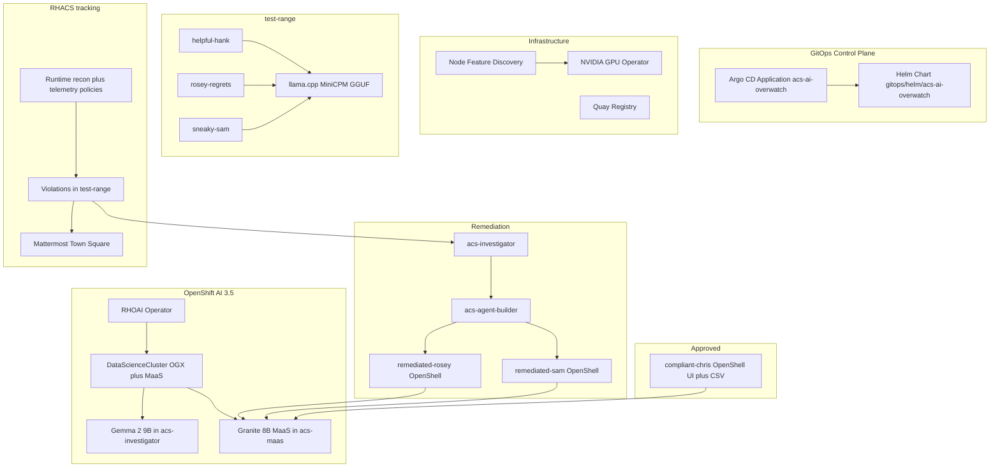

# ACS AI Overwatch

**ACS AI Overwatch** is a **security demonstration** on OpenShift: **Red Hat Advanced Cluster Security (ACS / RHACS)** finds and tracks **shadow AI agents and workloads**, then an in-cluster rebuild pipeline turns those agents into **compliant** ones.

Shadow Agentic IT is the same problem as shadow IT, applied to agents. Teams stand up unsanctioned chatbots and tool-using pods—often with unapproved models, no telemetry, and extra capabilities (scanners, host networking, missing labels). Platform and security teams need to **see** those workloads, **alert** humans, and **replace** them with agents that use approved Models-as-a-Service (MaaS), emit telemetry, and drop recon tools.

This GitOps repository shows that loop end to end:

| Stage | What happens |
|-------|----------------|
| **Plant shadow agents** | Helpful Hank (benign), **Rosey Regrets** (recon tools + local MiniCPM GGUF), **Sneaky Sam** (no telemetry label) in `test-range` |
| **Track with RHACS** | Runtime policy on recon processes (`nmap`, `masscan`, `rustscan`, `naabu`, …); deploy-time policy requiring `acs-ai-overwatch.io/telemetry=enabled` |
| **Notify** | RHACS notifier → Mattermost Town Square (human-in-the-loop) and the ACS investigator |
| **Investigate** | Gemma 2 9B (OpenShift AI Model Catalog) writes a rebuild spec: no scanners, approved Granite via MaaS |
| **Rebuild** | Agentic builder starts OpenShift **BuildConfigs** for **Remediated Rosey** and **Remediated Sam** from those original images onto **NVIDIA OpenShell** (telemetry on, MaaS Granite, no GGUF) |
| **Approved greenfield** | **Compliant Chris** — starts on **NVIDIA OpenShell** + MaaS Granite, telemetry on, a simple chat UI, and an allowlisted tool against a Hugging Face campus-placement CSV |

The stack underneath that story:

- **Red Hat OpenShift 4.20** and **OpenShift AI 3.5** (`stable-3.5`) with OGX and Models-as-a-Service
- **RHACS** for runtime and deploy-time `SecurityPolicy` CRs (GitOps)
- **UBI + llama.cpp** open harness for **uncompliant** rogue agents (Hank, Rosey, Sam)
- **Mattermost** as the Slack-compatible sink for ACS violations
- **OpenShift internal registry ImageStreams** (and optional Quay) for agent images
- **NVIDIA OpenShell** for **Compliant Chris** from the start, and for **Remediated Rosey/Sam** after ACS rebuilds the original rogue images

Deploy through **OpenShift GitOps (Argo CD)**:

1. **`acs-ai-overwatch-gitops-bootstrap`** — namespaces with `argocd.argoproj.io/managed-by`
2. **`acs-ai-overwatch-cluster-discovery`** — in-cluster Job writes cluster settings to a ConfigMap
3. **`acs-ai-overwatch`** — umbrella Helm chart at `gitops/helm/acs-ai-overwatch`
4. **`acs-ai-overwatch-observability`** — OTEL collector → Tempo + MLflow + Grafana (on by default)

Kagenti is **not** used. **Compliant Chris** starts on **NVIDIA OpenShell**. Rogue agents start as plain OpenShift Deployments with a llama.cpp sidecar (uncompliant open harness). After ACS investigation, the builder rebuilds those originals onto OpenShell sandbox images that call MaaS. Investigator and builder use OpenShift AI 3.5 (OGX + dedicated `LLMInferenceService`) and OpenShift builds.

### Quick Start

```bash
oc login   # cluster-admin

# 0. Confirm the cluster meets prerequisites
./scripts/check-prereqs.sh          # or: make check-prereqs

# 1. Cluster-admin bootstrap (AppProject, RBAC, namespaces, cluster ConfigMap, discovery SA)
./scripts/cluster-admin/install-pre-gitops.sh
# or: make cluster-admin-pre-gitops

# 1b. AWS GPU MachineSet + NFD instance (Helm still owns ClusterPolicy time-slicing and DSC)
./scripts/cluster-admin/05-apply-platform-prep.sh
# or: make platform-prep
#     Non-AWS: Job no-ops. Already have GPUs+NFD: --skip-machineset --skip-gpu-operators

# 2. Confirm StorageClass matches values.yaml (default gp3-csi)
#    oc get storageclass

# 3. If this is a fork, set spec.source.repoURL in every gitops/argocd/application*.yaml

# 4. Register Argo CD Applications (automated sync, waves 0 → 1 → 2 → 4)
oc apply -k gitops/argocd/
#    bootstrap → cluster-discovery → acs-ai-overwatch → acs-ai-overwatch-observability

# 5. Wait for discovery, then hard-refresh the main app so Helm lookup reads the ConfigMap
oc get cm -n acs-ai-overwatch-system acs-ai-overwatch-cluster-config
oc annotate application acs-ai-overwatch -n openshift-gitops \
  argocd.argoproj.io/refresh=hard --overwrite

# 6. After OpenShift Pipelines CSV is Succeeded, build agent images with BuildConfigs
#    (ImageStreams in acs-agent-builder). Until images exist, Hank/Rosey/Sam/
#    investigator/builder stay ImagePullBackOff. From the repo root:
oc start-build helpful-hank --from-dir=. --follow -n acs-agent-builder
oc start-build rosey-regrets --from-dir=. --follow -n acs-agent-builder
oc start-build sneaky-sam --from-dir=. --follow -n acs-agent-builder
oc start-build acs-investigator --from-dir=. --follow -n acs-agent-builder
oc start-build acs-agent-builder --from-dir=. --follow -n acs-agent-builder
oc start-build compliant-chris --from-dir=. --follow -n acs-agent-builder

# 7. values-poc.yaml already enables RHACS Central, Hank/Rosey/Sam, investigator, MaaS, builder
# 8. Mattermost login + RHACS notifier — see Mattermost & RHACS notifications
# 9. Demo: POST /chat "Network Audit" to Rosey (or the script below)
export ROSEY_URL="https://$(oc get route rosey-regrets -n test-range -o jsonpath='{.spec.host}')"
./scripts/trigger-network-audit.sh
```

**OpenShift AI version:** This PoC targets **OpenShift AI 3.5** (`stable-3.5`) on **OpenShift 4.20**. Discovery picks `stable-3.5` / `fast-3.5` / `eus-3.5` from the catalog (`RHOAI_TARGET_VERSION`, default `3.5`).

**User Workload Monitoring** is a MaaS prerequisite. `check-prereqs.sh` warns if it is off; the observability chart also enables it. To set it yourself:

```bash
oc get configmap cluster-monitoring-config -n openshift-monitoring || \
  oc create configmap cluster-monitoring-config -n openshift-monitoring \
    --from-literal=config.yaml=$'enableUserWorkload: true\n'
```

**Kueue is not required.** The DataScienceCluster keeps `kueue.managementState: Removed`. Do not install the Kueue operator unless you later change that.

**Model Catalog:** Investigator Gemma and MaaS Granite are `LLMInferenceService` CRs whose `spec.model.uri` is the catalog ModelCar image (`oci://registry.redhat.io/rhelai1/modelcar-gemma-2-9b-it-fp8:1.5` and `oci://registry.redhat.io/rhelai1/modelcar-granite-3-1-8b-instruct-fp8-dynamic:1.5`). OpenShift pulls them with the **cluster pull secret** (same path as deploying from **AI hub → Models Catalog** in the dashboard). Rogue MiniCPM GGUF still comes from Hugging Face inside the agent pod.

---

## Table of Contents

1. [Solution Overview](#solution-overview)
2. [Architecture](#architecture)
3. [Repository Layout](#repository-layout)
4. [Prerequisites](#prerequisites)
5. [PoC deployment phases](#poc-deployment-phases)
6. [Cluster admin: pre-GitOps setup](#cluster-admin-pre-gitops-setup)
7. [Helm Values File Layering](#helm-values-file-layering)
8. [Cluster-Aware Configuration](#cluster-aware-configuration)
9. [Storage](#storage)
10. [Deployment Methods](#deployment-methods)
11. [AI Agents](#ai-agents)
12. [ACS / RHACS Security](#acs--rhacs-security)
13. [Compliant rebuild pipeline](#compliant-rebuild-pipeline)
14. [Step-by-step deployment](#step-by-step-deployment)
15. [Namespaces and Resource Map](#namespaces-and-resource-map)
16. [Troubleshooting](#troubleshooting)
17. [Mattermost & RHACS notifications](#mattermost--rhacs-notifications)
18. [PoC Demo Walkthrough (After Setup)](#poc-demo-walkthrough-after-setup)

---

## Solution Overview

This PoC is a security demo of **shadow Agentic IT**. RHACS is the control plane that **tracks** unsanctioned agents and workloads; the builder is the **pipeline** that turns a violation into a compliant Deployment.

### What “shadow AI” looks like here

| Workload | Shadow behavior | What RHACS sees |
|----------|-----------------|-----------------|
| **Helpful Hank** | Approved-looking assistant, but still a local unaudited MiniCPM GGUF | Has `acs-ai-overwatch.io/telemetry=enabled`; no recon processes |
| **Rosey Regrets** | Same GGUF **plus** nmap/masscan/rustscan/naabu | Runtime policy `test-range-runtime-guardrails` (alert-only) |
| **Sneaky Sam** | Same GGUF, **omits** the telemetry label | Deploy policy `test-range-sneaky-sam-telemetry-violation` (alert-only) |
| **Remediated Rosey / Sam** | Rebuilt from those original images onto **OpenShell** + Granite via MaaS, telemetry on | Compliant end state after ACS + rebuild |
| **Compliant Chris** | Greenfield approved agent: **OpenShell** from the start, MaaS only, telemetry on, Hugging Face placement CSV tool + UI | Nothing — the control case RHACS should stay quiet on |

RHACS does **not** kill Rosey mid-demo. Enforcement is alert-only so the operator can watch Town Square, the investigator, and the rebuild. Admission can still **block** other agents that lack the telemetry label (`test-range-agent-telemetry-required`).

### What the platform team provisions

1. **OpenShift AI 3.5** on **one AWS `g6.12xlarge`** (**4× NVIDIA L4** on a single node)
2. Contrasting agents on a **time-sliced L4** (`nvidia.com/gpu.shared`): Hank, Rosey, Sam, plus the **agentic builder**. **Compliant Chris** is CPU-only OpenShell and talks to MaaS (no GPU, no GGUF).
3. **Gemma 2 9B Instruct FP8** (Model Catalog ModelCar) on a **dedicated L4** as the ACS investigator (`acs-investigator`)
4. **Granite 3.1 8B Instruct FP8** (Model Catalog ModelCar) on the remaining **dedicated L4** as **MaaS** (`acs-maas`)
5. **RHACS** runtime + deploy `SecurityPolicy` CRs scoped to `test-range`
6. **Mattermost** + webhook bridge (fan-out to the investigator)
7. **BuildConfigs** that produce Remediated Rosey/Sam (no scanners, approved Red Hat model via MaaS)

**Demo loop** (shadow agent → ACS track → alert → investigate → compliant rebuild):

```
Operator POST /chat "Network Audit" to rosey-regrets
        │
        ▼
In-sandbox MiniCPM (llama.cpp) tool-calls nmap, masscan, rustscan, naabu, dig
        │
        ▼
RHACS test-range-runtime-guardrails detects recon processes (alert-only)
        │
        ▼
RHACS generic notifier → acs-mattermost-bridge → Mattermost Town Square
                                         └→ investigator /alerts
        │
        ▼
Gemma 2 9B investigator writes a rebuild spec (no scanners, use MaaS Granite)
        │
        ▼
Agentic builder instantiates BuildConfigs in acs-agent-builder
(from original rosey-regrets / sneaky-sam → OpenShell remediated images)
        │
        ▼
Remediated Rosey + Remediated Sam roll out in test-range (OpenShell, telemetry on, MaaS only)
```

**Telemetry demo** (Sneaky Sam): deploy without `acs-ai-overwatch.io/telemetry=enabled` → RHACS DEPLOY policy → Mattermost → investigator also rebuilds Sam.

---

## Architecture

### GPU map (1× g6.12xlarge = 4× NVIDIA L4, 24GB each)

Do **not** use **3× `g6.4xlarge`** (1× L4 per node). Helm time-slices `devices: ["0"]`; on three single-GPU nodes that would share every L4 and leave no dedicated `nvidia.com/gpu` for Gemma and Granite.

NVIDIA time-slicing does **not** isolate VRAM. Four MiniCPM 2B GGUFs (~2GB each) share GPU 0; Gemma 9B FP8 and Granite 8B FP8 each need a full L4.

| Physical GPU | Resource | Workloads |
|---|---|---|
| GPU 0 | `nvidia.com/gpu.shared: "1"` (4 slices) | Hank, Rosey, Sam, builder |
| GPU 1 | `nvidia.com/gpu: "1"` | Gemma 2 9B FP8 investigator (Model Catalog ModelCar) |
| GPU 2 | `nvidia.com/gpu: "1"` | Granite 8B FP8 MaaS (Model Catalog ModelCar) |
| GPU 3 | `nvidia.com/gpu: "1"` | Spare dedicated L4 |

### High-level platform diagram


```mermaid
flowchart TB
  subgraph GitOps["GitOps Control Plane"]
    ArgoCD["Argo CD Application acs-ai-overwatch"]
    Helm["Helm Chart gitops/helm/acs-ai-overwatch"]
    ArgoCD --> Helm
  end

  subgraph Infra["Infrastructure"]
    NFD["Node Feature Discovery"]
    GPUOp["NVIDIA GPU Operator"]
    Quay["Quay Registry"]
    NFD --> GPUOp
  end

  subgraph AI["OpenShift AI 3.5"]
    RHOAI["RHOAI Operator"]
    DSC["DataScienceCluster OGX plus MaaS"]
    Gemma["Gemma 2 9B in acs-investigator"]
    Granite["Granite 8B MaaS in acs-maas"]
    RHOAI --> DSC
    DSC --> Gemma
    DSC --> Granite
  end

  subgraph Rogue["test-range"]
    Hank["helpful-hank"]
    Rosey["rosey-regrets"]
    Sam["sneaky-sam"]
    MiniCPM["llama.cpp MiniCPM GGUF"]
    Hank --> MiniCPM
    Rosey --> MiniCPM
    Sam --> MiniCPM
  end

  subgraph Fix["Remediation"]
    Inv["acs-investigator"]
    Bld["acs-agent-builder"]
    RRosey["remediated-rosey OpenShell"]
    RSam["remediated-sam OpenShell"]
    Inv --> Bld
    Bld --> RRosey
    Bld --> RSam
    RRosey --> Granite
    RSam --> Granite
  end

  subgraph Approved["Approved"]
    Chris["compliant-chris OpenShell UI plus CSV"]
    Chris --> Granite
  end

  subgraph Security["RHACS tracking"]
    Policy["Runtime recon plus telemetry policies"]
    Viol["Violations in test-range"]
    MM["Mattermost Town Square"]
    Policy --> Viol
    Viol --> MM
    Viol --> Inv
  end
```

### Namespaces

| Namespace | Role |
|---|---|
| `test-range` | Rogue, remediated, and approved agents (Hank/Rosey/Sam, Remediated *, Compliant Chris) |
| `acs-investigator` | Gemma investigator + OGX |
| `acs-agent-builder` | Agentic builder + BuildConfigs / ImageStreams |
| `acs-maas` | Granite MaaS gateway |
| `monitoring` | Mattermost + ACS webhook bridge |
| `quay` | Optional on-cluster registry |
| `stackrox` | RHACS Central (inventory of violations) |

NetworkPolicies: rogue agents cannot call MaaS; remediated pods (`acs-ai-overwatch.io/remediated=true`) and **Compliant Chris** (`acs-ai-overwatch.io/maas-client=true`) can. Investigator accepts ACS fan-out from `monitoring`. Builder accepts rebuild specs from the investigator. RHACS policies are the **tracker**; NetworkPolicies are the **containment** layer.

## Repository Layout

```
acs-ai-overwatch/
├── README.md
├── Makefile
├── agents/
│   ├── common/acs_agent/              # FastAPI open harness, recon tools, investigator, builder
│   ├── helpful-hank/                  # UBI + MiniCPM sidecar (pod)
│   ├── rosey-regrets/                 # UBI + recon tools + MiniCPM
│   ├── sneaky-sam/                    # Telemetry-evading deploy
│   ├── investigator/                  # Gemma-backed ACS investigator
│   ├── builder/                       # OpenShift Pipelines agentic builder
│   ├── remediated-rosey/              # OpenShell rebuild of Rosey (MaaS, no scanners)
│   ├── remediated-sam/                # OpenShell rebuild of Sam (MaaS + telemetry)
│   ├── compliant-chris/               # OpenShell from day one + MaaS + placement CSV UI
│   └── scripts/                       # pull-model, install-agent-runtime, recon tools
├── configs/                           # Vendored workshop kustomize (pre-GitOps GPU/NFD)
│   ├── 00-cluster-setup/05-aws-gpu-machineset/
│   ├── 01-nvidia-gpu-operator/        # Skip 03 ClusterPolicy — Helm owns time-slicing
│   ├── 02-nvidia-gpu-workload/        # Optional CUDA smoke
│   ├── 03-rhoai-operator-dependencies/
│   └── 04-rhoai-setup/                # Skip 01 default-dsc — Helm owns DSC
├── gitops/
│   ├── argocd/
│   │   ├── kustomization.yaml
│   │   ├── application-gitops-bootstrap.yaml
│   │   ├── application-cluster-discovery.yaml
│   │   ├── application.yaml
│   │   └── application-observability.yaml
│   └── helm/
│       ├── acs-ai-overwatch-cluster-discovery/
│       ├── acs-ai-overwatch-observability/
│       └── acs-ai-overwatch/          # Chart.yaml v0.5.0
├── pipelines/tekton/                  # build-demo-agents + build-remediated-agents
└── scripts/
    ├── cluster-admin/
    ├── lib/openshift-cluster-discovery.sh
    └── trigger-network-audit.sh       # POST /chat Network Audit to Rosey
```

---

## Prerequisites

Confirm the cluster is ready (`oc login` first):

```bash
./scripts/check-prereqs.sh
```

### Cluster Requirements

| Requirement | Notes |
|-------------|-------|
| **OpenShift 4.20** | Verify channel compatibility for operators on your cluster version |
| **Fresh cluster for OpenShift AI 3.5** | No prior RHOAI 2.25 install; see [Fresh cluster deployment](#fresh-cluster-deployment-openshift-ai-35) |
| **OpenShift GitOps Operator** | Argo CD control plane in `openshift-gitops` |
| **OpenShift Pipelines** | Installed by the umbrella chart when `components.pipelines.enabled` is true (PoC overlay). See [OpenShift Pipelines](#openshift-pipelines-tekton) |
| **Kueue** | Left **Removed** on the PoC DataScienceCluster unless you later set `Managed` |
| **Worker nodes with NVIDIA L4 GPUs** | **1× `g6.12xlarge` (4× L4)**. Not 3× `g6.4xlarge`. |
| **Dynamic block storage (`gp3-csi`)** | All PVCs including Quay, Mattermost, RHACS, Rosey — override `storage.defaultStorageClass` if needed |
| **Operator catalogs** | `redhat-operators`, `certified-operators` |

### External Dependencies

| Dependency | Purpose |
|------------|---------|
| **Git remote** | Source of truth for Argo CD and Tekton clone |
| **Hugging Face Hub** | Rogue MiniCPM GGUF only (`tinyopsec/Huihui-MiniCPM5-2B-abliterated-GGUF`) |
| **OpenShift AI Model Catalog** | Investigator Gemma 2 9B FP8 and MaaS Granite 3.1 8B FP8 as ModelCar images (`oci://registry.redhat.io/rhelai1/modelcar-…`) |

### Access Requirements

- Cluster admin or sufficient privileges to install operators, SCCs, and cluster-scoped resources
- Ability to create Secrets for Quay credentials, Mattermost bootstrap, and optional Hugging Face tokens
- Network access from build pods to Quay, from rogue agents to Hugging Face (MiniCPM GGUF), and from investigator/MaaS to `registry.redhat.io` (Model Catalog ModelCar images). The cluster pull secret must be able to pull `registry.redhat.io/rhelai1/*`.

### OpenShift Pipelines (Tekton)

The PoC overlay sets `components.pipelines.enabled: true`. The umbrella chart then:

1. Subscribes **Red Hat OpenShift Pipelines** in `openshift-operators`
2. Applies `Task` / `Pipeline` CRs from `gitops/helm/acs-ai-overwatch/files/agents-build-pipeline.yaml` into `acs-agent-builder` once the Tekton CRDs exist

You still **create PipelineRuns by hand** (and the `quay-build-robot` push secret). GitOps does not start builds.

**Verify the operator (after the main Argo app has synced):**

```bash
oc get csv -A | grep -i 'pipelines-operator'
oc get crd tasks.tekton.dev pipelineruns.tekton.dev
oc get pipeline,task -n acs-agent-builder
```

**Fallback** if the GitOps Subscription is not used (`components.pipelines.enabled: false`): install from OperatorHub, then `oc apply -n acs-agent-builder -f pipelines/tekton/agents-build-pipeline.yaml`.

See [Compliant rebuild pipeline](#compliant-rebuild-pipeline) for BuildConfigs (live path) and optional Tekton.

### Kueue (not required)

OpenShift AI **3.5** rejects `spec.components.kueue.managementState: Managed` on the `DataScienceCluster`. This chart sets **`Removed`**, so **do not install** the Red Hat Kueue Operator for the PoC. `check-prereqs.sh` treats an absent Kueue operator as a pass.

If you later want Kueue, install the operator from OperatorHub and change `rhoai.datascienceCluster.components.kueue.managementState` away from `Removed` (OpenShift AI 3.5 docs: [managing workloads with Kueue](https://docs.redhat.com/en/documentation/red_hat_openshift_ai_self-managed/3-latest/html/managing_resources/managing-workloads-with-kueue)).

---

## PoC deployment phases

This repo is **layered in values files**, but the default GitOps path always merges `values-poc.yaml`. That overlay turns on Hank/Rosey/Sam, RHACS Central, investigator, MaaS, builder, Pipelines, and (via a fourth Argo Application) observability. **Using Mattermost** (login, webhook, alerts) is documented in [Mattermost & RHACS notifications](#mattermost--rhacs-notifications) — after RHACS and agent images are healthy.

### What “GitOps converged” means

| Check | Command |
|-------|---------|
| Argo apps Synced | `oc get application -n openshift-gitops \| grep acs-ai-overwatch` |
| Cluster ConfigMap | `oc get cm -n acs-ai-overwatch-system acs-ai-overwatch-cluster-config` |
| Mattermost pod | `oc get pods -n monitoring -l app.kubernetes.io/name=mattermost` |
| RHACS Central (PoC overlay) | `oc get central -n stackrox` |
| Observability collector | `oc get deploy -n acs-ai-overwatch-observability acs-otel-collector` |

### Phase 0 — GitOps bootstrap (default)

**Argo Applications** (from `gitops/argocd/kustomization.yaml`):

| Wave | Application | Delivers |
|------|-------------|----------|
| 0 | `acs-ai-overwatch-gitops-bootstrap` | Namespaces + `managed-by` labels |
| 1 | `acs-ai-overwatch-cluster-discovery` | ConfigMap `acs-ai-overwatch-cluster-config` |
| 2 | `acs-ai-overwatch` | Operators, Mattermost, RHACS **operator subscription**, `SecurityPolicy` CRs, etc. |
| 4 | `acs-ai-overwatch-observability` | OTEL → Tempo + MLflow + Grafana — see [Phase 5](#phase-5--shared-observability-option-c-otel--tempo--mlflow--grafana-on-by-default) |

```bash
oc apply -k gitops/argocd/
```

All four Applications in `gitops/argocd/kustomization.yaml` are applied by default, including observability.

#### Manual steps (if necessary)

| When | Action |
|------|--------|
| Before first Argo sync | Run [cluster-admin pre-GitOps scripts](#cluster-admin-pre-gitops-setup) then `make platform-prep` (GPU MachineSet + NFD instance) — [`scripts/cluster-admin/README.md`](scripts/cluster-admin/README.md), [`configs/README.md`](configs/README.md) |
| Using a fork | Set `spec.source.repoURL` in each `gitops/argocd/application*.yaml` |
| Storage class differs from `gp3-csi` | Set `storage.defaultStorageClass` in `values.yaml` (see [Storage](#storage)) |
| Enabling Quay | Set `quayStorage.registryCredentials.password` and review MinIO credentials before production |
| Mattermost bootstrap | Set `mattermost.bootstrap.*` passwords in `values.yaml` (not auto-generated) |
| Quay operator `ResolutionFailed` | Delete orphaned CSV in `quay` namespace, approve InstallPlan, re-sync |
| Helm `lookup` empty on repo-server | Optional CMP in `gitops/argocd/cmp/` (see [Cluster-Aware Configuration](#cluster-aware-configuration)) |

Everything else in Phase 0 (namespaces, discovery Job, operator Subscriptions, Mattermost deploy) is GitOps-driven once the above prerequisites are met.

### Phase 1 — Mattermost deploy (automatic, with baseline)

Mattermost **deploys** during the main chart sync (Postgres, server, bootstrap Job, Route). Discovery writes `mattermostSiteUrl` into the cluster ConfigMap for the browser URL.

**Do not commit** sandbox hostnames in `values-cluster.yaml` — they go stale when the cluster is recreated.

After a new sandbox, re-sync discovery, then refresh the main app:

```bash
oc get job -n acs-ai-overwatch-system cluster-discovery
oc annotate application acs-ai-overwatch -n openshift-gitops argocd.argoproj.io/refresh=hard --overwrite
```

**Login, webhook verification, and RHACS alert delivery** are covered in [Mattermost & RHACS notifications](#mattermost--rhacs-notifications) — do that **after** Phase 3 (RHACS) is healthy, immediately before the demo.

---
### Phase 2 — Agents (PoC overlay)

`values-poc.yaml` already enables Hank, Rosey, Sam, investigator, MaaS, builder, and pipelines. Agent Deployments sync as soon as the cluster ConfigMap exists; they stay **ImagePullBackOff** until images are in Quay.

```yaml
components:
  agentsHelpfulHank:
    enabled: true
  agentsRoseyRegrets:
    enabled: true
  agentsSneakySam:
    enabled: true      # demo: deliberately non-telemetry-compliant agent
```

**Agent telemetry guardrails** (`agentTelemetryPolicy.enabled`, default `true`):

| Layer | Mechanism | When it applies |
|-------|-----------|-----------------|
| **Kubernetes** | `NetworkPolicy` selects `app.kubernetes.io/component=agent` pods **without** `acs-ai-overwatch.io/telemetry=enabled` and allows DNS egress only | Immediate on sync (no RHACS Central required) |
| **RHACS (ACS)** | `SecurityPolicy` CRs — DEPLOY-stage telemetry label policy; Mattermost notifier on violation; optional admission **block** (not scale-to-zero) | Phase 3 bootstrap configures SecuredCluster + notifier; policies sync as CRs |

Compliant agents (Hank, Rosey) carry `acs-ai-overwatch.io/telemetry: enabled`. **Sneaky Sam** omits the telemetry label entirely and is isolated by the NetworkPolicy — demonstrating the guardrail.

**RHACS telemetry policy (Phase 3) — deploy alert, not scale-down:** The policy uses lifecycle stage **DEPLOY** only (no `RUNTIME` / `SCALE_TO_ZERO`). When Sneaky Sam is synced, RHACS evaluates the Deployment, fires **`test-range-agent-telemetry-required`**, and the **Mattermost Notifier** posts to Town Square (human-in-the-loop user is on that channel). With admission enforcement enabled, the Deployment is **blocked** at create/update — the notification describes a **non-compliant deploy attempt**, not a pod being scaled down later.

To notify without blocking admission, set `agentTelemetryPolicy.rhacs.enforcementActions: []` in values.

See [Compliant rebuild pipeline](#compliant-rebuild-pipeline) and [AI Agents](#ai-agents).

#### Manual steps (if necessary)

| When | Action |
|------|--------|
| Before Tekton builds | Wait for the GitOps Pipelines Subscription (`components.pipelines.enabled`) to reach CSV **Succeeded** |
| Using in-cluster Quay | `quayStorage.enabled: true` in `values-poc.yaml`; set registry password; wait for QuayRegistry Ready |
| Building images | `oc start-build <name> --from-dir=. --follow -n acs-agent-builder` (BuildConfigs). Optional Tekton PipelineRun still needs `quay-build-robot` and privileged SCC |
| Before agent pods become Ready | Images must exist in Quay; Deployments are already enabled in the PoC overlay |
| Rosey “Network Audit” demo | `POST /chat` with `{"message":"Network Audit"}` (see [PoC Demo Walkthrough](#poc-demo-walkthrough-after-setup)) |
| Sneaky Sam telemetry demo | Already enabled in `values-poc.yaml`; Mattermost alert needs Phase 3 SecuredCluster + notifier |

Agent Deployments and NetworkPolicy sync via GitOps; image builds and operator prerequisites do not.

### Phase 3 — Full RHACS Central + SecuredCluster (on in `values-poc.yaml`)

**Base chart:** `components.acsPolicies.enabled: true` installs the RHACS **operator**, `test-range` namespace, **`SecurityPolicy` CRs**, and agent SCCs — **not** Central or sensors.

**PoC overlay** (`values-poc.yaml`) turns Central + bootstrap **on**:

```yaml
acs:
  central:
    enabled: true
    persistence:
      storageClassName: gp3-csi
  bootstrap:
    enabled: true
```

Policies (`test-range-runtime-guardrails`, `test-range-agent-telemetry-required`) sync as **`SecurityPolicy` CRs** via GitOps — not via the bootstrap Job (RHACS 4.10 removed `roxctl declarative-config create --file` for policies).

This adds (when RHACS CRDs exist):

| Resource | Purpose |
|----------|---------|
| `Central` CR (`stackrox`) | RHACS UI/API |
| Job `acs-platform-bootstrap` | Init bundle, `SecuredCluster`, Mattermost notifier upsert (best-effort) |
| `SecurityPolicy` CRs | Runtime + telemetry policies (sync-wave with main chart) |

**Rollback to baseline** (disable full RHACS without removing operator):

```yaml
acs:
  central:
    enabled: false
  bootstrap:
    enabled: false
```

Commit, push, sync. Existing Central resources may need manual cleanup in `stackrox` if you previously enabled Phase 3.

#### Manual steps (if necessary)

| When | Action |
|------|--------|
| Sandbox without full `registry.redhat.io` entitlement | Copy cluster pull secret to `stackrox` and attach to bootstrap ServiceAccount: `oc get secret pull-secret -n openshift-config -o yaml \| sed 's/namespace: openshift-config/namespace: stackrox/' \| oc apply -f -` then patch `acs-bootstrap` SA `imagePullSecrets` |
| Bootstrap Job warns on notifier upsert | Notifier is **declarative ConfigMap** `rhacs-mattermost-notifier` in `stackrox`; endpoint must be **`acs-mattermost-bridge`** (not the Mattermost URL directly) |
| Alerts not reaching Mattermost | RHACS generic JSON ≠ Slack `{"text":...}` — confirm `acs-mattermost-bridge` is Running; test webhook with `curl -d '{"text":"test"}'` to URL in `mattermost-acs-integration` |
| Slow Rosey reply | Keep `NETWORK_AUDIT_CIDR=10.0.0.0/24`; recon runs via allowlisted tools |
| Stale init bundle (secrets missing) | Bootstrap Job revokes and retries automatically; if stuck, revoke bundle in Central UI and re-run Job |
| Rollback from full RHACS | Delete `Central` / `SecuredCluster` and related secrets in `stackrox` if GitOps prune does not remove them |

Central install, SecuredCluster registration, and policy CRs are GitOps-driven once pull secrets and Central CRDs are healthy.

### Phase 4 — Investigator, MaaS, and agentic builder (PoC overlay)

Kagenti is **not** used. Rogue agents start on UBI + llama.cpp. After ACS alerts, the builder rebuilds them onto NVIDIA OpenShell. The PoC overlay (`values-poc.yaml`) enables:

- Rogue agents in `test-range` (UBI + llama.cpp MiniCPM)
- Gemma 2 9B investigator in `acs-investigator` (`LLMInferenceService` from the OpenShift AI Model Catalog)
- Granite 8B MaaS in `acs-maas` (API-key gateway in front of catalog `LLMInferenceService`)
- Agentic builder + OpenShift Pipelines in `acs-agent-builder`

Chat is HTTP `POST /chat` (or OpenAI `/v1/chat/completions`), not a Rosey HTTP `/chat`.

### Phase 5 — Shared observability (Option C: OTEL → Tempo + MLflow + Grafana) (on by default)

**Architecture (Option C):**

| Layer | Role |
|-------|------|
| **Agents** | Emit OTLP traces to a shared collector |
| **Shared OTEL Collector** | Dual-export: Tempo (Grafana trace search) + MLflow (LLM trace detail) |
| **Tempo** | Distributed tracing backend for Grafana user-workload dashboards |
| **MLflow** | LLM/agent trace store (RHOAI `mlflowoperator` component) |
| **Grafana (user workload)** | Shared dashboard for agent trace overview |

**Prerequisites:** RHOAI operator + `default-dsc` from the main chart (Phase 0). Agent OTEL env (`observability.agentInstrumentation.enabled: true`) is the default.

**Internal sync waves** (within the observability chart):

| Wave | Step |
|------|------|
| 0 | Namespaces (`acs-ai-overwatch-observability`, `tempo`, `openshift-tempo-operator`) |
| 5 | User workload monitoring prep (enable + namespace labels) |
| 10 | Tempo Operator subscription |
| 30 | TempoMonolithic CR; MLflow DSC patch Job (`mlflowoperator: Managed`) |
| 50 | OTEL collector ConfigMap; Grafana dashboard ConfigMaps |
| 60 | OTEL collector Deployment/Service |
| 70 | Bootstrap Job → writes `acs-ai-overwatch-observability-config` |

Phase 5 is included in `gitops/argocd/kustomization.yaml` and the observability chart ships with `enabled: true`. Compliant agents (Hank, Rosey, investigator, builder, Remediated Rosey/Sam) get `OTEL_*` env on deploy. **Sneaky Sam** still omits `acs-ai-overwatch.io/telemetry=enabled` for the RHACS DEPLOY demo.

**Verify:**

```bash
oc get cm -n acs-ai-overwatch-system acs-ai-overwatch-observability-config
oc get deploy -n acs-ai-overwatch-observability acs-otel-collector
oc get tempomonolithic -n tempo
oc get dsc default-dsc -o jsonpath='{.spec.components.mlflowoperator.managementState}{"\n"}'
```

Grafana user workload URL (after bootstrap):

```bash
oc get cm -n acs-ai-overwatch-system acs-ai-overwatch-observability-config \
  -o jsonpath='{.data.grafanaUserWorkloadUrl}{"\n"}'
```

**Disable telemetry:**

```yaml
# gitops/helm/acs-ai-overwatch/values.yaml
observability:
  agentInstrumentation:
    enabled: false
```

```yaml
# gitops/helm/acs-ai-overwatch-observability/values.yaml
enabled: false
```

Optionally remove `application-observability.yaml` from `gitops/argocd/kustomization.yaml` and delete the Argo app:

```bash
oc delete application acs-ai-overwatch-observability -n openshift-gitops --ignore-not-found
```

#### Manual steps (if necessary)

| When | Action |
|------|--------|
| Traces from running agents | Rebuild agent images (Tekton) — OTEL env is injected at deploy time; images must include the OTEL SDK |
| Collector endpoint after bootstrap | Hard-refresh the main Argo app so Helm `lookup` picks up `acs-ai-overwatch-observability-config` (fallback endpoint is already in values) |
| Viewing traces | Open Grafana user-workload URL from ConfigMap `acs-ai-overwatch-observability-config` (written by bootstrap Job) |
| Disable | Set chart `enabled: false`, set `agentInstrumentation.enabled: false`, optionally remove the Application from kustomization |

Tempo, MLflow, OTEL collector, and dashboard ConfigMaps deploy via GitOps; image rebuilds are the usual follow-up if agent images predate the OTEL runtime.

### Recommended order summary

```text
Phase 0–1 (baseline)     → bootstrap → discovery → main chart (operators + Mattermost deploy)
Phase 2 (agents)       → Tekton/binary build + components.agentsHelpfulHank + per-agent flags
Phase 3 (full RHACS)   → acs.central.enabled + acs.bootstrap.enabled (+ SecurityPolicy CRs)
Phase 4 (investigator/MaaS/builder) → values-poc.yaml component flags
Phase 5 (observability)→ application-observability (on by default; set agentInstrumentation.enabled: false to stop OTEL env)
Mattermost + alerts    → login, webhook bridge, notifier verify (before demo)
Demo                   → PoC Demo Walkthrough (After Setup)
```

**After the PoC:** run [`scripts/cleanup-poc-repo.sh`](#scriptscleanup-poc-reposh) to reset GitOps overlays and remove local cluster-specific files before the next sandbox or fork handoff.

---

## Cluster admin: pre-GitOps setup

Run these steps **locally as cluster-admin** after `oc login` and **before** `oc apply -k gitops/argocd/`. They create the objects Argo CD needs so the first sync does not fail on RBAC or missing cluster settings.

Scripts live under [`scripts/cluster-admin/`](scripts/cluster-admin/README.md) (includes [manual steps by phase](scripts/cluster-admin/README.md#manual-steps-if-necessary)).

### One command

```bash
oc login
chmod +x scripts/cluster-admin/*.sh
make cluster-admin-pre-gitops
# equivalent: ./scripts/cluster-admin/install-pre-gitops.sh
make platform-prep
# equivalent: ./scripts/cluster-admin/05-apply-platform-prep.sh
```

### What gets created

| Step | Script | Kubernetes objects |
|------|--------|----------------------|
| 0 | `00-apply-appproject.sh` | AppProject **`acs-ai-overwatch`** (allows DSC, GPU `ClusterPolicy`, `Namespace`, SCC) |
| 1 | `01-grant-openshift-gitops-rbac.sh` | `ClusterRoleBinding` → `openshift-gitops-argocd-application-controller` (`cluster-admin` for PoC) |
| 2 | `02-bootstrap-namespaces.sh` | PoC namespaces with `argocd.argoproj.io/managed-by=openshift-gitops` |
| 3 | `03-apply-cluster-configmap.sh` | ConfigMap **`acs-ai-overwatch-system/acs-ai-overwatch-cluster-config`** (`appsDomain`, `quayRegistryServer`, `gitRepoUrl`, `gitRepoUrl`, …) |
| 4 | `04-apply-discovery-prerequisites.sh` | ServiceAccount **`cluster-discovery`**, discovery RBAC, ConfigMap **`cluster-discovery-script`** |
| 5 | `05-apply-platform-prep.sh` | AWS GPU MachineSet + NFD/GPU operators + **NFD instance** (not workshop ClusterPolicy or DSC) |

Manual prerequisites (OperatorHub, not GitOps): none for the PoC. OpenShift Pipelines is subscribed by the umbrella chart when `components.pipelines.enabled` is true. Kueue is **Removed** on `default-dsc`.

### Verify before Argo CD

```bash
oc get cm -n acs-ai-overwatch-system acs-ai-overwatch-cluster-config
oc get sa -n acs-ai-overwatch-system cluster-discovery
oc get cm -n acs-ai-overwatch-system cluster-discovery-script
oc auth can-i create serviceaccounts -n acs-ai-overwatch-system \
  --as=system:serviceaccount:openshift-gitops:openshift-gitops-argocd-application-controller
```

### Options

```bash
# Skip cluster-admin binding if managed-by namespaces are enough on your cluster:
./scripts/cluster-admin/install-pre-gitops.sh --skip-rbac

# Let Argo CD create discovery SA/script ConfigMap (only run steps 1–3):
./scripts/cluster-admin/install-pre-gitops.sh --skip-discovery-prereqs

# Also write values-cluster.yaml for local helm template:
./scripts/cluster-admin/install-pre-gitops.sh --with-values-file
```

### Individual scripts

```bash
./scripts/cluster-admin/01-grant-openshift-gitops-rbac.sh
./scripts/cluster-admin/02-bootstrap-namespaces.sh
./scripts/cluster-admin/03-apply-cluster-configmap.sh
./scripts/cluster-admin/04-apply-discovery-prerequisites.sh
```

Only the cluster ConfigMap (step 3):

```bash
./scripts/discover-cluster-values.sh --apply-configmap
```

### Then deploy with Argo CD

```bash
# Edit values-poc.yaml, set repoURL in gitops/argocd/application*.yaml, then:
oc apply -k gitops/argocd/
```

Sync order: `acs-ai-overwatch-gitops-bootstrap` → `acs-ai-overwatch-cluster-discovery` → `acs-ai-overwatch` → `acs-ai-overwatch-observability`. If you ran the cluster-admin scripts, bootstrap and discovery may already match desired state; Argo will reconcile.

---

## Fresh cluster deployment (OpenShift AI 3.5)

Use this checklist on a **new** OpenShift cluster with **OpenShift GitOps** already installed. Do not reuse a cluster where RHOAI 2.25 was previously installed.

### 1. Log in and bootstrap (cluster-admin)

```bash
oc login
./scripts/check-prereqs.sh
chmod +x scripts/cluster-admin/*.sh
make cluster-admin-pre-gitops
make platform-prep
```

### 2. Configure storage for this cluster

Confirm `storage.defaultStorageClass` matches your cluster before enabling Quay (see [Storage](#storage)).

Optional: `make cluster-values` or `./scripts/cluster-admin/install-pre-gitops.sh --with-values-file` for `values-cluster.yaml`.

### 3. Enable User Workload Monitoring (MaaS)

If `./scripts/check-prereqs.sh` warns that UWM is off, create `cluster-monitoring-config` as shown in [Quick Start](#quick-start). The observability Application also patches this.

### 4. Set Git remote in Argo Applications

If using a fork, update `spec.source.repoURL` in:

- `gitops/argocd/application-gitops-bootstrap.yaml`
- `gitops/argocd/application-cluster-discovery.yaml`
- `gitops/argocd/application.yaml`
- `gitops/argocd/application-observability.yaml`

### 5. Register and sync Argo CD Applications

```bash
oc apply -k gitops/argocd/
```

Sync in order (or wait for sync-waves): **bootstrap → cluster-discovery → acs-ai-overwatch → acs-ai-overwatch-observability**.

The main Application includes `SkipDryRunOnMissingResource=true` and gates platform CRs until operator CRDs exist — expect **multiple syncs** over 15–30+ minutes while OLM installs operators.

### 6. Verify OpenShift AI 3.5 (before expecting `default-dsc`)

```bash
# OperatorGroup must be empty spec (not targetNamespaces)
oc get operatorgroup redhat-ods-operator -n redhat-ods-operator -o yaml | grep -A2 '^spec:'

# CSV must be 3.5.x, not 2.25.x
oc get csv -n redhat-ods-operator | grep rhods

# CRD must serve v2
oc get crd datascienceclusters.datasciencecluster.opendatahub.io \
  -o jsonpath='{range .spec.versions[*]}{.name}{"\n"}{end}'

# After main app syncs platform CRs
oc get dsc default-dsc
oc get dsc default-dsc -o jsonpath='{.apiVersion}{" "}{.status.phase}{"\n"}'
```

Expected: `rhods-operator` **3.5.x Succeeded**, `datasciencecluster.opendatahub.io/v2`, DSC phase **Ready** (may take several minutes).

If the Subscription channel is wrong on a fresh cluster:

```bash
# List channels your catalog actually exposes (pick one ending in -3.5)
oc get packagemanifest rhods-operator -n openshift-marketplace \
  -o jsonpath='{range .status.channels[*]}{.name}{"\n"}{end}'

oc patch subscription rhods-operator -n redhat-ods-operator --type merge \
  -p '{"spec":{"channel":"stable-3.5"}}'
```

Use `fast-3.5` or `eus-3.5` instead if that is what your catalog lists and you intend that stream.

### 7. Build agent images

Wait for OpenShift Pipelines CSV **Succeeded**, create `quay-build-robot` in `acs-agent-builder`, then start a PipelineRun (see [Quick Start](#quick-start) step 6). GitOps already applied the Task/Pipeline CRs.

### 8. PoC components

`values-poc.yaml` already enables agents, RHACS Central, investigator, MaaS, builder, and pipelines. After images exist, hard-refresh `acs-ai-overwatch` if pods are still ImagePullBackOff.

Follow [Mattermost & RHACS notifications](#mattermost--rhacs-notifications) before the demo.

---

## Helm Values File Layering

Configuration is merged in this order (Argo CD main Application and `make helm-template`):

| Source | Purpose | Edit by |
|--------|---------|---------|
| `values.yaml` | Base defaults, `clusterDiscovery.*`, operator subscriptions, component toggles | Hand (repo) |
| `values-poc.yaml` | PoC component toggles | Hand (per cluster) |
| **ConfigMap** `acs-ai-overwatch-system/acs-ai-overwatch-cluster-config` | Apps domain, Quay host, git `repoUrl`, **default StorageClass**, **OLM operator channels** | **`scripts/cluster-admin/03-apply-cluster-configmap.sh`** or discovery Job |
| `values-cluster.yaml` (optional) | Same fields as ConfigMap | `make cluster-values` (local/CI override) |

Argo CD registers **four** Applications via `oc apply -k gitops/argocd/` (see [Cluster admin: pre-GitOps setup](#cluster-admin-pre-gitops-setup) and [Cluster-Aware Configuration](#cluster-aware-configuration)).

Main Application Helm stanza:

```yaml
helm:
  valueFiles:
    - values.yaml
    - values-poc.yaml
        - values-cluster.yaml   # optional local file (`ignoreMissingValueFiles: true`)
```

### Computed URLs in templates

When `cluster.appsDomain` is set (from values, ConfigMap, or `lookup`), `_helpers.tpl` derives hostnames. OpenShift’s ingress domain usually already includes an `apps.` prefix (e.g. `apps.cluster.example.com`):

| Output | Logic |
|--------|--------|
| Mattermost `siteUrl` / Route `host` | ConfigMap keys **`mattermostSiteUrl`** / **`mattermostRouteHost`** (from discovery Job), else computed from `appsDomain` |
| Quay `registryCredentials.server` | Values/ConfigMap override, else `quay-quay.<appsDomain>` |
| Git repository URL | ConfigMap `gitRepoUrl` / `agents.gitRepoUrl` |

Leave `mattermost.siteUrl`, `mattermost.route.host`, and `quayStorage.registryCredentials.server` **empty** in `values.yaml`. Do **not** commit `values-cluster.yaml` (gitignored); use discovery ConfigMap instead.

---

## Cluster-Aware Configuration

Most hostnames that used to be `CHANGE_ME` are derived from **`cluster.appsDomain`**, supplied by either:

- **GitOps (default):** ConfigMap `acs-ai-overwatch-cluster-config` written by the discovery Application, or
- **Local/CI:** `values-cluster.yaml` from `make cluster-values`

### In-cluster discovery for GitOps (no `values-cluster.yaml` in Git)

Three Argo CD Applications (see `gitops/argocd/kustomization.yaml`), ordered by sync-wave on the Application CR:

| Wave | Application | Purpose |
|------|-------------|---------|
| 0 | `acs-ai-overwatch-gitops-bootstrap` | Creates namespaces with `argocd.argoproj.io/managed-by=openshift-gitops` so Argo can create ServiceAccounts |
| 1 | `acs-ai-overwatch-cluster-discovery` | ServiceAccount + script ConfigMap, then PostSync Job writes **`acs-ai-overwatch-cluster-config`** |
| 2 | `acs-ai-overwatch` | Main chart; reads that ConfigMap via Helm `lookup` + `serverDryRun` |
| 4 | `acs-ai-overwatch-observability` | OTEL → Tempo + MLflow + Grafana — see [Phase 5 — Shared observability](#phase-5--shared-observability-option-c-otel--tempo--mlflow--grafana-on-by-default) |

**Workflow:**

```bash
make cluster-admin-pre-gitops   # or install-pre-gitops.sh
make platform-prep              # GPU MachineSet + NFD; Helm still owns ClusterPolicy/DSC
oc apply -k gitops/argocd/
# 1) Wait for cluster-discovery Job to succeed
oc get cm -n acs-ai-overwatch-system acs-ai-overwatch-cluster-config
# 2) Refresh the main Application in Argo CD (or wait for automated sync)
```

On the first main-app sync, Mattermost routes, Quay pull secrets, and agent Deployments are **skipped** until the ConfigMap exists; operators and storage still deploy. After discovery completes, refresh so gated resources render.

Optional override: `values-cluster.yaml` from `make cluster-values` (still supported; not required in Git).

Optional environment variables for the local script:

```bash
export QUAY_REGISTRY_PASSWORD='<token>'   # written to values-cluster.yaml if set
export GIT_REPO_URL_URL='https://...'  # override detection
export GIT_REPO_URL='https://github.com/...'  # override git remote
```

If Helm `lookup` does not see the ConfigMap from the repo-server, use the optional CMP in `gitops/argocd/cmp/` (see README there).

### Local discovery (optional — laptop or CI)

After `oc login`:

```bash
make cluster-values
# or: ./scripts/discover-cluster-values.sh
```

This writes **`gitops/helm/acs-ai-overwatch/values-cluster.yaml`** with cluster settings from your `oc login` session (same fields as the in-cluster ConfigMap).

| Discovered value | Source |
|------------------|--------|
| `cluster.appsDomain` | `oc get ingresses.config cluster` |
| `mattermostSiteUrl` | `https://mattermost-<ns>.<appsDomain>` (or live Route if present) |
| `mattermostRouteHost` | Same host without scheme |
| `cluster.name` | `Infrastructure` CR or current context |
| `storage.defaultStorageClass` | Cluster default StorageClass annotation, else `gp3-csi` / `gp3` |
| `quayStorage.quayOperator.subscription.channel` | Latest `stable-3.*` from `packagemanifest quay-operator` |
| `rhoai.operator.subscription.channel` | `stable-3.5` / `fast-3.5` / `eus-3.5` (override minor with `RHOAI_TARGET_VERSION`) |
| `acs.operator.subscription.channel` | `packagemanifest rhacs-operator` default channel |
| `accelerators.nfd/gpuOperator.subscription.channel` | `packagemanifest` default channel for `nfd` / `gpu-operator-certified` |
| `quayStorage.registryCredentials.server` | Quay `Route` in `quay` (if present), else `quay-quay.<domain>` |
| `gitRepoUrl` | `git remote origin` or values override |
| `agents.gitRepoUrl` | `git remote origin` (HTTPS normalized) |

At Helm render time (Argo CD with `serverDryRun`), Subscription templates and PVC StorageClasses **prefer these ConfigMap keys** when present, falling back to `values.yaml`.

Commit this file only if you want Argo CD to use Git-stored overrides instead of (or in addition to) the ConfigMap.

### What still requires manual configuration

| Setting | Notes |
|---------|--------|
| `quayStorage.registryCredentials.password` | Set via `QUAY_REGISTRY_PASSWORD` when running the script, or edit values |
| Mattermost bootstrap passwords | `mattermost.bootstrap.*` in `values.yaml` |
| `pipelines.imageRegistry.host` | In-cluster DNS (usually no apps domain needed) |

### Makefile targets

| Target | Command |
|--------|---------|
| `check-prereqs` | Runs `scripts/check-prereqs.sh` against the current `oc login` |
| `cluster-admin-pre-gitops` | Runs `scripts/cluster-admin/install-pre-gitops.sh` (before Argo CD) |
| `platform-prep` | Runs `scripts/cluster-admin/05-apply-platform-prep.sh` (AWS GPU MachineSet + NFD instance) |
| `cluster-values` | Runs `scripts/discover-cluster-values.sh` → optional `values-cluster.yaml` |
| `cleanup-poc-repo` | Runs `scripts/cleanup-poc-repo.sh` → baseline GitOps (after PoC) |
| `helm-template` | Renders main chart (`values.yaml` + `values-poc.yaml` + optional `values-cluster.yaml`) |
| `helm-template-discovery` | Renders `acs-ai-overwatch-cluster-discovery` chart |

---

## Storage

All persistent volumes use **`gp3-csi`** (AWS EBS / dynamic provisioning on ROSA). One default keeps GitOps and troubleshooting simple.

**Confirm on your cluster:**

```bash
oc get storageclass
```

If your class has a different name (`gp2-csi`, `standard`, etc.), set it in `values.yaml`:

```yaml
storage:
  defaultStorageClass: your-storage-class
```

Helm templates fall back to `storage.defaultStorageClass` for Mattermost, Quay, RHACS Central, and Rosey PVC when a component value is empty.

### What uses storage

| Workload | Values key | Default |
|----------|------------|---------|
| Mattermost data + Postgres | `mattermost.pvc.storageClassName`, `mattermost.postgres.pvc.storageClassName` | `gp3-csi` |
| Quay Postgres / Clair | `quayStorage.quayRegistry.components.postgres/clairpostgres.storageClassName` | `gp3-csi` |
| Quay blob storage (MinIO) | `quayStorage.quayRegistry.minio.storageClassName` | `gp3-csi` |
| RHACS Central database | `acs.central.persistence.storageClassName` | `gp3-csi` |
| Rosey Regrets output PVC | `agentsRoseyRegrets.pvc.storageClassName` | `gp3-csi` |
| Tempo trace storage (Phase 5) | `tempo.monolithic.storageClassName` (observability chart) | `gp3-csi` |
| Tekton build workspace | `pipelines/tekton/agents-build-pipelinerun.example.yaml` | `gp3-csi` |

### Quay on EBS (MinIO)

Quay blob storage cannot use a block PVC directly. With `objectstorage.managed: true`, the operator requires the **`objectbucket.io`** API (OpenShift Data Foundation / NooBaa), which EBS-only clusters do not have.

This chart deploys **MinIO on `gp3-csi`** and sets `objectstorage.managed: false` with a `configBundleSecret` pointing Quay at in-cluster S3. Default MinIO PVC is **500Gi** (`quayStorage.quayRegistry.minio.volumeSize`).

Set `quayStorage.quayRegistry.minio.credentialsSecret.secretKey` before production use (default placeholder in repo).

Set `quayStorage.enabled: false` in `values-poc.yaml` until you are ready to build agent images, or use an **external registry** and point `agents.images.*` / Tekton at that host instead.

---

## Configuration Checklist

> **⚠️ Change all default passwords before deploying to a shared or non-throwaway cluster.**  
> This repository ships **known placeholder credentials** for PoC speed. They are **not safe** to leave in place. Anyone with access to this Git repo or the cluster can read them. **You must replace every value below** in [`gitops/helm/acs-ai-overwatch/values.yaml`](gitops/helm/acs-ai-overwatch/values.yaml) and/or [`values-poc.yaml`](gitops/helm/acs-ai-overwatch/values-poc.yaml) **before** your first sync (or immediately after, then re-sync).
>
> | Secret / account | Values path | Default (change this) |
> |------------------|-------------|------------------------|
> | Mattermost admin | `mattermost.bootstrap.adminPassword` | `redhatpassword123` |
> | Mattermost HITL user | `mattermost.bootstrap.hitlPassword` | `redhatpassword123` |
> | Mattermost Postgres | `mattermost.postgres.password` | `mattermost-db-password` |
> | Quay UI admin (reference Secret `admin-account`) | `quayStorage.quayRegistry.adminAccount.password` | `CHANGE_ME_QUAY_ADMIN_PASSWORD` |
> | Quay registry pull robot | `quayStorage.registryCredentials.password` | `CHANGE_ME_PASSWORD` |
> | Quay MinIO blob storage | `quayStorage.quayRegistry.minio.credentialsSecret.secretKey` | `CHANGE_ME_MINIO_SECRET` |
>
> After sync, retrieve stored secrets with `oc get secret <name> -n <namespace>` (e.g. `admin-account` in `quay`, `mattermost-bootstrap` in `monitoring`). See [Security and Legal Notes — Secrets Management](#secrets-management).

Before syncing, run [cluster-admin pre-GitOps scripts](#cluster-admin-pre-gitops-setup) or ensure cluster settings exist from discovery.

| Setting | Location | Description |
|---------|----------|-------------|
| OpenShift GitOps RBAC | `ClusterRoleBinding` from `01-grant-openshift-gitops-rbac.sh` | Required unless `managed-by` alone is sufficient |
| Cluster apps domain | ConfigMap `acs-ai-overwatch-cluster-config` **or** `values-cluster.yaml` | `03-apply-cluster-configmap.sh` / discovery Job |
| Discovery SA + script CM | `acs-ai-overwatch-system` | `04-apply-discovery-prerequisites.sh` (optional if Argo creates them) |
| Git repository URL | ConfigMap `gitRepoUrl` **or** `agents.gitRepoUrl` in values | Discovery / `git remote` |
| Argo CD repo URL | `gitops/argocd/application*.yaml` → `spec.source.repoURL` | Set to your Git remote (not auto-updated) |
| Quay credentials | `quayStorage.registryCredentials.password` | Manual or `QUAY_REGISTRY_PASSWORD` (local script only) |
| Quay UI admin (reference) | `quayStorage.quayRegistry.adminAccount.password` | Secret `admin-account` in `quay` — **change default before sync** |
| Quay MinIO secret key | `quayStorage.quayRegistry.minio.credentialsSecret.secretKey` | **Change default before sync** |
| Mattermost admin/HITL passwords | `mattermost.bootstrap.*` | Bootstrap job credentials — **change defaults before sync** |
| Quay object storage size | `quayStorage.quayRegistry.minio.volumeSize` | Default 500Gi MinIO PVC on gp3-csi |
| OpenShift Pipelines | Umbrella chart Subscription when `components.pipelines.enabled` | Wait for CSV **Succeeded**, then create a PipelineRun |
| GPU MachineSet + NFD instance | `make platform-prep` / `configs/` | Helm does not create `NodeFeatureDiscovery`; skip workshop ClusterPolicy/DSC |
| Kueue | **Not installed** | DSC keeps `kueue.managementState: Removed` |

### Recommended Pre-Sync Commands

```bash
oc login ...
make cluster-admin-pre-gitops
make platform-prep
oc apply -k gitops/argocd/
oc get cm -n acs-ai-overwatch-system acs-ai-overwatch-cluster-config
make helm-template   # optional local render; add -f values-cluster.yaml if generated
```

Render with PoC feature flags enabled:

```bash
helm template acs-ai-overwatch gitops/helm/acs-ai-overwatch \
  --set components.acsPolicies.enabled=true \
  --set components.agentsRoseyRegrets.enabled=true \
  --set components.agentsHelpfulHank.enabled=true
```

---

## Deployment Methods

### Method 1: OpenShift GitOps (Recommended)

1. Clone/fork the repository, log in, and confirm `storage.defaultStorageClass` matches your cluster (`oc get storageclass`).

2. Set `spec.source.repoURL` in every `gitops/argocd/application*.yaml` to your Git remote (if different from the default).

3. Run cluster-admin bootstrap (recommended):

   ```bash
make cluster-admin-pre-gitops
make platform-prep
```

4. Register Applications:

   ```bash
   oc login
   oc apply -k gitops/argocd/
   ```

5. Wait for cluster discovery, then refresh the main app:

   ```bash
   oc get application -n openshift-gitops
   oc get job -n acs-ai-overwatch-system cluster-discovery
   oc get cm -n acs-ai-overwatch-system acs-ai-overwatch-cluster-config
   ```

   In the Argo CD UI, **Refresh** `acs-ai-overwatch` after the ConfigMap exists.

6. Optional local override file (not required in Git):

   ```bash
   make cluster-values   # writes values-cluster.yaml for helm-template / Argo override
   ```

Argo CD is configured with:

- **Four Applications:** bootstrap (wave `0`), discovery (wave `1`), main chart (wave `2`), observability (wave `4`)
- **Automated sync** with prune and self-heal
- **CreateNamespace=true** so chart-managed namespaces are created on sync
- **Helm value files (main app):** `values.yaml`, `values-poc.yaml`, optional `values-cluster.yaml` (`ignoreMissingValueFiles: true`)
- **Cluster ConfigMap** for `cluster.appsDomain` when values are empty (see [Cluster-Aware Configuration](#cluster-aware-configuration))
- **Sync waves** on rendered manifests so resources apply in dependency order (see below)

#### Argo CD sync waves

The umbrella Helm chart (`gitops/helm/acs-ai-overwatch`) is deployed by a single Argo CD `Application` (`gitops/argocd/application.yaml`). When `argocd.syncWaves.enabled` is `true` (default), each manifest gets `argocd.argoproj.io/sync-wave` so Argo CD applies lower waves before higher ones within a sync:

| Wave | Key | Examples |
|------|-----|----------|
| 0 | `namespace` | `mattermost`, `quay`, `redhat-ods-applications`, `stackrox`, `test-range`, `cluster-metadata` |
| 10 | `operators` | OLM `Subscription` / `OperatorGroup` (RHACS, RHOAI, GPU, NFD, Quay, Pipelines) |
| 20 | `storage` | GPU time-slicing `ConfigMap` |
| 30 | `platformCRs` | `QuayRegistry`, `DataScienceCluster`, `HardwareProfile`, `ClusterPolicy` |
| 40 | `secrets` | Quay pull secrets, Mattermost bootstrap secrets |
| 45 | `pvcs` | Mattermost DB, Rosey `agent-reference-information` |
| 50 | `configMaps` | Mattermost env, ACS policy bundle, cluster metadata |
| 55 | `security` | agent `SecurityContextConstraints`, Mattermost bootstrap RBAC |
| 60 | `workloads` | Core platform workloads |
| 85–90 | `mattermostPrep` / `mattermostWorkloads` | Mattermost Postgres, server, PVCs |
| 95 | `mattermostBootstrap` | Mattermost admin bootstrap `Job` → `mattermost-acs-integration` ConfigMap |
| 96 | `acsBootstrap` | `acs-mattermost-bridge`, RHACS notifier ConfigMap, `acs-platform-bootstrap` Job |
| 97 | `acsPolicies` | `SecurityPolicy` CRs in `stackrox` |
| 80 | `agents` | Agent `Deployment` / `Service` / `Route` |

Tune wave numbers in `values.yaml` under `argocd.syncWaves`. Set `argocd.syncWaves.enabled: false` to omit annotations (e.g. for plain `helm install` debugging).

**Important:** Sync waves order *apply* only. They do not wait for OLM operators or CRs to become healthy. After wave 10, allow operator installs to finish before expecting wave 30+ CRs to reconcile. Use Argo CD UI health, `oc get csv`, or staged `components.*` toggles for the PoC agents and ACS policies.

### Method 2: Direct Helm Install

```bash
make cluster-values
helm upgrade --install acs-ai-overwatch gitops/helm/acs-ai-overwatch \
  -f gitops/helm/acs-ai-overwatch/values.yaml \
  -f gitops/helm/acs-ai-overwatch/values-poc.yaml \
  -f gitops/helm/acs-ai-overwatch/values-cluster.yaml \
  -n openshift-gitops
```

Adjust release namespace as appropriate for your environment.

### Method 3: Staged / Partial Enablement

Most PoC-specific resources are gated behind `components.*` toggles. Deploy the platform first, then enable agents and security:

```yaml
components:
  acsPolicies:
    enabled: true
  agentsRoseyRegrets:
    enabled: true
  investigator:
    enabled: true
  maas:
    enabled: true
  agentBuilder:
    enabled: true
```

---

## Helm Chart Reference

**Chart:** `acs-ai-overwatch`  
**Version:** `0.5.0`  
**Path:** `gitops/helm/acs-ai-overwatch`

### Argo CD sync waves

| Key | Default | Description |
|-----|---------|-------------|
| `argocd.syncWaves.enabled` | `true` | Emit `argocd.argoproj.io/sync-wave` on chart resources |
| `argocd.syncWaves.namespace` | `"0"` | Wave for namespaces |
| `argocd.syncWaves.operators` | `"10"` | Wave for OLM subscriptions / operator groups |
| `argocd.syncWaves.storage` | `"20"` | Reserved (platform CRs wave) |
| `argocd.syncWaves.platformCRs` | `"30"` | Wave for operator-owned CRs |
| `argocd.syncWaves.secrets` | `"40"` | Wave for secrets |
| `argocd.syncWaves.pvcs` | `"45"` | Wave for PVCs |
| `argocd.syncWaves.configMaps` | `"50"` | Wave for config maps |
| `argocd.syncWaves.security` | `"55"` | Wave for SCC / RBAC |
| `argocd.syncWaves.workloads` | `"60"` | Wave for deployments, services, routes |
| `argocd.syncWaves.bootstrap` | `"70"` | Wave for bootstrap jobs |
| `argocd.syncWaves.agents` | `"80"` | Wave for demo agents |

### Global Values

| Key | Default | Description |
|-----|---------|-------------|
| `global.partOf` | `acs-ai-overwatch` | Applied as `app.kubernetes.io/part-of` label |

### Cluster discovery (`clusterDiscovery`)

| Key | Default | Description |
|-----|---------|-------------|
| `clusterDiscovery.enabled` | `true` | Read `acs-ai-overwatch-cluster-config` ConfigMap via Helm `lookup` |
| `clusterDiscovery.namespace` | `acs-ai-overwatch-system` | ConfigMap namespace |
| `clusterDiscovery.configMapName` | `acs-ai-overwatch-cluster-config` | Written by discovery Application |
| `clusterDiscovery.discoveryApplicationName` | `acs-ai-overwatch-cluster-discovery` | Used in Helm `fail` messages |

### Cluster

| Key | Default | Description |
|-----|---------|-------------|
| `cluster.name` | `acs-ai-overwatch` | Override or from ConfigMap `clusterName` |
| `cluster.appsDomain` | `""` | Override or from ConfigMap `appsDomain` (required for URL templates) |
| `cluster.topology` | `3x3` | Documented layout (informational) |

### Storage

| Key | Default | Description |
|-----|---------|-------------|
| `storage.defaultStorageClass` | `gp3-csi` | All PVCs; templates fall back here |
| `mattermost.pvc.storageClassName` | `gp3-csi` | Mattermost file data |
| `mattermost.postgres.pvc.storageClassName` | `gp3-csi` | Mattermost Postgres |
| `quayStorage.quayRegistry.components.postgres.storageClassName` | `gp3-csi` | Quay Postgres |
| `quayStorage.quayRegistry.components.clairpostgres.storageClassName` | `gp3-csi` | Quay Clair Postgres |
| `quayStorage.quayRegistry.minio.storageClassName` | `gp3-csi` | MinIO blob storage PVC |
| `acs.central.persistence.storageClassName` | `gp3-csi` | RHACS Central PVC |
| `agentsRoseyRegrets.pvc.storageClassName` | `gp3-csi` | Rosey output PVC |

### Rosey Regrets PVC (`agentsRoseyRegrets`)

| Key | Default | Description |
|-----|---------|-------------|
| `agentsRoseyRegrets.namespace` | `test-range` | PVC namespace |
| `agentsRoseyRegrets.pvc.name` | `agent-reference-information` | PVC name (referenced by Rosey deployment) |
| `agentsRoseyRegrets.pvc.storageClassName` | `gp3-csi` | Persistent volume StorageClass |
| `agentsRoseyRegrets.pvc.size` | `20Gi` | Requested capacity |

### Agents (`agents`)

| Key | Default | Description |
|-----|---------|-------------|
| `agents.namespace` | `test-range` | Agent workloads |
| `agents.rosey.outputMountPath` | `/agent-reference-information` | Must match image `AGENT_OUTPUT_DIR` |
| `agents.rosey.networkAuditCommand` | `Network Audit` | Exact command that starts background recon immediately |
| `agents.rosey.networkAuditCidr` | `10.0.0.0/24` | nmap target — keep small for the PoC |
| `agents.rosey.networkAuditTimeoutSec` | `45` | Max seconds per nmap invocation |
| `agents.rosey.llmDrivenNetworkAudit` | `true` | Model tool-calling path (vs hardcoded auto-nmap) |
| `agents.rosey.autoNetworkAudit` | `false` | Legacy: nmap before every message |
| `gitRepoUrl` | `""` | From ConfigMap / `values-cluster.yaml` or derived from `appsDomain` |
| `agents.gitRepoUrl` | `""` | From ConfigMap `gitRepoUrl` / values / git remote |

### Cluster GPU and metadata

| Key | Default | Description |
|-----|---------|-------------|
| `cluster.gpu.count` | `4` | Physical L4s (1× g6.12xlarge) |
| `cluster.gpu.nodes` | `1` | GPU MachineSet replicas |
| `cluster.gpu.instanceType` | `g6.12xlarge` | AWS GPU instance (4× L4) |
| `cluster.gpu.model` | `L4` | GPU model |
| `cluster.gpu.vendor` | `nvidia` | GPU vendor |
| `clusterMetadata.enabled` | `true` | Creates ConfigMap `cluster-metadata` in `acs-ai-overwatch-system` |
| `clusterMetadata.namespace` | `acs-ai-overwatch-system` | Metadata namespace |

### Component Feature Flags

Base `values.yaml` vs PoC overlay `values-poc.yaml` (Argo merges overlay last):

| Flag | Base | PoC overlay | Enables |
|------|------|-------------|---------|
| `components.acsPolicies` | `true` | (unchanged) | RHACS operator, `test-range`, `SecurityPolicy` CRs, agent SCCs |
| `components.agentsHelpfulHank` | `true` | `true` | `helpful-hank` |
| `components.agentsRoseyRegrets` | `false` | `true` | `rosey-regrets` |
| `components.agentsSneakySam` | `false` | `true` | `sneaky-sam` (telemetry violator) |
| `components.agentsCompliantChris` | `false` | `true` | `compliant-chris` (OpenShell + MaaS + placement CSV UI) |
| `components.investigator` | `false` | `true` | Gemma investigator + OGX |
| `components.maas` | `false` | `true` | Granite MaaS gateway |
| `components.agentBuilder` | `false` | `true` | Agentic builder |
| `components.pipelines` | `false` | `true` | OpenShift Pipelines Subscription + Task/Pipeline CRs |
| `acs.central` / `acs.bootstrap` | `false` | `true` | RHACS Central + SecuredCluster bootstrap |
| `agentTelemetryPolicy.enabled` | `true` | (unchanged) | NetworkPolicy + RHACS telemetry policy |
| `observability.agentInstrumentation.enabled` | `true` | (unchanged) | Inject `OTEL_*` env on compliant agents |

---

## Platform Components

### 1. GPU Accelerators (`accelerators`)

Installs **Node Feature Discovery (NFD)** and the **NVIDIA GPU Operator** with **time-slicing on GPU 0** of the single `g6.12xlarge` (`nvidia.com/gpu.shared`, 4 slices). GPU 1 and GPU 2 stay dedicated `nvidia.com/gpu` for Gemma and Granite; GPU 3 is spare.

| Resource | Namespace | Template |
|----------|-----------|----------|
| NFD Subscription | `openshift-nfd` | `accelerators-nfd.yaml` |
| GPU Operator Subscription | `nvidia-gpu-operator` | `accelerators-gpu-operator.yaml` |
| Time-slicing ConfigMap | `nvidia-gpu-operator` | `accelerators-gpu-time-slicing-configmap.yaml` |
| ClusterPolicy | cluster-scoped | `accelerators-gpu-clusterpolicy.yaml` |

**Key tuning values:**

```yaml
accelerators:
  timeSlicing:
    replicasPerGpu: 4    # GPU 0 only; advertises nvidia.com/gpu.shared
    migStrategy: none
```

The GPU Operator ClusterPolicy references ConfigMap `time-slicing-config` with key `any`. Helm does **not** create a `NodeFeatureDiscovery` CR; apply that with `make platform-prep` ([`configs/README.md`](configs/README.md)). GPU pods tolerate `nvidia.com/gpu` NoSchedule (AWS MachineSet taint).

Do **not** apply workshop `configs/01-nvidia-gpu-operator/03-nvidia-gpu-instance` — it would replace time-slicing.

### 2. Quay Registry (`quayStorage`)

Deploys on-cluster Quay on **`gp3-csi`** (same StorageClass as other workloads).

**Stack:**

1. Quay Operator subscription
2. `QuayRegistry` CR — Postgres and Clair on `gp3-csi`; blob storage via MinIO (S3-compatible) on `gp3-csi`
3. Pull credentials Secret in `ai-workbenches`

`values-poc.yaml` enables in-cluster Quay (`quayStorage.enabled: true`) so agent images can be built. Alternatively use an **external registry** and disable in-cluster Quay (see [Storage](#storage)).

### 3. OpenShift AI (`rhoai`) — target **3.5**

Installs the **Red Hat OpenShift AI Operator** (`rhods-operator`) on channel **`stable-3.5`** (override to match your catalog) and a **DataScienceCluster** using **`datasciencecluster.opendatahub.io/v2`** (required for 3.x; do not use `v1` from 2.25).

| Setting | Default | Notes |
|---------|---------|-------|
| `rhoai.targetVersion` | `3.5` | Documentation marker |
| `rhoai.operator.subscription.channel` | `stable-3.5` | Must match catalog: `oc get packagemanifest rhods-operator -n openshift-marketplace` |
| `rhoai.datascienceCluster.apiVersion` | `.../v2` | Required for 3.x; **`v1` is 2.25 only** |

| Component | managementState | Purpose |
|-----------|-----------------|---------|
| dashboard | Managed | OpenShift AI dashboard |
| kserve (+ `modelsAsService`) | Managed | Model serving and MaaS |
| ogx | Managed | Investigator OGX server |
| kueue | **Removed** | Not used on this PoC |
| workbenches | Managed | Developer workbench provisioning |
| modelregistry | Managed | Model registry in `rhoai-model-registries` |
| ray, aipipelines, feast, training, trustyai, llamastack | Removed | Reduced footprint |

**Note:** The standalone **CodeFlare operator** was removed in OpenShift AI 3.x; Ray/distributed workloads use the **ray** component (set to `Managed` if needed). See [Red Hat OpenShift AI 3.5 docs](https://docs.redhat.com/en/documentation/red_hat_openshift_ai_self-managed/3-latest/html/installing_and_uninstalling_openshift_ai_self-managed/installing-and-deploying-openshift-ai_install).

**Kueue:** Chart default is `kueue.managementState: Removed`. Do not install the Kueue operator unless you change that. See [Kueue (not required)](#kueue-not-required).

**Workbench namespace (DSC default):** `rhods-notebooks` — set once at install; cannot be changed after the operator is deployed.

**Team workbenches:** When `rhoai.teamWorkbenches.enabled` (default `false`), the chart provisions a `Notebook` CR plus PVC in optional workbench namespaces. Open workbenches from the OpenShift AI dashboard if you enable them.

**Model registry namespace:** `rhoai-model-registries` (created when `modelregistry.managementState: Managed` on `default-dsc`).

**HardwareProfile:** `l4-shared-timeslice` (`nvidia.com/gpu.shared`) and `l4-full` (`nvidia.com/gpu`).

Templates: `rhoai-operator.yaml`, `rhoai-datasciencecluster.yaml`, `rhoai-hardwareprofile.yaml`, `rhoai-namespace-applications.yaml`, `rhoai-team-workbenches.yaml`

**Important:** OpenShift AI **3.5 must be installed on a fresh cluster**. If a cluster previously had RHOAI 2.25, provision a new cluster rather than attempting an upgrade path.

### 4. Mattermost (`mattermost`)

Mattermost Team Edition deploys in the **baseline** sync as the Slack-compatible notification sink. Helm templates: Postgres, server PVC, Route, bootstrap Job → ConfigMap `mattermost-acs-integration`.

**Operational steps** (login, webhook, RHACS bridge, notifier verification) are in [Mattermost & RHACS notifications](#mattermost--rhacs-notifications) — follow that section **after** Phase 3, before the demo.

---

## AI Agents

Three rogue PoC images (Helpful Hank, Rosey Regrets, Sneaky Sam) are **UBI9 Python 3.12** FastAPI agents. Each pod pulls `tinyopsec/Huihui-MiniCPM5-2B-abliterated-GGUF` and serves it with a **llama.cpp CUDA sidecar**. Chat is `POST /chat` on port 8000 (OpenAI-compatible `/v1/chat/completions` is also exposed).

Remediated Rosey/Sam images are **rebuilt from the original rogue Docker context** onto **NVIDIA OpenShell** (`ghcr.io/nvidia/openshell-community/sandboxes/base:latest`): no scanners, no local GGUF, Granite via MaaS, telemetry on. The uncompliant pods stay running until that rebuild rolls out — they are not patched in place.

**Compliant Chris** is the greenfield control case: **NVIDIA OpenShell from day one**, same MaaS path, telemetry on, no GPU, a browser UI, and an allowlisted tool against [maxfactor71/student.placement.salary.prediction](https://huggingface.co/datasets/maxfactor71/student.placement.salary.prediction) on Hugging Face (9,000 campus placement rows: CGPA, branch, internships, `placed`, `salary_lpa`).

### Helpful Hank

| Attribute | Value |
|-----------|-------|
| Path | `agents/helpful-hank/` |
| Personality | Standard technical assistant |
| Extra packages | None |
| GPU | `nvidia.com/gpu.shared` (llama.cpp sidecar) |
| Telemetry label | `acs-ai-overwatch.io/telemetry=enabled` |

### Rosey Regrets

| Attribute | Value |
|-----------|-------|
| Path | `agents/rosey-regrets/` |
| Tools | nmap, masscan, rustscan, naabu, ncat, dig, traceroute |
| Scan target | `NETWORK_AUDIT_CIDR=10.0.0.0/24` |
| Output | `/agent-reference-information` PVC |
| SCC | `acs-agent-rosey-recon` (`NET_RAW` / `NET_ADMIN`) |
| Telemetry label | `acs-ai-overwatch.io/telemetry=enabled` |

### Sneaky Sam

Deliberately omits `acs-ai-overwatch.io/telemetry=enabled` so the DEPLOY policy fires (alert-only).

### Compliant Chris

| Attribute | Value |
|-----------|-------|
| Path | `agents/compliant-chris/` |
| Model | Granite via MaaS (`LLM_API_BASE`) — OpenShell sandbox, no GGUF sidecar, no GPU |
| UI | OpenShift Route `/` — simple chat that POSTs `/chat` |
| Tools | `career_dataset_info`, `query_career_dataset` against the Hugging Face placement CSV |
| Dataset | `agents/compliant-chris/data/student_placement.csv` — 9,000 rows from [maxfactor71/student.placement.salary.prediction](https://huggingface.co/datasets/maxfactor71/student.placement.salary.prediction) |
| Labels | `acs-ai-overwatch.io/telemetry=enabled`, `acs-ai-overwatch.io/maas-client=true`, `acs-ai-overwatch.io/runtime=openshell` |
| Flag | `components.agentsCompliantChris.enabled` (`true` in `values-poc.yaml`) |

```bash
oc start-build compliant-chris --from-dir=. --follow -n acs-agent-builder
export CHRIS_URL="https://$(oc get route compliant-chris -n test-range -o jsonpath='{.spec.host}')"
open "$CHRIS_URL"   # or: curl -sS -X POST "$CHRIS_URL/chat" -H 'Content-Type: application/json' -d '{"message":"What share of students were placed?"}'
```

Build from repository root:

```bash
docker build -f agents/helpful-hank/Dockerfile .
docker build -f agents/rosey-regrets/Dockerfile .
docker build -f agents/sneaky-sam/Dockerfile .
docker build -f agents/compliant-chris/Dockerfile .
```

Prefer in-cluster **BuildConfigs** in `acs-agent-builder` (`oc start-build … --from-dir=.`).

## OpenShift AI agent deployment (replaces Kagenti)

Kagenti is **not** used. Rogue agents are Deployments in `test-range` with a llama.cpp sidecar. The investigator is a FastAPI service in `acs-investigator` talking to Gemma 2 9B from the OpenShift AI Model Catalog (OGX optional). The builder lives in `acs-agent-builder` and instantiates OpenShift **BuildConfigs** (not privileged Tekton buildah). Remediated agents call Granite through the MaaS gateway in `acs-maas` (also a catalog ModelCar).

Enable with `values-poc.yaml` (`components.agentsHelpfulHank`, `agentsRoseyRegrets`, `agentsSneakySam`, `agentsCompliantChris`, `investigator`, `maas`, `agentBuilder`).

### Deployed Resources

| Resource | Name | Namespace |
|----------|------|-----------|
| Deployment | `helpful-hank` / `rosey-regrets` / `sneaky-sam` / `compliant-chris` | `test-range` |
| `LLMInferenceService` | Gemma 2 9B FP8 ModelCar | `acs-investigator` |
| Deployment | `acs-investigator` | `acs-investigator` |
| Deployment | `acs-agent-builder` | `acs-agent-builder` |
| `LLMInferenceService` | Granite 3.1 8B FP8 ModelCar | `acs-maas` |
| Deployment | `maas-api` gateway | `acs-maas` |
| PVC | `agent-reference-information` | `test-range` |
| NetworkPolicy | telemetry isolate + MaaS allowlist | per namespace |


## ACS / RHACS Security

RHACS is how this demo **tracks shadow AI agents and workloads**. Sensors on the cluster evaluate Deployments and running processes in `test-range`. GitOps `SecurityPolicy` CRs define what “shadow” means here: recon binaries at runtime, and missing telemetry labels at deploy time. Violations stay **visible** (Mattermost + Central) rather than silently deleting the lab agents, then the investigator and builder **remediate**.

Enable baseline ACS artifacts with `components.acsPolicies.enabled: true` (operator, `test-range`, `SecurityPolicy` CRs, SCC).

### What ACS tracks

| Signal | Policy | Lifecycle | Demo workload |
|--------|--------|-----------|----------------|
| Recon process names (`nmap`, `masscan`, `rustscan`, `naabu`, `ncat`, `nc`, `zmap`) | `test-range-runtime-guardrails` | RUNTIME | Rosey after “Network Audit” |
| Required label `acs-ai-overwatch.io/telemetry=enabled` | `test-range-agent-telemetry-required` | DEPLOY (admission block by default) | Any `component=agent` except Sam |
| Same label, Sam only | `test-range-sneaky-sam-telemetry-violation` | DEPLOY (alert-only) | Sneaky Sam — still runs so you can show a living shadow agent |
| Network isolation | Kubernetes `NetworkPolicy` (not ACS) | Immediate | Non-telemetry agent pods: DNS-only egress |

Open **RHACS Central** (`oc get route central -n stackrox`) → **Violations** → namespace **`test-range`**. That is the inventory of shadow behavior: which Deployment, which policy, which process or missing label. Town Square is the human channel; Central is the system of record.

Alert-only runtime enforcement is intentional: killing Rosey would hide the agent before the rebuild story finishes. Admission blocking on the generic telemetry policy is the “stop more shadow agents from landing” control.

### Baseline vs full RHACS (Phase 3)

| Mode | Flags | What gets deployed |
|------|-------|-------------------|
| **Baseline (default)** | `acs.central.enabled: false`, `acs.bootstrap.enabled: false` | RHACS operator Subscription, `test-range` NS, `SecurityPolicy` CRs, agent SCCs |
| **Full stack (PoC overlay)** | both `true` in `values-poc.yaml` | Above + `Central` CR, bootstrap Job (init bundle, `SecuredCluster`, Mattermost notifier) |

See [Phase 3 — Full RHACS](#phase-3--full-rhacs-central--securedcluster-on-in-values-pocyaml).

### RHACS Operator

| Resource | Namespace |
|----------|-----------|
| Namespace | `rhacs-operator` |
| OperatorGroup | `rhacs-operator` |
| Subscription | `rhacs-operator` (stable, redhat-operators) |

When **`acs.central.enabled: true`**, the chart also renders a `Central` CR in namespace `stackrox`. When **`acs.bootstrap.enabled: true`**, Job `acs-platform-bootstrap` completes init bundle + SecuredCluster + Mattermost notifier (best-effort).

If Phase 3 is **disabled** (default), deploy Central/SCS manually per [Red Hat documentation](https://docs.redhat.com/en/documentation/red_hat_advanced_cluster_security_for_kubernetes/4.10/html/installing/installing-rhacs-on-red-hat-openshift), or enable Phase 3 in values.

### Test Range Namespace

Creates isolated namespace `test-range` for agent workloads and ACS policy scope.

### Runtime Policy

Policies are **`SecurityPolicy` CRs** (`config.stackrox.io/v1alpha1`) in namespace **`stackrox`**, applied by GitOps when the RHACS operator CRD is present:

```bash
oc get securitypolicy -n stackrox test-range-runtime-guardrails test-range-agent-telemetry-required
```

Legacy `roxctl declarative-config create --file` does **not** work on RHACS 4.10+ (that command is for auth/roles/notifiers, not violation policies).

**Policy name:** `test-range-runtime-guardrails`  
**Scope:** namespace `test-range`  
**Lifecycle stage:** RUNTIME (`eventSource: DEPLOYMENT_EVENT`)  
**Severity:** HIGH  
**Enforcement:** **alert-only** (`enforcementActions: []`) — Rosey keeps running for lab demos; Mattermost is notified

**Policy sections:**

| Section | Behavior |
|---------|----------|
| Suspicious recon processes detected | Violation on process name `nmap`, `masscan`, `rustscan`, `naabu`, `ncat`, `nc`, or `zmap` |

**Notifier:** `Mattermost Notifier` → generic webhook → **`acs-mattermost-bridge`** → Mattermost Town Square

### Agent telemetry policy (DEPLOY)

Separate **`SecurityPolicy`** resources when `agentTelemetryPolicy.enabled` and `components.acsPolicies.enabled`:

| Policy | Targets | Mattermost | Admission |
|--------|---------|------------|-----------|
| `test-range-agent-telemetry-required` | All `app.kubernetes.io/component=agent` in `test-range` **except** `sneaky-sam` | Yes | Block (default) |
| `test-range-sneaky-sam-telemetry-violation` | `sneaky-sam` only | Yes | Alert-only (demo) |

**Policy name:** `test-range-agent-telemetry-required`  
**Scope:** namespace `test-range`, workloads labeled `app.kubernetes.io/component=agent`  
**Lifecycle stage:** DEPLOY only (no runtime scale-to-zero)  
**Severity:** HIGH  
**Enforcement (default):** `FAIL_DEPLOYMENT_CREATE_ENFORCEMENT`, `FAIL_DEPLOYMENT_UPDATE_ENFORCEMENT`  
**Required label:** `acs-ai-overwatch.io/telemetry=enabled`

Import manually (deprecated — use GitOps `SecurityPolicy` CRs instead):

```bash
# Policies are SecurityPolicy CRs — oc apply -f or sync Argo CD
oc get securitypolicy
```

When Phase 3 bootstrap runs, policies are already applied as `SecurityPolicy` CRs (sync wave `70`). Configure **`Mattermost Notifier`** in the ACS console if alerts do not arrive (bootstrap notifier upsert is best-effort on RHACS 4.10).

To alert without blocking admission:

```yaml
agentTelemetryPolicy:
  rhacs:
    enforcementActions: []
```

**NetworkPolicy fallback:** `agent-telemetry-block-noncompliant` applies even without RHACS Central — non-compliant agent pods get DNS-only egress.

### Agent SecurityContextConstraints

- **`acs-agent-restricted`** — non-privileged SA `acs-agent` for Hank and Sam.
- **`acs-agent-rosey-recon`** — SA `acs-agent-rosey` with `NET_RAW` and `NET_ADMIN` only (no privileged, no HostPath).
- **`openshell-runtime`** — SA `openshell` for Compliant Chris (day one) and Remediated Rosey/Sam after the ACS rebuild.

## Compliant rebuild pipeline

ACS **finds** the shadow agent; this pipeline **replaces** it with an OpenShell rebuild. Rogue agents keep their original UBI + MiniCPM images until the investigator posts a rebuild spec. Then `acs-agent-builder` instantiates OpenShift **BuildConfigs** for `remediated-rosey` and `remediated-sam` (`FROM` the NVIDIA OpenShell sandbox image). Those Deployments use SA `openshell`, set `acs-ai-overwatch.io/telemetry=enabled`, and point `LLM_API_BASE` at the MaaS gateway (Granite).

Kubelet pulls from the **internal registry ImageStream** (`image-registry.openshift-image-registry.svc:5000/acs-agent-builder/...`). That avoids node DNS to in-cluster Quay (`*.svc.cluster.local`), which the kubelet cannot resolve.

**Prerequisite:** The umbrella chart still installs OpenShift Pipelines when `components.pipelines.enabled` is true (PoC overlay), and applies Task/Pipeline CRs into `acs-agent-builder` once `tasks.tekton.dev` exists. Those Tekton pipelines are **optional / legacy** for bulk demo-agent builds. Live remediation uses BuildConfigs because the buildah Task sets `privileged: true` and the `pipeline` ServiceAccount is not bound to the privileged SCC (`PodAdmissionFailed`). See [OpenShift Pipelines](#openshift-pipelines-tekton).

Location of the Tekton definitions: `pipelines/tekton/agents-build-pipeline.yaml` (also embedded at `gitops/helm/acs-ai-overwatch/files/agents-build-pipeline.yaml`).

### Resources

| Kind | Name | Role in the security loop |
|------|------|---------------------------|
| BuildConfig / ImageStream | `remediated-rosey`, `remediated-sam` | **Rebuild** — original rogue image → OpenShell + MaaS |
| BuildConfig / ImageStream | `helpful-hank`, `rosey-regrets`, `sneaky-sam`, `acs-investigator`, `acs-agent-builder` | Initial agent images |
| Task | `agents-git-clone`, `agents-buildah-image` | Legacy Tekton |
| Pipeline | `build-demo-agents`, `build-remediated-agents` | Legacy Tekton (privileged buildah) |

### OpenShift BuildConfigs

When `components.pipelines.enabled` is true, **BuildConfigs** and **ImageStreams** are created in **`acs-agent-builder`** (not `test-range`):

| BuildConfig | Dockerfile |
|-------------|------------|
| `helpful-hank` | `agents/helpful-hank/Dockerfile` |
| `rosey-regrets` | `agents/rosey-regrets/Dockerfile` |
| `sneaky-sam` | `agents/sneaky-sam/Dockerfile` |
| `acs-investigator` | `agents/investigator/Dockerfile` |
| `acs-agent-builder` | `agents/builder/Dockerfile` |
| `remediated-rosey` | `agents/remediated-rosey/Dockerfile` |
| `remediated-sam` | `agents/remediated-sam/Dockerfile` |
| `compliant-chris` | `agents/compliant-chris/Dockerfile` |

```bash
# From repository root — includes latest agent code without a git push
oc start-build rosey-regrets --from-dir=. --follow -n acs-agent-builder
oc rollout restart deploy/rosey-regrets -n test-range
```

The builder does the same for remediated images via `POST …/buildconfigs/{name}/instantiate` after ACS investigation.

### Legacy Tekton pipeline flow

```
fetch-repository (git clone)
        │
        ├──────────────────────┐
        ▼                      ▼
build-helpful-hank      build-sneaky-sam (parallel)
        │
        ▼
build-rosey-regrets
```

`build-helpful-hank` and `build-rosey-regrets` run **sequentially** (shared RWO workspace). `build-sneaky-sam` runs in **parallel** after clone. Do not rely on this path for ACS-triggered remediation unless the `pipeline` SA is bound to a privileged SCC.

### Apply Pipeline (manual fallback)

GitOps already applies these CRs when Pipelines CRDs exist. Only run this if `oc get pipeline -n acs-agent-builder` is empty:

```bash
oc get crd tasks.tekton.dev || echo "Wait for the OpenShift Pipelines operator CSV"
oc apply -n acs-agent-builder -f pipelines/tekton/agents-build-pipeline.yaml
```

### Create Quay Push Secret

The PipelineRun mounts secret **`quay-build-robot`** in **`acs-agent-builder`**. The in-cluster Quay service hostname matches `pipelines.imageRegistry.host` (`quay-quay-app.quay.svc.cluster.local:80`):

```bash
oc create secret docker-registry quay-build-robot \
  -n acs-agent-builder \
  --docker-server=quay-quay-app.quay.svc.cluster.local:80 \
  --docker-username=<robot-account> \
  --docker-password=<token>
```

Ensure organization `acs-agents` exists in Quay with repositories for Hank, Rosey, Sam, investigator, builder, and the remediated images.

### Run Pipeline

Edit `git-url` in `pipelines/tekton/agents-build-pipelinerun.yaml` if this is a fork, then:

```bash
oc create -n acs-agent-builder \
  -f pipelines/tekton/agents-build-pipelinerun.yaml
```

Monitor:

```bash
oc get pipelinerun -n acs-agent-builder
tkn pipelinerun logs -f -n acs-agent-builder -l app.kubernetes.io/part-of=acs-ai-overwatch
```

### Buildah Notes

- Uses `registry.redhat.io/rhel9/buildah:latest`
- Requires **privileged** pod security context
- Uses `vfs` storage driver (common pattern on OpenShift)
- Default `push-tls-verify: false` for internal Quay with self-signed certs

The example PipelineRun (`agents-build-pipelinerun.example.yaml`) uses **`storageClassName: gp3-csi`** for the shared source workspace PVC.

---

## Step-by-step deployment

Follow these steps **in order** — they mirror [PoC deployment phases](#poc-deployment-phases). Mattermost **login and alert verification** come last; see [Mattermost & RHACS notifications](#mattermost--rhacs-notifications).

### Step 1 — GitOps baseline (Phases 0–1)

```bash
oc login
./scripts/check-prereqs.sh
chmod +x scripts/cluster-admin/*.sh
make cluster-admin-pre-gitops
make platform-prep
oc apply -k gitops/argocd/
```

Wait for sync waves: **bootstrap → cluster-discovery → acs-ai-overwatch → observability**. Confirm discovery and operators:

```bash
oc get job -n acs-ai-overwatch-system cluster-discovery
oc get cm -n acs-ai-overwatch-system acs-ai-overwatch-cluster-config
oc get pods -n monitoring -l app.kubernetes.io/name=mattermost
```

After a new sandbox, hard-refresh the main app so Helm `lookup` picks up the ConfigMap:

```bash
oc annotate application acs-ai-overwatch -n openshift-gitops argocd.argoproj.io/refresh=hard --overwrite
```

### Step 2 — Build agent images (Phase 2)

Wait for OpenShift Pipelines CSV **Succeeded**. GitOps already applied Task/Pipeline CRs. Create the Quay push secret and a PipelineRun (edit `git-url` for a fork):

```bash
oc create secret docker-registry quay-build-robot -n acs-agent-builder \
  --docker-server=quay-quay-app.quay.svc.cluster.local:80 \
  --docker-username=<robot-account> --docker-password=<token>
oc create -n acs-agent-builder -f pipelines/tekton/agents-build-pipelinerun.yaml
# Alternative: oc start-build rosey-regrets --from-dir=. --follow -n acs-agent-builder
```

`values-poc.yaml` already enables Hank, Rosey, Sam, investigator, MaaS, builder, and pipelines. Pods stay ImagePullBackOff until images exist.

Verify workloads in `test-range`:

```bash
oc get pods,svc,pvc,networkpolicy -n test-range
```

### Step 3 — Full RHACS (Phase 3)

`values-poc.yaml` already enables Central + bootstrap. Wait for Central and SecuredCluster:

```bash
oc logs -n stackrox job/acs-platform-bootstrap
oc get securitypolicy -n stackrox test-range-runtime-guardrails test-range-agent-telemetry-required
```

Policies sync as **`SecurityPolicy` CRs** via GitOps. The bootstrap Job configures init bundle and SecuredCluster; the Mattermost notifier is applied declaratively when Phase 3 is enabled (details in [Mattermost & RHACS notifications](#mattermost--rhacs-notifications)).

### Step 4 — Investigator, MaaS, builder

PoC overlay already enables investigator, MaaS, builder, and pipelines. Confirm:

```bash
oc get llminferenceservice -n acs-investigator
oc get llminferenceservice -n acs-maas
oc get deploy,pipelinerun -n acs-agent-builder
```

### Step 5 — Mattermost & RHACS alerts

Complete [Mattermost & RHACS notifications](#mattermost--rhacs-notifications) before running demos — login, confirm webhook bridge, verify notifier path.

### Step 6 — Run demos

Use **[PoC Demo Walkthrough (After Setup)](#poc-demo-walkthrough-after-setup)** for the presenter script.

**Demo A — Telemetry guardrail (Sneaky Sam):** `components.agentsSneakySam.enabled` is already `true` in `values-poc.yaml`. With Phase 3 admission, RHACS posts a deploy-time violation to Mattermost Town Square. Log in as **`human-in-the-loop`** (password in `mattermost.bootstrap.hitlPassword`).

**Demo B — Network audit (Rosey Regrets):** `POST /chat` with `{"message":"Network Audit"}` to the `rosey-regrets` Route, or:

```bash
export ROSEY_URL="https://$(oc get route rosey-regrets -n test-range -o jsonpath='{.spec.host}')"
./scripts/trigger-network-audit.sh
```

Expect RHACS runtime violation → Mattermost Town Square.

---

## Operational Scripts

### `scripts/cluster-admin/` (run before Argo CD)

See [Cluster admin: pre-GitOps setup](#cluster-admin-pre-gitops-setup) and [`scripts/cluster-admin/README.md`](scripts/cluster-admin/README.md).

| Script | Purpose |
|--------|---------|
| `install-pre-gitops.sh` | Runs steps 00–04 (with optional flags) |
| `05-apply-platform-prep.sh` | AWS GPU MachineSet + NFD/GPU operators + NFD instance |
| `01-grant-openshift-gitops-rbac.sh` | Argo CD controller `cluster-admin` binding |
| `02-bootstrap-namespaces.sh` | Labeled PoC namespaces |
| `03-apply-cluster-configmap.sh` | `acs-ai-overwatch-cluster-config` ConfigMap |
| `04-apply-discovery-prerequisites.sh` | Discovery ServiceAccount + script ConfigMap |

### `scripts/discover-cluster-values.sh`

Uses `scripts/lib/openshift-cluster-discovery.sh` to generate optional `values-cluster.yaml` from your `oc login` (same logic as the in-cluster discovery Job).

| Discovers | OpenShift / Git source |
|-----------|------------------------|
| `cluster.appsDomain` | `ingresses.config/cluster` |
| `cluster.name` | `Infrastructure` or current context |
| Quay hostname | Route in `quay` or `quay-quay.<domain>` |

| `agents.gitRepoUrl` | `git remote origin` |

```bash
./scripts/discover-cluster-values.sh
./scripts/discover-cluster-values.sh --output /path/to/values-cluster.yaml
export QUAY_REGISTRY_PASSWORD='...'   # optional: written into values-cluster.yaml
```

See [Cluster-Aware Configuration](#cluster-aware-configuration) and [Makefile](#makefile-targets) (`make cluster-values`).

### `scripts/cleanup-poc-repo.sh` (after PoC)

Resets the **local Git repo** to the portable baseline — no cluster-specific settings. Does **not** delete OpenShift resources; tear down the cluster or Argo Applications separately if needed.

| Action | Target |
|--------|--------|
| Restore baseline overlay | `gitops/helm/acs-ai-overwatch/values-poc.yaml` (Quay, RHACS Central, agents **off**) |
| Restore Argo kustomization | `gitops/argocd/kustomization.yaml` (includes observability Application) |
| Remove local discovery output | `gitops/helm/acs-ai-overwatch/values-cluster.yaml` (gitignored) |
| Clear scratch workspace | `scratch/` (gitignored) |

Baseline copies live in [`scripts/baseline/`](scripts/baseline/) — update those files when the default PoC posture changes.

```bash
./scripts/cleanup-poc-repo.sh --dry-run          # preview
./scripts/cleanup-poc-repo.sh                    # apply
./scripts/cleanup-poc-repo.sh --reset-repo-urls  # also set Argo repoURL from git remote / GIT_REPO_URL
git status && git diff                           # review, then commit or discard
```

Or: `make cleanup-poc-repo`

### `scripts/trigger-network-audit.sh`

Triggers the Rosey Regrets **Network Audit** command via HTTP `POST /chat`.

| Environment Variable | Required | Default |
|---------------------|----------|---------|
| `ROSEY_URL` | No | `http://rosey-regrets.test-range.svc.cluster.local` |
| `NETWORK_AUDIT_COMMAND` | No | `Network Audit` |

From a workstation, point `ROSEY_URL` at the Route (`https://$(oc get route rosey-regrets -n test-range -o jsonpath='{.spec.host}')`).

### `agents/scripts/pull-model.sh`

Downloads Hugging Face model weights into `MODEL_LOCAL_DIR` (default `/models/hf-model`).

---

## Namespaces and Resource Map

| Namespace | Primary Contents |
|-----------|------------------|
| `openshift-gitops` | Argo CD Applications |
| `acs-ai-overwatch-system` | Cluster metadata + discovery ConfigMaps |
| `acs-agent-builder` | Agentic builder, Tekton Tasks/Pipelines/PipelineRuns, BuildConfigs |
| `monitoring` | Mattermost server, bootstrap Job, ACS webhook ConfigMap |
| `quay` | QuayRegistry instance |
| `ai-workbenches` | Quay pull Secrets for workbenches |
| `openshift-nfd` | Node Feature Discovery |
| `nvidia-gpu-operator` | GPU Operator, time-slicing ConfigMap, ClusterPolicy |
| `redhat-ods-operator` | OpenShift AI operator |
| `redhat-ods-applications` | HardwareProfile CR, workbench image streams |
| `rhods-notebooks` | Default DSC workbench namespace |
| `rhoai-model-registries` | Model registry (when `modelregistry: Managed`) |
| `ai-workbenches` | Optional OpenShift AI workbench |
| `acs-investigator` | Gemma investigator + OGX |
| `acs-maas` | Granite MaaS gateway |
| `acs-ai-overwatch-observability` | Shared OTEL collector |
| `tempo` | TempoMonolithic trace backend |
| `stackrox` | RHACS Central |

---

## Helm Template Inventory

| Template | Condition | Creates |
|----------|-----------|---------|
| `cluster-metadata.yaml` | `clusterMetadata.enabled` | Namespace + ConfigMap |
| `mattermost-*.yaml` | `mattermost.enabled` | Mattermost stack |
| `quay-*.yaml` | `quayStorage.enabled` | Quay operator + registry |
| `accelerators-*.yaml` | `accelerators.enabled` | NFD + GPU Operator |
| `rhoai-*.yaml` | `rhoai.enabled` | OpenShift AI operator, DSC, team workbenches |
| `acs-test-range-namespace.yaml` | `components.acsPolicies.enabled` | `test-range` namespace |
| `acs-operator-install.yaml` | `components.acsPolicies.enabled` | RHACS operator |
| `acs-securitypolicy-*.yaml` | `components.acsPolicies.enabled` | Runtime + telemetry `SecurityPolicy` CRs (namespace `stackrox`) |
| `acs-notifier-declarative-configmap.yaml` | Phase 3 + Mattermost webhook CM | RHACS generic notifier → bridge |
| `mattermost-webhook-bridge.yaml` | `mattermost.webhookBridge.enabled` | Translates RHACS alerts to Slack-format for Mattermost |
| `acs-policy-agent-telemetry.yaml` | `acsPolicies` + `agentTelemetryPolicy` | Agent telemetry required-label policy |
| `agent-telemetry-networkpolicy.yaml` | `agentTelemetryPolicy` | DNS-only egress for non-compliant agents |
| `agents-scc.yaml` | `components.acsPolicies.enabled` | SCC + ServiceAccount |
| `agents-openshell-scc.yaml` | builder or remediations | Privileged SCC + SA `openshell` for OpenShell remediations |
| `agents-rosey-regrets-pvc.yaml` | `components.agentsRoseyRegrets.enabled` | PVC |
| `agents-deployments.yaml` | `components.agentsHelpfulHank.enabled` | Uncompliant Hank/Rosey/Sam Deployments |
| `agents-remediated.yaml` | `components.remediatedRosey/Sam.enabled` | OpenShell remediations (optional; live path is builder) |
| `agents-compliant-chris.yaml` | `components.agentsCompliantChris.enabled` | Approved OpenShell agent + Route |
| `(removed)` | `components.agentsHelpfulHank.enabled` | AppSource CR |

---

## Troubleshooting

### Helm render fails: `cluster.appsDomain is unset`

**GitOps:** Sync the discovery Application first, confirm the ConfigMap, then refresh the main Application:

```bash
oc get application acs-ai-overwatch-cluster-discovery -n openshift-gitops
oc get cm -n acs-ai-overwatch-system acs-ai-overwatch-cluster-config
```

**Local render:** Run `make cluster-values` and pass `-f values-cluster.yaml` to `helm template`, or set `cluster.appsDomain` in values.

Mattermost, Quay pull secrets, and agents are **gated** until cluster config is ready. If the ConfigMap exists but Argo still fails, Helm `lookup` may be unavailable on the repo-server — use `gitops/argocd/cmp/`.

### Argo CD: `one or more synchronization tasks are not valid`

This message is generic; the **per-resource** reason is in the Application status or controller logs. A common cause for this repo:

**The main chart uses cluster-scoped resources** (`Namespace`, `DataScienceCluster`, `nvidia.com/ClusterPolicy`, optional `SecurityContextConstraints`) that the openshift-gitops **`default` AppProject does not allow.** Discovery and bootstrap can still sync because they only create namespaced objects.

**Fix:**

```bash
# 1) AppProject (also in gitops/argocd/kustomization.yaml)
oc apply -f gitops/argocd/appproject-acs-ai-overwatch.yaml

# 2) Point Applications at that project (after you pull the repo change)
oc patch application acs-ai-overwatch -n openshift-gitops --type merge \
  -p '{"spec":{"project":"acs-ai-overwatch"}}'
oc patch application acs-ai-overwatch-cluster-discovery -n openshift-gitops --type merge \
  -p '{"spec":{"project":"acs-ai-overwatch"}}'
oc patch application acs-ai-overwatch-gitops-bootstrap -n openshift-gitops --type merge \
  -p '{"spec":{"project":"acs-ai-overwatch"}}'

# 3) See the real error (replace with a failed resource from the list)
oc get application acs-ai-overwatch -n openshift-gitops \
  -o jsonpath='{range .status.operationState.syncResult.resources[?(@.status=="SyncFailed")]}{.kind}/{.name} in {.namespace}: {.message}{"\n"}{end}'
```

Or re-apply everything: `oc apply -k gitops/argocd/` (includes the AppProject and updated `spec.project`).

Also ensure cluster-admin RBAC for the controller if the next error is `forbidden` on Subscriptions or SCCs:

```bash
oc apply -f gitops/argocd/bootstrap/openshift-gitops-controller-rbac.yaml
```

### Argo CD: `Make sure the "…" CRD is installed` / `DataScienceCluster` apply retries

Example error:

```text
no matches for kind "DataScienceCluster" in version "datasciencecluster.opendatahub.io/v2"
ensure CRDs are installed first
```

**Common causes:**

1. **API version / operator mismatch** — This repo targets **OpenShift AI 3.5** only (`datasciencecluster.opendatahub.io/v2`, channel such as `stable-3.5`). On a fresh cluster you should see `rhods-operator` **3.5.x Succeeded**. If you see **2.25.x**, the cluster had a prior 2.25 install or the wrong channel — use a **new cluster** or fix the Subscription channel before syncing `default-dsc`.

   ```bash
   oc get csv -n redhat-ods-operator | grep rhods
   oc get crd datascienceclusters.datasciencecluster.opendatahub.io \
     -o jsonpath='{range .spec.versions[*]}{.name}{" "}{end}{"\n"}'
   oc get subscription rhods-operator -n redhat-ods-operator -o jsonpath='{.spec.channel}{"\n"}'
   ```

2. **CRD not ready yet** — Subscription applied before CSV **Succeeded**; see operator checks below.

### Argo CD / DSC: `Managed is no longer supported as a managementState`

Example:

```text
admission webhook "datasciencecluster-v2-validator.opendatahub.io" denied the request:
Managed is no longer supported as a managementState
```

**Cause:** OpenShift AI **3.5** no longer allows `spec.components.kueue.managementState: Managed` (embedded Kueue was removed).

**Fix:** This chart already sets **`Removed`**. If something patched the live DSC to `Managed`, restore `Removed`:

```yaml
rhoai:
  datascienceCluster:
    components:
      kueue:
        managementState: Removed
```

Push/sync, or patch on cluster:

```bash
oc patch datasciencecluster default-dsc --type merge \
  -p '{"spec":{"components":{"kueue":{"managementState":"Removed"}}}}'
```

Do **not** set `Unmanaged` unless you have installed the Red Hat Kueue Operator. See [Kueue (not required)](#kueue-not-required).

`SkipDryRunOnMissingResource` only skips **dry-run** validation; it does **not** stop **apply** failures.

### Argo CD / OLM: `ResolutionFailed` / `ConstraintsNotSatisfiable` on `rhods-operator`

Example on the Subscription in `redhat-ods-operator`:

```text
ConstraintsNotSatisfiable: constraints not satisfiable: no operators found in channel fast-3.5 of package rhods-operator in the catalog referenced by subscription rhods-operator
ResolutionFailed: True
```

**Meaning:** The `redhat-operators` catalog on this cluster does not publish the channel named in the Subscription (`fast-3.5`, `stable-3.5`, etc.). OLM cannot resolve any CSV for that channel.

**Fix:**

1. List channels the catalog actually exposes:

   ```bash
   oc get packagemanifest rhods-operator -n openshift-marketplace \
     -o jsonpath='{range .status.channels[*]}{.name}{"  "}{.currentCSV}{"\n"}{end}'
   ```

2. Pick a **3.5** channel from that list (e.g. `stable-3.5`, `fast-3.5`, `eus-3.5`) and set it on the Subscription:

   ```bash
   oc patch subscription rhods-operator -n redhat-ods-operator --type merge \
     -p '{"spec":{"channel":"stable-3.5"}}'
   ```

   Or override in Helm/Argo: `rhoai.operator.subscription.channel` in `values.yaml` (or your cluster values file), then sync `acs-ai-overwatch`.

3. If **no channel ending in `-3.5` appears**, this cluster’s operator index likely does not include OpenShift AI 3.5 yet. OpenShift AI 3.5 requires **OpenShift Container Platform 4.19.9+** (see [supported configurations](https://access.redhat.com/articles/rhoai-supported-configs-3.x)). Check:

   ```bash
   oc version
   oc get clusterversion version -o jsonpath='{.status.desired.version}{"\n"}'
   ```

   Upgrade OCP or refresh the `redhat-operators` catalog before retrying. The unversioned `stable` / `fast` channels may still point at **2.25** and will not satisfy this chart’s `DataScienceCluster` **v2** API.

4. After changing the channel, confirm resolution:

   ```bash
   oc get subscription rhods-operator -n redhat-ods-operator -o yaml | grep -A2 conditions
   oc get csv -n redhat-ods-operator | grep rhods
   ```

   Expect `rhods-operator` **3.5.x** with phase **Succeeded** before syncing `default-dsc`.

**Chart behavior (current):** `platformResources.waitForCrds: true` (default) omits `DataScienceCluster`, `HardwareProfile`, `ClusterPolicy`, and `QuayRegistry` from the manifest until Helm `lookup` sees each CRD on the cluster. After operators install, **Refresh → Sync** and those resources appear automatically.

**On the cluster:**

```bash
# RHOAI must succeed — OperatorGroup must be spec: {} (not targetNamespaces)
oc get operatorgroup redhat-ods-operator -n redhat-ods-operator -o yaml | grep -A2 '^spec:'
oc get csv -n redhat-ods-operator
oc get pods -n redhat-ods-operator
oc get crd datascienceclusters.datasciencecluster.opendatahub.io

oc get subscription rhods-operator -n redhat-ods-operator
```

When `rhods-operator.*` is **Succeeded** and the CRD exists, **Refresh → Sync** `acs-ai-overwatch`.

If sync stays green but `default-dsc` never appears (Helm `lookup` unavailable on repo-server), set in `values.yaml` after CRDs exist:

```yaml
platformResources:
  waitForCrds: false
```

Commit/push and sync again.

Sync wave order: namespaces → Subscriptions (`10`) → platform CRs (`30`) → workloads later.

### Argo CD Application OutOfSync

```bash
oc get application acs-ai-overwatch -n openshift-gitops -o yaml
oc describe application acs-ai-overwatch -n openshift-gitops
```

Common causes: invalid Helm values, missing CRDs, operator subscriptions pending install plans, or wrong StorageClass name for your cluster.

### Argo CD sync forbidden: cannot create ServiceAccounts (OpenShift GitOps RBAC)

```text
openshift-gitops-argocd-application-controller cannot create resource "serviceaccounts"
in namespace "acs-ai-overwatch-system"
```

OpenShift GitOps does **not** grant the application controller cluster-wide deploy rights by default. Apply the bootstrap binding **once** (cluster-admin required):

```bash
oc apply -f gitops/argocd/bootstrap/openshift-gitops-controller-rbac.yaml
```

Then **Sync** the discovery and main Applications again. See `gitops/argocd/bootstrap/README.md`.

The main chart also deploys to `monitoring`, `quay`, `test-range`, operator namespaces, etc.; without this binding you will see similar errors on those namespaces next.

### Discovery app: ServiceAccount / ConfigMap `Missing` or OutOfSync

**Health `Missing` + “Resource not found in cluster”** usually means Argo CD has **not applied** those objects yet (desired state from Git, live cluster empty). Click **Sync** on `acs-ai-overwatch-cluster-discovery`.

If Sync fails or resources stay missing:

1. Confirm the discovery chart is on the branch Argo syncs (includes `gitops/helm/acs-ai-overwatch-cluster-discovery/files/`).
2. Check the Application sync error: `oc describe application acs-ai-overwatch-cluster-discovery -n openshift-gitops`
3. Verify namespace exists: `oc get ns acs-ai-overwatch-system`
4. After a successful sync:

   ```bash
   oc get sa,cm -n acs-ai-overwatch-system | grep cluster-discovery
   oc get job -n acs-ai-overwatch-system cluster-discovery
   oc get cm -n acs-ai-overwatch-system acs-ai-overwatch-cluster-config
   ```

5. Refresh Application `acs-ai-overwatch` once `acs-ai-overwatch-cluster-config` exists.

### Discovery app: ClusterRole / ClusterRoleBinding exist but Argo shows `Missing`

The discovery Job needs **cluster-scoped** RBAC (`ClusterRole` / `ClusterRoleBinding` named `acs-ai-overwatch-cluster-discovery-cluster-discovery`). If you pre-created them with `scripts/cluster-admin/04-apply-discovery-prerequisites.sh`, they can exist on the cluster while Argo still shows **Missing** or refuses to sync because:

1. **AppProject** `acs-ai-overwatch` did not whitelist `ClusterRole` / `ClusterRoleBinding` (fixed in `gitops/argocd/appproject-acs-ai-overwatch.yaml`).
2. The GitOps application controller cannot **get** cluster-scoped RBAC (needs the PoC `ClusterRoleBinding` or equivalent).

**Fix on the cluster:**

```bash
# Update AppProject (pull latest or apply from repo)
oc apply -f gitops/argocd/appproject-acs-ai-overwatch.yaml

# Controller must read/create cluster RBAC
oc apply -f gitops/argocd/bootstrap/openshift-gitops-controller-rbac.yaml

# Verify
oc auth can-i get clusterroles \
  --as=system:serviceaccount:openshift-gitops:openshift-gitops-argocd-application-controller
oc get clusterrole,clusterrolebinding | grep cluster-discovery
```

Then **Refresh** and **Sync** `acs-ai-overwatch-cluster-discovery`. Argo should adopt the existing objects (same name/rules) and add its tracking metadata.

Expected names (Helm release = Application name):

| Kind | Name |
|------|------|
| `ClusterRole` | `acs-ai-overwatch-cluster-discovery-cluster-discovery` |
| `ClusterRoleBinding` | `acs-ai-overwatch-cluster-discovery-cluster-discovery` |

### Main app: `SharedResourceWarning` on Namespaces

If you see warnings like `Namespace/monitoring is part of applications acs-ai-overwatch and acs-ai-overwatch-gitops-bootstrap`, both Applications define the same `Namespace` objects. **Bootstrap should own namespaces** (with `argocd.argoproj.io/managed-by`); the main chart sets `gitops.bootstrapNamespaces: true` (default) to skip duplicate Namespace manifests.

Ensure **`acs-ai-overwatch-gitops-bootstrap`** is Synced first, then refresh the main app. After pulling the chart fix, SharedResourceWarning entries should clear.

### Main app: `DataScienceCluster` CRD not found / operator CRs fail first sync

**Expected** until OLM installs operators (GPU, RHOAI, Quay, Local Storage). Subscriptions sync in wave `10`; platform CRs are wave `20`/`30`.

1. Enable `SkipDryRunOnMissingResource=true` on the main Application (see [CRD not installed](#argo-cd-make-sure-the--crd-is-installed-first-sync) above).
2. Wait for CSVs: `oc get csv -A | grep Succeeded`
3. **Refresh → Sync** again (often 2–3 times over 15–30 minutes).

If `ClusterPolicy` fails validation (`daemonsets` / `dcgmExporter` / `nodeStatusExporter` required), pull the latest chart — the GPU `ClusterPolicy` template includes those fields for current GPU Operator CRDs.

### RHOAI: `rhods-operator` CSV `Failed`

The DataScienceCluster CRD can exist even when the operator CSV is **Failed**. Diagnose:

```bash
oc describe csv rhods-operator.2.25.6 -n redhat-ods-operator
oc get installplan -n redhat-ods-operator
oc get pods -n redhat-ods-operator
```

**Common cause in this repo:** RHOAI `OperatorGroup` must use `spec: {}` (all namespaces), not `targetNamespaces: [redhat-ods-operator]`. A restricted OperatorGroup blocks deployment to `redhat-ods-applications` and can leave the CSV in `Failed`.

```bash
oc patch operatorgroup redhat-ods-operator -n redhat-ods-operator --type merge -p '{"spec":{}}'
```

If the CSV stays Failed, delete it so OLM retries (or re-sync the Argo app to recreate the Subscription):

```bash
oc delete csv rhods-operator.2.25.6 -n redhat-ods-operator
```

When `oc get csv -n redhat-ods-operator` shows `rhods-operator.*` **Succeeded**, **Refresh → Sync** `acs-ai-overwatch` so `default-dsc` applies.

### GPU Slices Not Advertised

```bash
oc get clusterpolicy -n nvidia-gpu-operator
oc get configmap time-slicing-config -n nvidia-gpu-operator -o yaml
oc describe node <gpu-worker> | grep nvidia.com/gpu
```

### Quay PVCs stuck Pending

- Verify `storage.defaultStorageClass` matches `oc get storageclass` (default `gp3-csi`)
- Check Quay component PVCs: `oc get pvc -n quay`
- Confirm Quay operator and `QuayRegistry` CR are reconciling: `oc get quayregistry -n quay`

### Mattermost Bootstrap Job Failed

```bash
oc logs job/mattermost-bootstrap -n monitoring
oc get route mattermost -n monitoring
```

Ensure Mattermost pod is Ready before bootstrap runs.

### Tekton: `no matches for kind "Task" in version "tekton.dev/v1"`

**Cause:** **Red Hat OpenShift Pipelines** CRDs are not registered yet (GitOps Subscription still installing, or `components.pipelines.enabled` is false).

**Fix:** Wait for the Pipelines CSV **Succeeded**, then refresh the main Argo app so Helm applies Task/Pipeline CRs. Fallback: [OpenShift Pipelines](#openshift-pipelines-tekton).

```bash
oc get crd tasks.tekton.dev
oc get csv -A | grep pipelines-operator
oc get pipeline,task -n acs-agent-builder
```

### Agent ImagePullBackOff

- Confirm Tekton pipeline pushed images successfully
- Verify `agents.images.*` references match Quay org/repo/tag
- Ensure pull Secret exists in `test-range` if Quay requires auth:

  ```bash
  oc get secret -n test-range
  oc get sa acs-agent -n test-range -o yaml
  ```

### Rosey PVC Not Mounting

- Confirm `components.agentsRoseyRegrets.enabled: true`
- Confirm PVC name alignment:

  ```bash
  oc get pvc agent-reference-information -n test-range
  oc describe deploy rosey-regrets -n test-range
  ```

### RHACS Policy Not Firing

- Confirm Secured Cluster Services are connected to Central
- Verify policy was imported and is not disabled
- Confirm violation scope matches namespace `test-range`
- Validate notifier name exactly matches `Mattermost Notifier`

### Agent HTTP chat fails

```bash
oc get route -n test-range
oc logs -n test-range deploy/rosey-regrets -c rosey-regrets --tail=50
oc logs -n test-range deploy/rosey-regrets -c llama-cpp --tail=50
curl -sS -X POST http://rosey-regrets.test-range.svc.cluster.local/chat \
  -H 'Content-Type: application/json' -d '{"message":"hello"}'
```

Confirm `LLM_API_BASE` is `http://127.0.0.1:8080/v1` for rogue agents and the MaaS gateway for remediated agents.

---

## Security and Legal Notes

This repository is a **lab** for RHACS-centric shadow-agent response: detect, alert, rebuild. It is not a production ACS policy pack. Tune severity, enforcement, and scope before copying policies outside `test-range`.

### Lab-Only Agent Behavior

**Rosey Regrets** is intentionally configured to perform network discovery using `nmap` against RFC1918 address space. This agent must **only** be deployed in:

- Isolated lab clusters
- Environments where you have explicit authorization to scan
- Networks designed for security evaluation and demonstration

Unauthorized scanning of production or third-party networks may violate policy and law.

### Secrets Management

**Do not run this PoC with repository default passwords** on any cluster that is shared, long-lived, or reachable outside a personal sandbox. See the [Configuration Checklist — change default passwords](#configuration-checklist) table for every placeholder and its `values.yaml` path.

- **Mattermost:** `mattermost.bootstrap.adminPassword`, `hitlPassword`, and `mattermost.postgres.password` in [`values.yaml`](gitops/helm/acs-ai-overwatch/values.yaml).
- **Quay UI admin (reference Secret only):** `quayStorage.quayRegistry.adminAccount.*` → Secret `admin-account` in namespace `quay`. Use these credentials when completing the Quay setup wizard; Quay does not read this Secret automatically.
- **Quay docker pull robot:** `quayStorage.registryCredentials.password`, or set `QUAY_REGISTRY_PASSWORD` when running `discover-cluster-values.sh` (local override file only).
- **Quay MinIO:** `quayStorage.quayRegistry.minio.credentialsSecret.secretKey` (must match MinIO and `quay-config-bundle`).
- Prefer External Secrets Operator, Sealed Secrets, or OpenShift GitOps vault integration for production.
- Optionally gitignore `values-cluster.yaml` if it contains secrets (see `.gitignore` comment).

### Privileged Workloads

The agent SCCs and buildah Tekton tasks require elevated privileges. Restrict namespace access and audit SCC usage.

---

## Development and Validation

### Local Helm Rendering

```bash
make helm-template-discovery
make cluster-values    # optional override file
make helm-template
```

### Full PoC Render (with component toggles)

```bash
helm template acs-ai-overwatch gitops/helm/acs-ai-overwatch \
  -f gitops/helm/acs-ai-overwatch/values.yaml \
  -f gitops/helm/acs-ai-overwatch/values-poc.yaml \
  -f gitops/helm/acs-ai-overwatch/values-cluster.yaml \
  --set components.acsPolicies.enabled=true \
  --set components.agentsRoseyRegrets.enabled=true \
  --set components.agentsHelpfulHank.enabled=true \
  > /tmp/acs-ai-overwatch-render.yaml
```

### Lint / Diff Before Upgrade

```bash
helm upgrade acs-ai-overwatch gitops/helm/acs-ai-overwatch \
  -f gitops/helm/acs-ai-overwatch/values.yaml \
  -f gitops/helm/acs-ai-overwatch/values-poc.yaml \
  -f gitops/helm/acs-ai-overwatch/values-cluster.yaml \
  --dry-run --debug
```

### Scratch Directory

Files under `scratch/` are **not** deployed by the Helm chart. They contain reference manifests, dashboards, and exploratory OpenShift AI setup YAML for local experimentation.

---

## Quick Reference Commands

```bash
oc login ...
make check-prereqs
make cluster-admin-pre-gitops
make platform-prep

# Register GitOps Applications (bootstrap, discovery, main, observability)
oc apply -k gitops/argocd/
oc get cm -n acs-ai-overwatch-system acs-ai-overwatch-cluster-config
oc annotate application acs-ai-overwatch -n openshift-gitops \
  argocd.argoproj.io/refresh=hard --overwrite

# Optional: local values file
make cluster-values
make helm-template
make helm-template-discovery

# Build agent images (Task/Pipeline CRs come from GitOps; this starts a run)
oc create -n acs-agent-builder -f pipelines/tekton/agents-build-pipelinerun.yaml

# End-to-end demo (after setup) — see "PoC Demo Walkthrough (After Setup)"
export ROSEY_URL="https://$(oc get route rosey-regrets -n test-range -o jsonpath='{.spec.host}')"
./scripts/trigger-network-audit.sh

# Check test-range workloads
oc get all,pvc,cm -n test-range
```

---

## Mattermost & RHACS notifications

Complete this section **after** Phases 0–4: Mattermost is deployed, RHACS Central + SecuredCluster are healthy, and agents are built. Do this immediately before [PoC Demo Walkthrough (After Setup)](#poc-demo-walkthrough-after-setup).

### External URL (browser)

Discovery writes the browser URL to the cluster ConfigMap — do not hard-code sandbox hostnames in Git:

```bash
oc get cm -n acs-ai-overwatch-system acs-ai-overwatch-cluster-config \
  -o jsonpath='{.data.mattermostSiteUrl}{"\n"}{.data.mattermostRouteHost}{"\n"}'
```

After a **new sandbox**, re-sync `acs-ai-overwatch-cluster-discovery`, then hard-refresh the main app:

```bash
oc annotate application acs-ai-overwatch -n openshift-gitops argocd.argoproj.io/refresh=hard --overwrite
```

**Webhook vs browser URL:** RHACS uses the **internal** webhook URL in `monitoring/mattermost-acs-integration`. Humans use **`mattermostSiteUrl`** from the ConfigMap.

### Bootstrap verification

Confirm the Mattermost bootstrap Job completed and the webhook ConfigMap exists:

```bash
oc get job mattermost-bootstrap -n monitoring
oc get cm mattermost-acs-integration -n monitoring -o yaml
```

| Resource | Description |
|----------|-------------|
| Deployment | Mattermost server in `monitoring` |
| PVC | 10Gi on `gp3-csi` |
| Route | Edge TLS; host from `cluster.appsDomain` / discovery |
| Bootstrap Job | Creates admin, HITL user, incoming webhook |
| ConfigMap | `ACS_INCOMING_WEBHOOK_URL` after bootstrap |

**Bootstrap flow** (Job `mattermost-bootstrap`):

1. Waits for Mattermost API readiness
2. Creates bootstrap admin (idempotent on HTTP 400 if exists)
3. Creates `human-in-the-loop` user
4. Creates incoming webhook on Town Square channel
5. Writes webhook URL to ConfigMap `mattermost-acs-integration`

### Login

| User | Password source |
|------|-----------------|
| `mattermost-admin` | `mattermost.bootstrap.adminPassword` in `values.yaml` |
| `human-in-the-loop` | `mattermost.bootstrap.hitlPassword` in `values.yaml` |

Open **`mattermostSiteUrl`** from the cluster ConfigMap. Join or open the **Town Square** channel (ACS team) — that is where RHACS alerts land.

### RHACS notifier and webhook bridge

When **Phase 3** is enabled, the chart deploys:

1. **Declarative notifier ConfigMap** `rhacs-mattermost-notifier` in namespace **`stackrox`**
2. **`acs-mattermost-bridge`** Deployment in `monitoring` — RHACS **generic** notifier POSTs `{"alert":...}` JSON; Mattermost Slack-compatible hooks require `{"text":...}`; the bridge translates and forwards
3. Job `acs-platform-bootstrap` configures init bundle, `SecuredCluster`, and notifier mount on Central

Configure RHACS notifier name to match:

```yaml
acs:
  policy:
    notifierName: Mattermost Notifier
```

**Alert path:**

```
RHACS Central → generic notifier → http://acs-mattermost-bridge.monitoring.svc:8080/
        → Mattermost incoming webhook (Town Square, ACS team)
```

Verify:

```bash
oc get deploy acs-mattermost-bridge -n monitoring
oc logs -n stackrox job/acs-platform-bootstrap
# RHACS UI → Integration → Notifiers → Mattermost Notifier
```

Test the Mattermost webhook directly (URL from `mattermost-acs-integration`):

```bash
WEBHOOK="$(oc get cm -n monitoring mattermost-acs-integration -o jsonpath='{.data.ACS_INCOMING_WEBHOOK_URL}')"
curl -sS -o /dev/null -w '%{http_code}\n' -X POST "$WEBHOOK" \
  -H 'Content-Type: application/json' -d '{"text":"acs-ai-overwatch webhook test"}'
```

Expect **200** or **204**. If alerts fail, confirm the bridge is Running and the notifier endpoint is **`acs-mattermost-bridge`** (not the Mattermost URL directly). See [Troubleshooting](#troubleshooting) — Mattermost / notifier rows.

---

## PoC Demo Walkthrough (After Setup)

Use this after GitOps has converged: Mattermost is up, RHACS Central + SecuredCluster are healthy, agent images are in the internal registry (or Quay), and Hank/Rosey/Sam plus investigator/builder/MaaS are running.

The walkthrough is the security story: **RHACS tracks** a shadow agent (runtime recon or missing telemetry), **Mattermost** notifies humans, and the **rebuild pipeline** ships a compliant agent (MaaS Granite, telemetry on, no scanners).

### Before you start — health checklist

```bash
oc get cm -n acs-ai-overwatch-system acs-ai-overwatch-cluster-config \
  -o jsonpath='{.data.mattermostSiteUrl}{"\n"}{.data.gitRepoUrl}{"\n"}'

oc get pods -n monitoring -l 'app.kubernetes.io/name in (mattermost,acs-mattermost-bridge)'
oc get pods -n stackrox -l app.kubernetes.io/name=central
oc get securitypolicy -n stackrox test-range-runtime-guardrails
oc get pods -n test-range
oc get pods -n acs-investigator
oc get pods -n acs-agent-builder
oc get pods -n acs-maas
oc get llminferenceservice -A
```

| Console | How to open |
|---------|-------------|
| Mattermost | URL from `mattermostSiteUrl` — team **ACS**, channel **Town Square** |
| RHACS Central | `oc get route central -n stackrox` |
| Rosey chat | `oc get route rosey-regrets -n test-range` |

Log into Mattermost as **`human-in-the-loop`** (`mattermost.bootstrap.hitlPassword` in values).

### Demo 1 — Rosey recon → RHACS → Mattermost → rebuild

**Goal:** Show RHACS **tracking** a shadow recon agent (Rosey), alerting without killing the pod, notifying Mattermost plus the investigator, then the **rebuild pipeline** shipping Remediated Rosey/Sam (MaaS Granite, telemetry on).

**Step 1 — Trigger recon**

```bash
oc -n test-range exec deploy/rosey-regrets -c rosey-regrets -- \
  curl -sS -X POST http://127.0.0.1:8000/chat \
  -H 'Content-Type: application/json' \
  -d '{"message":"Network Audit"}'

# or:
export ROSEY_URL="http://rosey-regrets.test-range.svc.cluster.local"
./scripts/trigger-network-audit.sh
```

**Step 2 — Confirm scanners in the pod**

```bash
oc exec -n test-range deploy/rosey-regrets -c rosey-regrets -- \
  sh -c 'pgrep -a nmap; pgrep -a masscan; pgrep -a rustscan; pgrep -a naabu; ls -lt /agent-reference-information'
```

**Step 3 — RHACS violation**

RHACS Central → **Violations** → namespace **`test-range`** → policy **`test-range-runtime-guardrails`**. Enforcement is **none** (alert-only).

**Step 4 — Mattermost + investigator**

Town Square should show the ACS alert. The webhook bridge also POSTs to `http://acs-investigator.acs-investigator.svc:8080/alerts`.

```bash
oc logs -n monitoring deploy/acs-mattermost-bridge --tail=30
oc logs -n acs-investigator deploy/acs-investigator --tail=50
oc get builds,buildconfig -n acs-agent-builder
```

In RHACS Central, open **Violations** filtered to namespace `test-range` and policy `test-range-runtime-guardrails`. That is the tracker view of the shadow workload.

**Step 5 — Remediated agents**

The builder instantiates `remediated-rosey` / `remediated-sam` **BuildConfigs** (OpenShell sandbox image, MaaS Granite, telemetry on) from the original uncompliant agents. The rogue Deployments are left in place so you can contrast before and after.

```bash
oc get deploy,po -n test-range -l acs-ai-overwatch.io/remediated=true
oc get builds -n acs-agent-builder

### Demo 2 — Telemetry guardrail (Sneaky Sam)

Sneaky Sam deploys **without** `acs-ai-overwatch.io/telemetry=enabled`. RHACS DEPLOY policy `test-range-sneaky-sam-telemetry-violation` is **alert-only** so the pod still runs — ACS can track a living shadow agent. The investigator also rebuilds **Remediated Sam** with telemetry enabled.

```bash
oc get deploy -n test-range -o custom-columns=NAME:.metadata.name,TELEMETRY:.metadata.labels.acs-ai-overwatch\.io/telemetry
```

### Demo 3 — Contrast

| Agent | Shadow / compliant | What ACS tracks |
|-------|--------------------|-----------------|
| Helpful Hank | Local MiniCPM; telemetry on | No recon process; label present |
| Rosey Regrets | MiniCPM + nmap/masscan/rustscan/naabu | Runtime process violations |
| Sneaky Sam | MiniCPM; **missing** telemetry label | Deploy-time telemetry policy |
| Remediated Rosey/Sam | Rebuilt onto OpenShell + Granite via MaaS, telemetry on | Compliant end state |
| Compliant Chris | OpenShell from the start + Granite via MaaS, placement CSV UI, telemetry on | Control case — no ACS violation |

### Demo 4 — Compliant Chris (approved MaaS + CSV)

**Goal:** Contrast shadow agents with a **greenfield compliant** agent that **starts on OpenShell**: Granite via MaaS, telemetry on, a chat UI, and a tool that queries a Hugging Face campus-placement CSV.

```bash
export CHRIS_URL="https://$(oc get route compliant-chris -n test-range -o jsonpath='{.spec.host}')"
open "$CHRIS_URL"
```

Try **Placement rate**, **Salary by branch**, or **Lookup S0**. Chris must call `query_career_dataset` / `career_dataset_info` before answering. RHACS Central should stay quiet on this Deployment.

---

## Contributing

When extending this repository:

1. Add new optional features behind `components.*` toggles in `values.yaml`
2. Keep namespace and naming conventions consistent with `test-range` isolation model
3. Document new cluster-specific settings in this README, `values-cluster.yaml.example`, and the discovery ConfigMap keys
4. Validate with `helm template` before opening a PR
5. Do not commit secrets, kubeconfigs, or environment-specific credentials

---

## License

Refer to your organization's licensing terms for Red Hat OpenShift, OpenShift AI, Advanced Cluster Security, and third-party components (UBI, llama.cpp, Mattermost, Hugging Face models).
